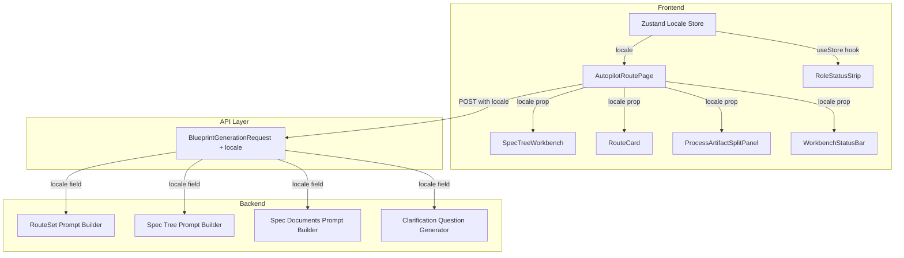
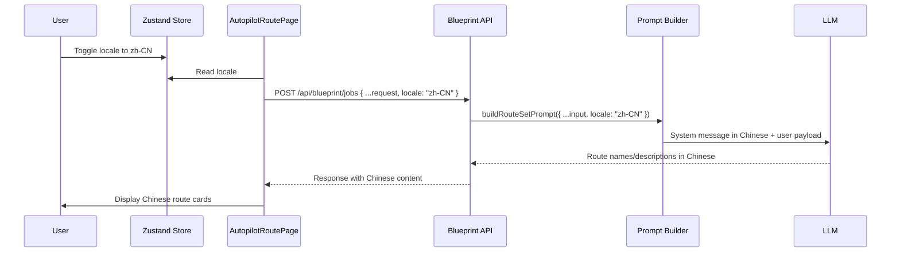

# Design Document: Autopilot i18n Consistency

## Overview

This design addresses the i18n consistency gap on the Autopilot page where many UI labels and LLM-generated content remain in English when the user selects `zh-CN`. The solution operates on two fronts:

1. **Frontend dictionary expansion and locale wiring** — Extend `copyDynamic` and add a new `ROLE_LABELS` dictionary for `RoleStatusStrip`; wire locale into components that currently lack it.
2. **Backend locale-aware prompt generation** — Add a `locale` field to `BlueprintGenerationRequest`, pass it through to all prompt builders, and inject locale-specific system instructions so the LLM generates content in the user's preferred language.

The design preserves backward compatibility: missing `locale` defaults to `"en-US"`, the `t()` helper signature is unchanged, and excluded scope (console logs, API paths, 3D scene labels) remains untouched.

## Architecture



### Data Flow: Locale Propagation



## Components and Interfaces

### Component 1: Role Label Resolver (`client/src/pages/autopilot/right-rail/role-labels.ts`)

A new module exporting a pure function and dictionary for role name localization.

```typescript
import type { AppLocale } from "@/lib/locale";

/** Role ID → { zh-CN label, en-US label } */
export const ROLE_LABELS: Record<string, Record<AppLocale, string>> = {
  "intake-analyst": { "zh-CN": "输入分析师", "en-US": "Intake Analyst" },
  "repo-researcher": { "zh-CN": "仓库研究员", "en-US": "Repo Researcher" },
  "route-planner": { "zh-CN": "路线规划师", "en-US": "Route Planner" },
  "spec-curator": { "zh-CN": "规格策展师", "en-US": "Spec Curator" },
  "effect-previewer": { "zh-CN": "效果预演师", "en-US": "Effect Previewer" },
  "prompt-packager": { "zh-CN": "提示词打包师", "en-US": "Prompt Packager" },
  "engineering-operator": { "zh-CN": "工程执行员", "en-US": "Engineering Operator" },
  "review-auditor": { "zh-CN": "评审审计员", "en-US": "Review Auditor" },
  // ... extensible
};

/**
 * Resolve a role identifier to a human-readable localized label.
 * Falls back to the raw roleId if no mapping exists.
 */
export function resolveRoleLabel(roleId: string, locale: AppLocale): string {
  const entry = ROLE_LABELS[roleId];
  if (!entry) return roleId;
  return entry[locale] ?? roleId;
}
```

### Component 2: Stage Label Localizer (modification to `RoleStatusStrip.tsx`)

Replace the existing `STAGE_LABELS` record with a locale-aware version:

```typescript
import type { AppLocale } from "@/lib/locale";

const STAGE_LABELS: Record<AppLocale, Record<number, string>> = {
  "zh-CN": { 0: "阶段 0", 1: "阶段 1", 2: "阶段 2", 3: "阶段 3", 4: "阶段 4", 5: "阶段 5" },
  "en-US": { 0: "Stage 0", 1: "Stage 1", 2: "Stage 2", 3: "Stage 3", 4: "Stage 4", 5: "Stage 5" },
};

export function resolveStageLabel(index: number, locale: AppLocale): string {
  const labels = STAGE_LABELS[locale] ?? STAGE_LABELS["en-US"];
  return labels[index] ?? (locale === "zh-CN" ? `阶段 ${index}` : `Stage ${index}`);
}
```

`RoleStatusStrip` will read `locale` from the Zustand store via `useAppStore(state => state.locale)` and pass it to `resolveRoleLabel` and `resolveStageLabel`. This is an explicit exception to the right-rail props-only convention because `RoleStatusStrip` already consumes `useBlueprintRealtimeStore` directly as a store-consumer observation strip.

### Component 3: `BlueprintGenerationRequest` Extension (`shared/blueprint/contracts.ts`)

Add an optional `locale` field to all request types that trigger LLM generation:

```typescript
type BlueprintRequestLocale = "zh-CN" | "en-US";

export interface BlueprintGenerationRequest {
  // ... existing fields
  locale?: BlueprintRequestLocale;
}

export interface BlueprintGenerateSpecDocumentsRequest {
  // ... existing fields
  locale?: BlueprintRequestLocale;
}

// In server/routes/blueprint.ts:
interface BlueprintClarificationSessionRequest {
  // ... existing fields
  locale?: BlueprintRequestLocale;
}
```

### Component 4: Frontend Locale Injection (`client/src/pages/autopilot/`)

**Locale read boundary**: `AutopilotRoutePage.tsx` reads locale from `useAppStore(state => state.locale)` and is the single source of truth. Right-rail components and hooks receive locale via props or function parameters — they do NOT import `useAppStore` directly (except `RoleStatusStrip` which is an explicit exception as a store-consumer observation strip).

- `AutopilotRoutePage.tsx`: reads `useAppStore(state => state.locale)`, includes locale in `BlueprintGenerationRequest` for job creation
- `AutopilotRightRail.tsx`: receives `locale` via `AutopilotRightRailProps.locale`, includes it in `BlueprintGenerateSpecDocumentsRequest` for manual spec docs generation
- `use-auto-advance.ts`: receives `locale` as a parameter (injected by caller), includes it in `BlueprintGenerateSpecDocumentsRequest` for auto-advance spec docs generation
- Frontend clarification session creation: includes locale in `BlueprintClarificationSessionRequest`

### Component 5: Backend Locale Resolution (`server/routes/blueprint.ts`)

Add a locale resolution utility at the top of the blueprint route handler:

```typescript
function resolveRequestLocale(body: unknown): "zh-CN" | "en-US" {
  if (body && typeof body === "object" && "locale" in body) {
    const locale = (body as { locale?: string }).locale;
    if (locale === "zh-CN") return "zh-CN";
  }
  return "en-US"; // default for backward compatibility
}
```

Pass the resolved locale to all prompt builder invocations.

### Component 6: Clarification Question Locale Awareness

Modify `generateClarificationQuestionsWithLlm` to accept and use the request locale instead of hardcoding `"zh-CN"`. The `defaultPreviewClarificationQuestions` call and the fallback LLM system message will both respect the locale parameter.

### Component 7: `copyDynamic` Dictionary Expansion (`client/src/pages/autopilot/copy-dynamic.ts`)

Extend `DYNAMIC_ZH_COPY` with additional entries for known LLM-generated strings that currently lack translations. The function signature and fallback behavior remain unchanged.

### Relationship Between `copyDynamic` and `blueprintCopy`

These two translation helpers serve different scopes and will **coexist** rather than be consolidated:

| Aspect | `copyDynamic` | `blueprintCopy` |
|--------|---------------|-----------------|
| Location | `pages/autopilot/copy-dynamic.ts` | `lib/blueprint-copy.ts` |
| Scope | Autopilot page dynamic content (route titles, step labels) | Spec tree node names, workbench chrome, artifact titles |
| Consumers | `AutopilotRoutePage`, `RouteCard`, stage descriptors | `SpecTreeWorkbench`, `ArtifactCreatedCard`, workbench panels |
| Size | ~30 entries + 3 regex patterns | 200+ entries + 15+ regex patterns |
| Strategy | Lightweight, page-scoped | Comprehensive, cross-page |

**Design decision**: No consolidation in this spec. Both dictionaries serve distinct component trees. Future consolidation (if desired) would be a separate refactoring spec.

## Data Models

### Shared Locale Type

```typescript
/** Shared locale field added to all blueprint request types. */
type BlueprintRequestLocale = "zh-CN" | "en-US";
```

### Extended Request Types

All three request types that trigger LLM generation receive the optional `locale` field:

```typescript
interface BlueprintGenerationRequest {
  projectId?: string;
  sourceId?: string;
  version?: string;
  mode?: BlueprintGenerationMode;
  intakeId?: string;
  clarificationSessionId?: string;
  targetText?: string;
  githubUrls?: string[];
  clarifications?: BlueprintClarificationAnswer[];
  domainContext?: BlueprintProjectDomainContext;
  locale?: BlueprintRequestLocale; // NEW
}

interface BlueprintGenerateSpecDocumentsRequest {
  nodeId?: string;
  types?: BlueprintSpecDocumentType[];
  locale?: BlueprintRequestLocale; // NEW
}

interface BlueprintClarificationSessionRequest {
  strategyId?: BlueprintClarificationStrategyId;
  templateId?: string;
  locale?: BlueprintRequestLocale; // NEW
}
```

### Role Labels Dictionary Shape

```typescript
type RoleLabelDictionary = Record<string, Record<AppLocale, string>>;
```

### Stage Labels Dictionary Shape

```typescript
type StageLabelDictionary = Record<AppLocale, Record<number, string>>;
```

### copyDynamic Dictionary Shape (unchanged)

```typescript
type DynamicCopyDictionary = Record<string, string>; // English → Chinese
```

## Correctness Properties

*A property is a characteristic or behavior that should hold true across all valid executions of a system — essentially, a formal statement about what the system should do. Properties serve as the bridge between human-readable specifications and machine-verifiable correctness guarantees.*

### Property 1: Role label resolver locale symmetry

*For any* roleId that exists in the ROLE_LABELS dictionary and *for any* valid locale, `resolveRoleLabel(roleId, locale)` SHALL return the corresponding label from the dictionary entry for that locale, and the result SHALL NOT equal the raw roleId (since dictionary entries provide human-readable forms).

**Validates: Requirements 1.1, 1.2**

### Property 2: Role label resolver fallback passthrough

*For any* string that does NOT exist as a key in the ROLE_LABELS dictionary and *for any* valid locale, `resolveRoleLabel(roleId, locale)` SHALL return the input roleId unchanged.

**Validates: Requirements 1.3**

### Property 3: copyDynamic en-US passthrough

*For any* string value, `copyDynamic("en-US", value)` SHALL return the original value unchanged (identity function for English locale).

**Validates: Requirements 2.3, 3.4**

### Property 4: copyDynamic zh-CN dictionary hit

*For any* key that exists in the DYNAMIC_ZH_COPY dictionary, `copyDynamic("zh-CN", key)` SHALL return `DYNAMIC_ZH_COPY[key]`; the returned value MAY equal the key for brand names or technical terms.

**Validates: Requirements 2.1, 3.1, 3.2**

### Property 5: copyDynamic zh-CN fallback passthrough

*For any* string that does NOT match any dictionary key or regex pattern in copyDynamic, `copyDynamic("zh-CN", value)` SHALL return the original value unchanged.

**Validates: Requirements 2.2, 3.3, 8.4**

### Property 6: Stage label locale correctness

*For any* valid stage index (0–5) and locale `"zh-CN"`, `resolveStageLabel(index, "zh-CN")` SHALL return a string starting with `"阶段"`. *For any* valid stage index and locale `"en-US"`, `resolveStageLabel(index, "en-US")` SHALL return a string starting with `"Stage"`.

**Validates: Requirements 5.4**

### Property 7: Locale resolution defaults to en-US

*For any* request payload where the `locale` field is missing, undefined, null, or any value other than `"zh-CN"`, `resolveRequestLocale(payload)` SHALL return `"en-US"`.

**Validates: Requirements 6.3**

### Property 8: Prompt builder locale determines system message language

*For any* valid prompt builder input with locale `"zh-CN"`, the resulting `systemMessage` SHALL contain Chinese characters. *For any* valid prompt builder input with locale `"en-US"`, the resulting `systemMessage` SHALL NOT contain Chinese characters and SHALL start with the English prefix.

**Validates: Requirements 7.1, 7.2, 7.4**

## Error Handling

| Scenario | Handling Strategy |
|----------|-------------------|
| `locale` field missing from API request | Default to `"en-US"` (backward compatibility) |
| Unknown roleId not in ROLE_LABELS | Return raw roleId unchanged (graceful degradation) |
| copyDynamic receives `undefined` or empty string | Return empty string (existing behavior preserved) |
| LLM ignores locale instruction and returns English despite zh-CN prompt | Frontend attempts dictionary fallback for known legacy strings; otherwise displays original text unchanged |
| New LLM-generated string has no dictionary entry | Display original text unchanged (no error, graceful degradation) |
| Invalid locale value in request (e.g., `"fr-FR"`) | Treat as `"en-US"` via resolveRequestLocale |

## Testing Strategy

### Property-Based Tests (fast-check)

Property-based testing is appropriate for this feature because the core logic involves pure dictionary lookup functions with clear input/output behavior and a large input space (arbitrary strings, role IDs).

**Library**: `fast-check` (already used in the project)
**Minimum iterations**: 100 per property

Each property test will be tagged with:
```
Feature: autopilot-i18n-consistency, Property {N}: {property_text}
```

**Properties to implement as PBT:**

1. **Property 1 & 2**: `resolveRoleLabel` — dictionary hit returns localized label; miss returns raw input
2. **Property 3, 4, 5**: `copyDynamic` — en-US passthrough; zh-CN dictionary hit; zh-CN fallback
3. **Property 6**: `resolveStageLabel` — locale-correct prefix
4. **Property 7**: `resolveRequestLocale` — defaults to en-US for missing/invalid locale
5. **Property 8**: Prompt builder system message language determination

### Unit Tests (example-based)

| Test | Validates |
|------|-----------|
| RoleStatusStrip renders Chinese labels when store locale is zh-CN | Req 1.1, 1.4 |
| RoleStatusStrip renders English labels when store locale is en-US | Req 1.2 |
| ProcessArtifactSplitPanel lane titles respect locale prop | Req 4.1, 4.3 |
| WorkbenchStatusBar static labels use t() with locale | Req 5.1, 5.3 |
| API request payload includes locale from store | Req 6.1, 6.4 |
| Clarification questions display in Chinese when backend provides them | Req 9.1 |
| Console logs and API paths are never translated | Req 10.1, 10.2 |
| t() function signature unchanged | Req 10.4 |

### Integration Tests

| Test | Validates |
|------|-----------|
| Full blueprint job creation with locale zh-CN produces Chinese route names | Req 6.1, 7.1 |
| Spec tree generation with locale zh-CN produces Chinese node names | Req 7.2 |
| Clarification generation with locale zh-CN produces Chinese questions | Req 7.3, 9.1 |

### Non-Regression Checks

- 3D Scene components (`Scene3D.tsx`, `PetWorkers.tsx`) have no new locale-related imports
- `t()` helper signature in `AutopilotRoutePage.tsx` remains `(locale: AppLocale, zh: string, en: string) => string`
- No `copyDynamic` or `blueprintCopy` calls wrap `console.log` arguments
- API endpoint string constants remain unchanged
