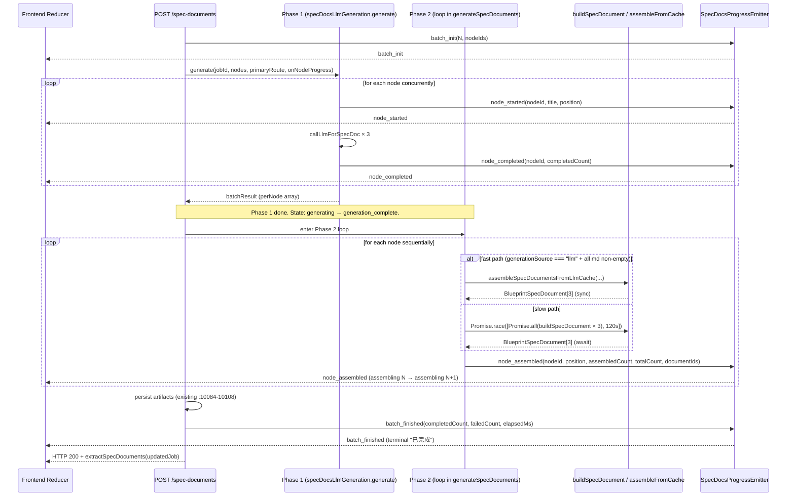

# Autopilot Spec Docs Runtime Perception Double-Pass — Bugfix Design

## Overview

The bug condition C(X) is the perceived-double-pass on the 24-node × 3-doc happy path: `generateSpecDocuments` in `server/routes/blueprint.ts` has two completion boundaries (Phase 1 LLM batch at `server/routes/blueprint.ts:9869`, Phase 2 assembly + artifact persist at `server/routes/blueprint.ts:9914-9985` and `server/routes/blueprint.ts:10084-10108`), but the emitter union at `server/routes/blueprint/spec-docs-progress-emitter.ts:33` only exposes the Phase 1 boundary, so the frontend goes silent during Phase 2 and reads desynchronized truth sources (progress `24/24` while document statistics stay `0%`). This design closes the gap with three coordinated changes: (1) introduce a third, narrowly-scoped event variant `node_assembled` between `node_completed` and `batch_finished` so the frontend reducer can render an explicit `assembling → assembled` intermediate state; (2) short-circuit Phase 2 for nodes whose batch result has `generationSource === "llm"` and complete markdown by assembling `BlueprintSpecDocument[]` synchronously from the cache, removing the `Promise.race + Promise.all` async wrapper for those nodes; (3) pin the batch-template-fallback semantic (`generationSource === "template"`) to template-only, skipping the legacy `ctx.specDocumentsLlmService(...)` retry at `server/routes/blueprint.ts:14206` regardless of the legacy `BLUEPRINT_SPEC_DOCUMENTS_LLM_ENABLED` env flag. No new abstractions are introduced beyond these three.

## Glossary

- **Bug_Condition (C)**: The condition that triggers the bug — a successful 24-node batch whose Phase 2 emits no commit-stage event between the last `node_completed` and `batch_finished`. See `bugfix.md` §Bug Condition.
- **Property (P)**: For inputs satisfying C, the fixed pipeline emits `node_assembled` for every node after `node_completed[i]` and before `batch_finished`, with zero LLM calls during Phase 2 for LLM-handled nodes.
- **Preservation**: For inputs not satisfying C (failed batch nodes, mixed-source nodes, legacy env enabled, single-node path, no eventBus path), the fix preserves Phase 1 event sequence, HTTP response shape, artifact provenance, and existing test pass set. Phase 2 `node_assembled` events are an intentional observable addition and are NOT subject to the preservation constraint.
- **`generateSpecDocuments`**: Top-level Phase 1 + Phase 2 pipeline in `server/routes/blueprint.ts` (entry point at `:9869`, Phase 2 loop at `:9914-9985`).
- **`buildSpecDocument`**: Per-(node, doc-type) document builder in `server/routes/blueprint.ts:14125+` with an LLM short-circuit at `:14140-14199` and a legacy LLM-service path at `:14206`.
- **`SpecDocsProgressEmitter`**: The event emitter contract in `server/routes/blueprint/spec-docs-progress-emitter.ts`, currently exposing `batch_init | node_started | node_completed | node_failed | batch_finished` (union at line 33).
- **`SpecDocsLlmNodeOutput`**: Per-node batch result shape from `server/routes/blueprint/spec-docs-llm-generation.ts` carrying `generationSource: "llm" | "template"` plus three markdowns (`requirements`, `design`, `tasks`).
- **Fast path**: Phase 2 branch for nodes with `generationSource === "llm"` and all three markdowns non-empty — synchronous assembly, no `Promise.race`.
- **Slow path**: Phase 2 branch for nodes missing from `llmNodeOutputById`, or with `generationSource === "template"`, or with empty markdown — retains the existing 120s `Promise.race` wrapper.
- **Batch-template-fallback**: A node whose batch result returned `generationSource === "template"` (the per-document LLM call inside the batch failed and the batch generator already wrote a templated body).

## Bug Details

### Bug Condition

The bug manifests when a 24-node SPEC tree is submitted via `POST /api/blueprint/jobs/:jobId/spec-documents` and every node's batch LLM result is successful and complete. Phase 1 emits `node_completed × 24` and the user sees `24/24 已完成`, but `generateSpecDocuments` then enters Phase 2 (`server/routes/blueprint.ts:9914-9985`), iterates 24 sequential `Promise.race(120s)` wrappers around `buildSpecDocument`, and persists artifacts at `server/routes/blueprint.ts:10084-10108` — all without emitting a single progress event. The frontend reducer has nothing to consume between the last `node_completed` and `batch_finished`, so the document statistics counter remains at `0%` while the progress bar shows complete.

**Formal Specification:**

```
FUNCTION isBugCondition(X)
  INPUT: X of type SpecDocsRunInput
    // X = {
    //   specTreeNodeCount         : N >= 1,
    //   batchLlmAllSucceeded      : true,
    //   nodeGenerationSourceLlm   : true for all nodes,
    //   markdownNonEmpty          : true for all (node, docType),
    //   envSpecDocsLlmEnabled     : true,
    //   envSpecDocumentsLlmEnabled: unset
    // }
  OUTPUT: boolean

  RETURN X.batchLlmAllSucceeded
       AND (FOR ALL node IN X.specTreeNodes:
              node.generationSource = "llm"
              AND ALL 3 markdowns non-empty)
       AND (no Phase 2 commit-stage event exists in the emitter contract)
END FUNCTION
```

### Examples

- **24-node happy path (C holds)**: User clicks 全部生成 with 24 nodes, all batch calls succeed. Expected stream: `batch_init → node_started × 24 → node_completed × 24 → node_assembled × 24 → batch_finished`. Actual (unfixed): `batch_init → node_started × 24 → node_completed × 24 → (silent gap N seconds) → batch_finished`.
- **3-node smoke fixture (C holds)**: Same shape, smaller N. Expected fast-path triggers 3 synchronous assemblies, 0 LLM calls during Phase 2. Actual (unfixed): silent gap during Phase 2 + identical 0% document stat regression at smaller scale.
- **Mixed source (¬C)**: 22 LLM nodes + 2 template-fallback nodes. Expected: 22 fast-path + 2 slow-path → all 24 emit `node_assembled`, but template-fallback nodes go through `buildSpecDocument`'s template branch (no `ctx.specDocumentsLlmService` call). Preserves provenance.
- **Template-fallback node (¬C, Phase 2 success)**: A node with `generationSource === "template"` in the batch result means Phase 1 LLM failed for this node, but the batch generator already wrote a template body. Phase 2 successfully assembles template documents via the slow path. This node IS successful from Phase 2's perspective → it DOES emit `node_assembled` and counts toward `assembledCount`. It is NOT a "failed node".
- **Phase 2 failure (¬C, Phase 2 failure)**: Phase 2 `buildSpecDocument` throws or times out for a node. This node truly failed — no usable documents are produced (only error placeholders). This node emits `node_failed` (Phase 2 failure) and does NOT emit `node_assembled`. It counts toward `failedCount`.
- **Phase 1 failure → Phase 2 outcome depends on assembly success (¬C)**: 23 nodes have `generationSource="llm"` in batch result, 1 has `generationSource="template"` (Phase 1 LLM failed). If the template-fallback node's Phase 2 assembly succeeds (buildSpecDocument produces template docs), it DOES emit `node_assembled` and counts toward `assembledCount`. Only if Phase 2 itself fails (buildSpecDocument throws or times out) does the node emit `node_failed` and NOT emit `node_assembled`. Expected for the common case (all 24 Phase 2 succeed): all 24 emit `node_assembled`, `batch_finished` reports `assembledCount=24, failedCount=0`.
- **Legacy env enabled (¬C)**: `BLUEPRINT_SPEC_DOCUMENTS_LLM_ENABLED=true` set on a batch-template-fallback node. Expected post-fix: zero `ctx.specDocumentsLlmService` invocations for that node (template-only Decision 3). Pre-fix: a second LLM dispatch could occur via the fall-through at `server/routes/blueprint.ts:14206`.

## Expected Behavior

### Preservation Requirements

**Unchanged Behaviors:**

- Phase 1 batch LLM contract: `onNodeProgress` bridge at `server/routes/blueprint/spec-docs-llm-generation.ts:741-745` continues to drive `node_started / node_completed / node_failed` with the same payload shape and ordering.
- HTTP response shape: `extractSpecDocuments(updatedJob)` at `server/routes/blueprint.ts:10110-10114` is unchanged.
- Artifact provenance fields on `BlueprintSpecDocument` (provenance.generationSource, promptId, model, promptFingerprint, responseDigest, treeVersion, nodeType, …) at `server/routes/blueprint.ts:10084-10108` are unchanged.
- The 5140+ existing-test pass set continues to pass; no regression.
- Single-LLM-call semantics under default env flags (`BLUEPRINT_SPEC_DOCS_LLM_ENABLED=true`, `BLUEPRINT_SPEC_DOCUMENTS_LLM_ENABLED` unset) is preserved.
- The `Promise.race([..., 120s timeout])` wrapper continues to apply for the slow-path (nodes that legitimately need async assembly) so a stuck node cannot block the request.
- The single-node / no-eventBus branch at `server/routes/blueprint.ts:10024+` (existing `Promise.all` shortcut without progress emission) is unchanged.

**Scope:**

All inputs that do NOT satisfy `isBugCondition` should be completely unaffected by this fix. This includes:

- Failed batch nodes and Phase 1 failures (still emit `node_failed`, not `node_assembled`).
- Mixed-source batches (LLM nodes + template-fallback nodes) — fast / slow path coexists, no second LLM dispatch.
- Legacy env enabled — Decision 3 unconditionally short-circuits the legacy LLM-service retry for batch-template-fallback nodes.
- Single-node / no-eventBus path — falls through the existing `Promise.all` shortcut, unchanged.

## Hypothesized Root Cause

Based on the verified audit in `bugfix.md`, the root cause has three concrete contributors:

1. **Missing emitter variant**: `SpecDocsProgressEmitter` exposes only Phase 1 events. The union at `server/routes/blueprint/spec-docs-progress-emitter.ts:33` (`batch_init | node_started | node_completed | node_failed | batch_finished`) has no slot for Phase 2 commit progress. Reusing `node_completed` would double-count in the frontend reducer; using `batch_finished` as the next signal forces an artificial silent gap.

2. **Phase 2 unnecessarily wraps cached output in async machinery**: For LLM-handled nodes, the 3-doc-type assembly inside `Promise.race([Promise.all(...), 120s])` (`server/routes/blueprint.ts:9923-9944`) is pure synchronous work — `pickSpecDocsLlmMarkdownForType` returns a string and the rest is record construction. Wrapping it in `Promise.all` introduces microtask scheduling latency × 24 and obscures the fact that nothing async is happening. The 120s timeout is meaningful only when an async path could stall (i.e., the legacy LLM-service path), so retaining it for fast-path nodes is dead protection.

3. **Batch-template-fallback can re-enter the legacy LLM path**: When `llmNodeOutput?.generationSource === "template"`, `pickSpecDocsLlmMarkdownForType` returns `undefined` (the LLM short-circuit at `server/routes/blueprint.ts:14140` requires `generationSource === "llm"`). Execution falls through to `ctx?.specDocumentsLlmService(...)` at `server/routes/blueprint.ts:14206`, which dispatches a per-document LLM call when `BLUEPRINT_SPEC_DOCUMENTS_LLM_ENABLED=true`. This is theoretically a second LLM pass; bugfix.md §1.3 calls it out as untested.

4. **Frontend reducer has no intermediate state**: Even if the backend emitted a richer signal, the existing reducer state machine collapses Phase 1 completion onto the visible "已完成" state with no `assembling` / `assembled` intermediate. The fix must coordinate emitter + reducer; one without the other does not close the perceived gap.

## Correctness Properties

Property 1: Bug Condition — Every Successful Node Emits `node_assembled` Exactly Once

_For any_ input where the bug condition holds (`isBugCondition` returns true), the fixed `generateSpecDocuments` SHALL emit exactly one `node_assembled` event per successful node, ordered strictly after that node's `node_completed` (or `node_failed`) event and strictly before `batch_finished`. The event payload SHALL carry `nodeId`, `position`, `assembledCount`, `totalCount`, `occurredAt`, and `documentIds` so the frontend reducer can reconcile per-node commit state without double-counting.

**Validates: Requirements 2.1, 2.5, 2.6**

Property 2: Bug Condition — Phase 2 Invokes Zero LLM Calls For LLM-Handled Nodes

_For any_ node whose batch result satisfies `generationSource === "llm"` AND all three markdowns are non-empty, Phase 2 SHALL produce a `BlueprintSpecDocument[]` synchronously from the cache via `assembleSpecDocumentsFromLlmCache(...)`, dispatching zero calls to `callLlmForSpecDoc` and zero calls to `ctx.specDocumentsLlmService` for that node, regardless of the value of `BLUEPRINT_SPEC_DOCUMENTS_LLM_ENABLED`.

**Validates: Requirements 2.3, 3.2, 3.5**

Property 3: Preservation — Batch-Template-Fallback Skips Legacy LLM Service

_For any_ node whose batch result has `generationSource === "template"`, `buildSpecDocument` SHALL skip `ctx.specDocumentsLlmService(...)` entirely (zero calls) and route directly to the template path (`buildSpecDocumentBody(input)` at `server/routes/blueprint.ts:14254`), regardless of the value of `BLUEPRINT_SPEC_DOCUMENTS_LLM_ENABLED`. The resulting document SHALL preserve `provenance.generationSource = "template"` and all other provenance fields unchanged.

**Validates: Requirements 2.4, 3.3, 3.6**

Property 4: Preservation — Non-Buggy Inputs Preserve Phase 1 Events, HTTP Response, and Artifact Provenance

_For any_ input (whether or not it satisfies the bug condition), the fixed pipeline F' SHALL:
- Emit the same Phase 1 event sequence as F (batch_init, node_started, node_completed, node_failed — unchanged payload shapes and ordering).
- Return the same HTTP response shape (extractSpecDocuments(updatedJob)) with the same artifact provenance fields on BlueprintSpecDocument.
- Pass the same existing test suite (no regressions).

The fixed pipeline F' MAY additionally emit `node_assembled` events during Phase 2 that F did not emit. This is the intentional, observable change introduced by this bugfix. Tests asserting preservation MUST NOT assert "identical event stream" — they MUST assert "Phase 1 events unchanged AND response shape unchanged AND provenance unchanged".

Failed nodes SHALL emit `node_failed` and SHALL NOT emit `node_assembled` (same as F).

**Validates: Requirements 3.1, 3.3, 3.4, 3.7, 3.8**

## Architecture

### Event Flow (Happy Path, N nodes)

```
batch_init
  ├── node_started[1] → node_completed[1]
  ├── node_started[2] → node_completed[2]
  ├── …
  └── node_started[N] → node_completed[N]    ← Phase 1 boundary (LLM batch done)
  ┌── node_assembled[1]                       ← Phase 2 fast-path or slow-path commit
  ├── node_assembled[2]
  ├── …
  └── node_assembled[N]                       ← Phase 2 boundary (all artifacts written)
batch_finished                                ← HTTP response ready
```

Ordering invariant (enforced by Phase 2 loop structure, asserted in tests):

```
∀ i ∈ [1..N]:
  IF node i succeeds in Phase 2:
    node_assembled[i] occurs after that node's Phase 1 terminal event (node_completed[i])
    ∧ node_assembled[i] occurs before batch_finished
  IF node i fails in Phase 2:
    node_failed[i] is emitted; node_assembled[i] is NEVER emitted
  NOTE: A node that failed Phase 1 (batch generationSource="template") but succeeds
  Phase 2 (template docs assembled) IS a successful Phase 2 node and DOES emit node_assembled.
```

### Phase 2 Fast-Path vs Slow-Path Split

```
Phase 2 loop entry (server/routes/blueprint.ts:9914)
  │
  for each node in targetNodes:
    │
    ├── llmNodeOutput = llmNodeOutputById?.get(node.id)
    │
    ├── isFastPath ?= (
    │       llmNodeOutput?.generationSource === "llm"
    │     ∧ requirementsMd, designMd, tasksMd are all non-empty strings
    │   )
    │
    ├── if isFastPath:
    │     ┌─────────────────────────────────────────────────┐
    │     │ FAST PATH (synchronous, no Promise.race)        │
    │     │ docs = assembleSpecDocumentsFromLlmCache({...}) │
    │     │ documents.push(...docs)                         │
    │     │ progressEmitter.emitNodeAssembled(...)          │
    │     └─────────────────────────────────────────────────┘
    │
    └── else (SLOW PATH, retains 120s Promise.race):
          ┌─────────────────────────────────────────────────────────┐
          │ try {                                                   │
          │   timeout = createCancellableTimeout(120_000)           │
          │   docs = await Promise.race([                           │
          │     Promise.all(targetTypes.map(t => buildSpecDocument( │
          │       …, llmNodeOutput  // template-fallback respects   │
          │              // Decision 3 inside buildSpecDocument     │
          │     ))),                                                │
          │     timeout.promise,                                    │
          │   ])                                                    │
          │   documents.push(...docs)                               │
          │   progressEmitter.emitNodeAssembled(...)  // ON SUCCESS │
          │ } catch (err) {                                         │
          │   progressEmitter.emitNodeFailed(...)                   │
          │   documents.push(...fallbackErrorDocuments)             │
          │   // do NOT emit node_assembled for failed nodes        │
          │ } finally { timeout.cancel() }                          │
          └─────────────────────────────────────────────────────────┘
```

### Frontend Reducer State Machine

```
idle
  │ (job created, batch_init received)
  ▼
generating (progress 0/N → N/N as node_completed events arrive)
  │ (last node_completed received; batch_finished NOT yet received)
  ▼
generation_complete (assembling 0/N → N/N as node_assembled events arrive)
  │ (last node_assembled received)
  ▼
assembled
  │ (batch_finished received)
  ▼
batch_finished
```

The reducer MUST NOT collapse `generation_complete (assembling)` onto a final-complete visual state. The "已完成" terminal state is reachable only after `batch_finished`.

### Sequence Diagram (Mermaid)



## Components and Interfaces

### 1. `SpecDocsProgressEmitter` Extension

**File**: `server/routes/blueprint/spec-docs-progress-emitter.ts`

Add a new variant to `SpecDocsProgressAction` (at line 33):

```ts
export type SpecDocsProgressAction =
  | "batch_init"
  | "node_started"
  | "node_completed"
  | "node_failed"
  | "node_assembled"   // ← NEW
  | "batch_finished";
```

Add a new emit method to the `SpecDocsProgressEmitter` interface and the factory return:

```ts
export interface SpecDocsProgressEmitter {
  emitBatchInit(totalCount: number, nodeIds: string[]): void;
  emitNodeStarted(nodeId: string, title: string, position: number): void;
  emitNodeCompleted(nodeId: string, completedCount: number): void;
  emitNodeFailed(nodeId: string, errorSummary: string, processedCount: number): void;
  /** NEW: Phase 2 commit boundary — node's documents have entered the documents array. */
  emitNodeAssembled(args: {
    nodeId: string;
    position: number;
    assembledCount: number;
    totalCount: number;
    documentIds: ReadonlyArray<string>;
  }): void;
  emitBatchFinished(completedCount: number, failedCount: number, elapsedMs: number): void;
}
```

Implementation mirrors the existing `emitNodeCompleted` pattern:

```ts
emitNodeAssembled({ nodeId, position, assembledCount, totalCount, documentIds }) {
  baseEmitter.observing(true, `↳ 文档装配 (${assembledCount}/${totalCount})`, {
    progressAction: "node_assembled",
    nodeId,
    position,
    assembledCount,
    totalCount,
    documentIds: [...documentIds],
  });
},
```

**Rationale for `node_assembled` over `node_persisted` or `node_committed`**:

- "assembled" matches the in-memory document-array-push semantics; true persistence (`store.save`) is batch-level and signaled by `batch_finished`. The frontend MUST NOT show "已落库" until `batch_finished`.
- "Persisted" is broader and could be misread as downstream replay/audit persistence (which happens at a different layer, not in this hot path).
- "Committed" implies persistence which hasn't happened yet at the point of emission — the event fires after `documents.push(...)` (in-memory assembly), NOT after `store.save(updatedJob)` (actual persistence).
- The frontend reducer state machine uses "assembling" terminology, so `node_assembled` aligns 1:1.

**Ordering invariant (documented in JSDoc on `emitNodeAssembled`)**:

```
node_assembled[i] MUST be emitted AFTER node_completed[i] AND BEFORE batch_finished.
Failed nodes (Phase 2 failure: buildSpecDocument throws or times out) MUST NOT call
emitNodeAssembled. A node that failed Phase 1 (generationSource="template") but succeeds
Phase 2 (template docs assembled) IS a successful Phase 2 node and DOES emit node_assembled.
```

### 2. `assembleSpecDocumentsFromLlmCache` Helper

**File**: `server/routes/blueprint.ts` (new helper, defined alongside `buildSpecDocument`).

**Signature**:

```ts
function assembleSpecDocumentsFromLlmCache(args: {
  job: BlueprintGenerationJob;
  specTree: BlueprintSpecTree;
  node: BlueprintSpecTreeNode;
  llmOutput: SpecDocsLlmNodeOutput;          // pre-validated: generationSource === "llm" + non-empty md
  primaryRoute: BlueprintGeneratedRoute | undefined;
  createdAt: string;
  previousRoleFindings: ReadonlyArray<RoleFindingEntry>;
  clarificationSession: ClarificationSession | undefined;
  domainContext: DomainContext | undefined;
  targetTypes: ReadonlyArray<BlueprintSpecDocumentType>;
}): BlueprintSpecDocument[];
```

**Responsibilities**:

- For each `type` in `targetTypes`, call `pickSpecDocsLlmMarkdownForType(args.llmOutput, type)` to obtain the cached markdown.
- Construct one `BlueprintSpecDocument` per type, mirroring the LLM short-circuit branch at `server/routes/blueprint.ts:14140-14199` (id, jobId, treeId, nodeId, type, status, version, sourceDocumentId, title via `buildSpecDocumentHeading`, summary via `node.summary`, content from cache, format, createdAt, updatedAt, full provenance with `generationSource: "llm"` + `promptId`, `model`, `promptFingerprint`, `responseDigest`).
- Return `BlueprintSpecDocument[]` of length `targetTypes.length` synchronously — no `await`, no Promise.

**Preconditions** (asserted by call site, not re-checked here):

- `args.llmOutput.generationSource === "llm"`.
- For every `type` in `targetTypes`, `pickSpecDocsLlmMarkdownForType(args.llmOutput, type)` returns a non-empty string.

**Rationale**: Extracting this helper makes the fast path readable, eliminates the `Promise.all + Promise.race + 120s timer` overhead × 24 for the 24-node case, and centralizes the document-construction logic that previously lived inline in `buildSpecDocument`'s LLM short-circuit. The original LLM short-circuit at `:14140-14199` remains in place for the slow path's `buildSpecDocument` call (which is reached for not-handled / template-fallback nodes that happen to recover an "llm" source — defensive safety net).

### 3. `generateSpecDocuments` Phase 2 Loop Refactor

**File**: `server/routes/blueprint.ts`, replacing the loop body at `:9914-9985`.

**New structure** (within the `if (progressEmitter)` branch):

```ts
for (let i = 0; i < targetNodes.length; i++) {
  const node = targetNodes[i];
  const llmHandled = llmEmittedNodes.has(node.id);
  if (!llmHandled) {
    progressEmitter.emitNodeStarted(node.id, node.title ?? node.id, i + 1);
  }

  const previousRoleFindings = collectReusableRoleFindings(job, {...});
  const primaryRoute = node.routeId ? routeById.get(node.routeId) : ...;
  const llmNodeOutput = llmNodeOutputById?.get(node.id);

  // ── Decision 2: classify fast path vs slow path ────────────────────
  const isFastPath =
    llmNodeOutput?.generationSource === "llm" &&
    targetTypes.every(type => {
      const md = pickSpecDocsLlmMarkdownForType(llmNodeOutput, type);
      return typeof md === "string" && md.length > 0;
    });

  try {
    let nodeDocs: BlueprintSpecDocument[];

    if (isFastPath) {
      // FAST PATH: synchronous assembly from LLM cache, no Promise.race wrapper
      nodeDocs = assembleSpecDocumentsFromLlmCache({
        job, specTree, node, llmOutput: llmNodeOutput!, primaryRoute, createdAt,
        previousRoleFindings, clarificationSession, domainContext, targetTypes,
      });
    } else {
      // SLOW PATH: retain existing 120s Promise.race protection
      const timeout = createCancellableTimeout(120_000);
      try {
        const result = await Promise.race([
          Promise.all(targetTypes.map(type => buildSpecDocument(ctx, {
            job, specTree, node, type, createdAt, previousRoleFindings,
            clarificationSession, domainContext, primaryRoute, llmNodeOutput,
          }))),
          timeout.promise,
        ]);
        if (result === TIMEOUT_SENTINEL) throw new Error("节点生成超时 (120s)");
        nodeDocs = result as BlueprintSpecDocument[];
      } finally {
        timeout.cancel();
      }
    }

    documents.push(...nodeDocs);
    assembledCount++;  // Phase 2 assembly counter (distinct from Phase 1's completedCount which tracks LLM generation completion)
    if (!llmHandled) {
      progressEmitter.emitNodeCompleted(node.id, completedCount);
    }
    // ── Decision 1: emit node_assembled AFTER documents are in array ──
    progressEmitter.emitNodeAssembled({
      nodeId: node.id,
      position: i + 1,
      assembledCount,
      totalCount: targetNodes.length,
      documentIds: nodeDocs.map(d => d.id),
    });
  } catch (err) {
    failedCount++;
    const errorMsg = err instanceof Error ? err.message : String(err);
    if (!llmHandled) {
      progressEmitter.emitNodeFailed(node.id, errorMsg, assembledCount + failedCount);
    }
    // Failed nodes: DO NOT emit node_assembled (Property 4: failed nodes only emit node_failed)
    for (const type of targetTypes) {
      documents.push({/* fallback error document, unchanged from :9994-10009 */});
    }
  }
}

const elapsedMs = Date.now() - batchStartTime;
progressEmitter.emitBatchFinished(assembledCount, failedCount, elapsedMs);
```

**Notes**:

- The `if (!llmHandled)` guards on `emitNodeStarted` / `emitNodeCompleted` / `emitNodeFailed` are preserved exactly as-is to avoid double-counting against Phase 1.
- `emitNodeAssembled` is **always** emitted on success (no `llmHandled` guard) because Phase 2 commit is a separate boundary that has no Phase 1 counterpart.
- The fallback error document construction at `server/routes/blueprint.ts:9994-10009` is preserved verbatim.

### 4. `buildSpecDocument` Modification — Decision 3

**File**: `server/routes/blueprint.ts`, modifying the `serviceResult` assignment at `:14206`.

**Change**: Skip `ctx.specDocumentsLlmService(...)` when the batch already produced a non-LLM result for this node.

```ts
// ── Decision 3: batch-template-fallback short-circuit ────────────────
// If the batch already produced a template-source result for this node,
// do NOT re-attempt the legacy per-document LLM service. Skip directly
// to the template path. This closes the theoretical second-LLM-dispatch
// path under the legacy BLUEPRINT_SPEC_DOCUMENTS_LLM_ENABLED env flag.
const batchTemplateOnly =
  input.llmNodeOutput !== undefined &&
  input.llmNodeOutput.generationSource !== "llm";

const serviceResult = ctx?.specDocumentsLlmService && !batchTemplateOnly
  ? await ctx.specDocumentsLlmService({
      jobId: input.job.id,
      job: input.job,
      // … unchanged args …
    })
  : undefined;
```

**Trade-off (documented for the reviewer)**:

- A batch-template-fallback node loses the legacy per-document LLM-retry safety net.
- Acceptable because the new pipeline already has a 5-key pool with retries at `server/routes/blueprint/spec-docs-llm-generation.ts:741-745`. If the batch couldn't get an LLM result with 5 keys × retries, a 6th legacy retry is unlikely to succeed and just adds latency + cost.
- Provenance is preserved: the resulting document carries `generationSource: "template"` (not `"llm_fallback"`), which honors the batch generator's verdict.

This is a 4-line surgical change inside `buildSpecDocument`.

### 5. Frontend Reducer State Machine

**Scope of this design**: server-side event contract is the source of truth. The frontend reducer must be updated to consume `node_assembled` and expose the `assembling` / `assembled` intermediate state, but the reducer code lives outside this server-side spec. The contract this design provides:

- `node_assembled` events arrive strictly after `node_completed` and strictly before `batch_finished`.
- `node_assembled.assembledCount` is monotonically increasing within a batch (1, 2, …, totalCount).
- Failed nodes do NOT emit `node_assembled`; the reducer must derive `assembledCount + failedCount === totalCount` as the precondition for `batch_finished`.
- `node_assembled.documentIds` enables per-document UI updates (e.g., flipping a per-doc indicator to "assembled").

**Reducer state machine** (informative, to be implemented in the frontend bugfix task):

```
idle ──(batch_init)──▶ generating ──(node_completed × N)──▶ generation_complete (assembling 0/N)
                                                                      │
                                                                      │ (node_assembled × N)
                                                                      ▼
                                                               assembled (assembling N/N)
                                                                      │
                                                                      │ (batch_finished)
                                                                      ▼
                                                               batch_finished (final 已完成)
```

The reducer MUST NOT show "已完成" until `batch_finished` is received. During `generation_complete`, the user-visible label is "生成完成 (assembling X/N)" or equivalent.

## Data Models

### `SpecDocsNodeAssembledEvent` Payload

```ts
interface SpecDocsNodeAssembledEvent {
  type: "node_assembled";
  jobId: string;
  nodeId: string;
  position: number;                    // 1-indexed; same numbering as node_started/completed
  assembledCount: number;              // running count (1..totalCount)
  totalCount: number;                  // total target nodes (N)
  occurredAt: string;                  // ISO timestamp
  documentIds: ReadonlyArray<string>;  // the 3 doc ids written for this node (one per targetType)
}
```

Note: `occurredAt` is NOT part of the `emitNodeAssembled` method signature payload. It is injected by the base event envelope layer (`baseEmitter.observing(...)` adds `occurredAt: new Date().toISOString()` to every emitted event automatically). The `SpecDocsNodeAssembledEvent` type above represents the FULL event shape as seen by the frontend consumer (base envelope + domain payload merged). The emitter interface method only accepts the domain-specific fields (`nodeId`, `position`, `assembledCount`, `totalCount`, `documentIds`).

### Discriminated Union Update

```ts
export type SpecDocsProgressEvent =
  | { type: "batch_init"; jobId: string; totalCount: number; nodeIds: ReadonlyArray<string>; occurredAt: string }
  | { type: "node_started"; jobId: string; nodeId: string; nodeTitle: string; position: number; occurredAt: string }
  | { type: "node_completed"; jobId: string; nodeId: string; completedCount: number; occurredAt: string }
  | { type: "node_failed"; jobId: string; nodeId: string; errorSummary: string; processedCount: number; occurredAt: string }
  | SpecDocsNodeAssembledEvent                              // ← NEW
  | { type: "batch_finished"; jobId: string; completedCount: number; failedCount: number; elapsedMs: number; occurredAt: string };
```

The discriminator field is `type` (matching the `progressAction` payload key carried on the underlying `role.agent.observing` event). Frontend reducer narrows on `event.type === "node_assembled"`.

### `SpecDocsLlmNodeOutput` (existing, no change)

Documented here for clarity since the fast-path classification depends on it:

```ts
interface SpecDocsLlmNodeOutput {
  nodeId: string;
  generationSource: "llm" | "template";
  requirementsMarkdown?: string;
  designMarkdown?: string;
  tasksMarkdown?: string;
  promptId?: string;
  model?: string;
  promptFingerprint?: string;
  responseDigest?: string;
}
```

Fast-path requires: `generationSource === "llm"` AND `pickSpecDocsLlmMarkdownForType(output, type)` returns non-empty for all three `type` values in `targetTypes`.

## Error Handling

### Phase 2 Node Outcomes (Three-Outcome Model)

Phase 2 node outcomes are mutually exclusive:

1. **LLM-assembled (fast path)**: `generationSource="llm"`, all 3 md present → sync assembly → `node_assembled`. Counts as assembled.
2. **Template-assembled (slow path success)**: `generationSource="template"` or partial md → `buildSpecDocument` succeeds → `node_assembled`. Counts as assembled.
3. **Failed (slow path failure)**: `buildSpecDocument` throws or times out → `node_failed` + error docs. Counts as failed. Does NOT emit `node_assembled`.

**Invariant**: `assembledCount + failedCount === totalCount` at `batch_finished`.

### Error Scenarios

| Error Scenario | Behavior | Rationale |
|---|---|---|
| Phase 1 node fails (`node_failed` emitted by batch) | Phase 2 sees that node missing from `llmNodeOutputById` (or with empty markdown). It enters the slow path, `buildSpecDocument` may fail or produce a template document. If `buildSpecDocument` succeeds, `node_assembled` IS emitted (the documents were assembled into the array). If `buildSpecDocument` throws, the catch branch emits `node_failed` (Phase 2 failure) and writes fallback error documents — `node_assembled` is NOT emitted. | A node that fails Phase 1 but succeeds Phase 2 still produces real documents and should signal assembly. A node that fails both has no usable documents in the array (only error placeholders), so signaling assembly would mislead the reducer. |
| Phase 2 timeout fires for a slow-path node (120s `Promise.race` resolves to TIMEOUT_SENTINEL) | The catch branch emits `node_failed` (Phase 2 failure), writes fallback error documents (preserves `server/routes/blueprint.ts:9994-10009` behavior), does NOT emit `node_assembled`. | Timeout means assembly never completed; documents in the array are error placeholders, not real artifacts. Same rationale as above. |
| `assembleSpecDocumentsFromLlmCache` throws synchronously (e.g., malformed cache) | Caught by the same try/catch; emits `node_failed`, writes fallback error documents, does NOT emit `node_assembled`. | Defensive: synchronous throws from the fast path follow the same failure semantics as the slow path. |
| `batch_finished` is reached but `assembledCount + failedCount !== totalCount` | Invariant violation. Throw a runtime error with diagnostic detail (`{ totalCount, assembledCount, failedCount, missing: targetNodes.map(n=>n.id).filter(...) }`) and surface via the existing `JobFailed` event path used by the route handler's outer try/catch. | This indicates a logic bug in the loop (e.g., a node was skipped without emitting either `node_assembled` or `node_failed`). Detecting it at `batch_finished` is the last opportunity before the HTTP response goes out; failing loud is preferable to silently delivering inconsistent state. |
| Decision 3: `BLUEPRINT_SPEC_DOCUMENTS_LLM_ENABLED=true` set on a batch-template-fallback node | `buildSpecDocument` short-circuits past `ctx.specDocumentsLlmService(...)` (zero LLM calls), routes to `buildSpecDocumentBody(input)` at `server/routes/blueprint.ts:14254`, document carries `provenance.generationSource = "template"`. | Pinning the semantic to template-only closes the second-LLM-dispatch theoretical path. The legacy env flag is effectively neutralized for batch-handled nodes; it remains active for the no-eventBus / no-batch path (preservation of L17 / pre-batch behavior). |
| `progressEmitter` is `undefined` (single-node path / no eventBus) | The else-branch at `server/routes/blueprint.ts:10024+` is unchanged; no `node_assembled` is emitted because no other progress events are emitted on that path. | Preservation: this path is `¬C(X)` and must be byte-identical to F. |

## Fix Implementation

### Changes Required

Assuming the root cause analysis is correct, the following files change:

**File 1**: `server/routes/blueprint/spec-docs-progress-emitter.ts`

1. **Extend `SpecDocsProgressAction` union (line 33)**: add `"node_assembled"`.
2. **Extend `SpecDocsProgressEmitter` interface**: add `emitNodeAssembled({...}): void` method signature with the payload shape from §Components 1.
3. **Extend factory return**: implement `emitNodeAssembled` mirroring the existing `emitNodeCompleted` pattern (calls `baseEmitter.observing(true, summary, extraPayload)` with `progressAction: "node_assembled"` and the structured fields).

**File 2**: `server/routes/blueprint.ts` (Phase 2 loop, `:9914-9985`)

4. **Add `assembleSpecDocumentsFromLlmCache` helper**: defined alongside `buildSpecDocument`, signature per §Components 2.
5. **Refactor Phase 2 loop body**: split into fast path (synchronous `assembleSpecDocumentsFromLlmCache`) vs slow path (retain `Promise.race + 120s` wrapper + `buildSpecDocument`).
6. **Emit `node_assembled` after `documents.push(...nodeDocs)`** on the success branch (both fast and slow path). Failed nodes (catch branch) do NOT emit `node_assembled`.

**File 3**: `server/routes/blueprint.ts` (`buildSpecDocument`, `:14206`)

7. **Add Decision 3 short-circuit**: 4-line change at the `serviceResult` assignment to skip `ctx.specDocumentsLlmService(...)` when `input.llmNodeOutput?.generationSource !== "llm"` (i.e., the batch already produced a template result).

**File 4**: Frontend reducer (out of scope for this server-side design, but the contract requires)

8. **Consume `node_assembled`**: the frontend reducer must add an `assembling` intermediate state and expose `assembledCount / totalCount` to the UI, gating the "已完成" terminal label on `batch_finished`. Implementation lives in the spec docs progress reducer task to be created in `tasks.md`.

## Testing Strategy

### Validation Approach

The testing strategy follows a two-phase approach: first, surface counterexamples that demonstrate the bug on unfixed code (Bug Condition Exploration), then verify the fix works correctly (Fix Checking) and preserves existing behavior (Preservation Checking).

### Exploratory Bug Condition Checking

**Goal**: Surface counterexamples that demonstrate the bug BEFORE implementing the fix. Confirm or refute the root cause analysis. If we refute, we will need to re-hypothesize.

**Test Plan**: Drive `generateSpecDocuments` with a 24-node × 3-doc fixture where every Phase 1 LLM call returns a successful 3-doc markdown. Capture the entire event stream emitted on the `eventBus`. Assert the absence of any `node_assembled` event between the last `node_completed` and `batch_finished`. Run on the UNFIXED code; the test MUST FAIL on unfixed code (because no `node_assembled` variant exists in the emitter contract — the test will need a placeholder assertion that the gap exceeds a threshold or that the event stream contains no commit-stage signal).

**Test Cases**:

1. **Happy-path 24×3 stream test**: Simulate 24 nodes × 3 doc types, all batch LLM calls succeed. Capture event stream; assert that between `last node_completed` and `batch_finished` there exists at least one event per node (this assertion fails on unfixed code, confirming the bug).
2. **3-node smoke**: Smaller fixture for fast feedback (will fail on unfixed code in the same way).
3. **Mixed-source (22 LLM + 2 template)**: Capture event stream; on unfixed code, all 24 nodes still produce no commit-stage event — same failure mode.
4. **Phase 2 silent gap timing**: Measure wall-clock gap between last `node_completed` and `batch_finished` on a 24-node fixture. On unfixed code with synchronous-equivalent assembly, the gap is small in unit-test timing but real in production due to artifact persistence; the test surfaces it via event-count, not timing.

**Expected Counterexamples**:

- Event stream on unfixed code: `[batch_init, node_started × 24, node_completed × 24, batch_finished]` — no commit-stage events.
- Possible causes: missing emitter variant, Phase 2 loop emits no progress events, frontend reducer has no intermediate state.

### Fix Checking

**Goal**: Verify that for all inputs where the bug condition holds, the fixed `generateSpecDocuments` produces the expected behavior.

**Pseudocode:**

```
FOR ALL X WHERE isBugCondition(X) DO
  events ← captureEventStream(POST /spec-documents, X)
  ASSERT events contains "node_assembled" for EVERY node, ordered AFTER node_completed AND BEFORE batch_finished
  ASSERT batch_finished is emitted AFTER all node_assembled events
  ASSERT NO LLM call (ctx.specDocumentsLlmService OR ctx.llm.callJson) is dispatched during Phase 2
  ASSERT documents in HTTP response have provenance.generationSource = "llm" for all nodes
END FOR
```

### Preservation Checking

**Goal**: Verify that for all inputs where the bug condition does NOT hold, the fixed function produces the same observable behavior as the original function.

**Pseudocode:**

```
FOR ALL X WHERE NOT isBugCondition(X) DO
  ASSERT response_shape(F(X)) = response_shape(F'(X))
  ASSERT artifact_provenance(F(X)) = artifact_provenance(F'(X))
  ASSERT phase1_event_sequence(F(X)) = phase1_event_sequence(F'(X))
  ASSERT existing_test_pass_set(F(X)) ⊆ existing_test_pass_set(F'(X))
END FOR
```

**Testing Approach**: Property-based testing is recommended for preservation checking because:

- It generates many input shapes automatically across the input domain (mixed source ratios, failure positions, env-flag combinations).
- It catches edge cases that manual unit tests might miss (e.g., 1-node batches, all-failed batches, all-template batches).
- It provides strong guarantees that behavior is unchanged for all non-buggy inputs.

**Test Plan**: Observe behavior on UNFIXED code first for each preservation case (failed nodes, mixed-source batches, single-node path, legacy env), capture observed behavior, then write tests that re-assert the same behavior on the fixed code.

**Test Cases**:

1. **Phase 1 failure preservation**: 23 LLM-success + 1 LLM-failed nodes. On unfixed code, the failed node produces fallback error documents and emits `node_failed`. On fixed code, same — and the failed node does NOT emit `node_assembled`, the 23 successful nodes DO.
2. **Mixed-source preservation**: 22 LLM + 2 template-fallback. Capture provenance fields, generation sources, document counts. Assert byte-identical artifact payloads on fixed code (within fields not directly affected by the fix).
3. **Single-node / no-eventBus preservation**: Drive `generateSpecDocuments` with `progressEmitter === undefined` path. Assert response shape and document provenance are byte-identical to unfixed code.
4. **Legacy env preservation**: Set `BLUEPRINT_SPEC_DOCUMENTS_LLM_ENABLED=true` on a batch-template-fallback node. Assert: zero `ctx.specDocumentsLlmService` calls (Decision 3), `provenance.generationSource === "template"`.
5. **Existing test pass set**: Run the entire existing server test suite. Assert zero regressions.

### Unit Tests

- `SpecDocsProgressEmitter.emitNodeAssembled` payload shape and `progressAction: "node_assembled"` discriminator.
- `assembleSpecDocumentsFromLlmCache` produces correct `BlueprintSpecDocument[]` for all 3 doc types from a sample `SpecDocsLlmNodeOutput`.
- `buildSpecDocument` Decision 3 short-circuit: when `input.llmNodeOutput?.generationSource === "template"`, `ctx.specDocumentsLlmService` is NOT called regardless of env flag state (use a spy `ctx.specDocumentsLlmService`).
- Phase 2 loop: failed node does NOT emit `node_assembled`; successful node DOES.
- Phase 2 loop: invariant violation (assembledCount + failedCount !== totalCount) throws and surfaces JobFailed.

### Property-Based Tests

- **PBT 1 (Property 1)**: Generate random N ∈ [1, 50], all nodes LLM-success, capture event stream; assert exactly N `node_assembled` events exist, each ordered after the corresponding `node_completed` and before `batch_finished`.
- **PBT 2 (Property 2)**: Generate random N ∈ [1, 30] with all nodes LLM-success; mock `ctx.specDocsLlmGeneration.generate` to return pre-built results; spy on `ctx.specDocumentsLlmService` and `ctx.llm.callJson`; assert zero invocations during Phase 2 (only Phase 1 calls).
- **PBT 3 (Property 3)**: Generate random N ∈ [1, 30] with random `generationSource: "template"` proportion ∈ [0%, 100%], with random `BLUEPRINT_SPEC_DOCUMENTS_LLM_ENABLED ∈ {undefined, "true"}`; spy on `ctx.specDocumentsLlmService`; assert zero invocations for nodes with `generationSource === "template"` regardless of env value.
- **PBT 4 (Property 4)**: Generate random failure positions in a 24-node batch; assert: each successful node emits exactly one `node_assembled`, each failed node emits zero `node_assembled` and exactly one `node_failed`, and `assembledCount + failedCount === totalCount` at `batch_finished`.

### Integration Tests

- **Bug condition exploration test (the Task 1 of bugfix workflow)**: Drives the 24-nodes × 3-docs happy path through `POST /api/blueprint/jobs/:jobId/spec-documents` end-to-end, captures the event stream, asserts the absence of any `node_assembled` event between the last `node_completed` and `batch_finished`. **Must FAIL on unfixed code** (failure confirms the bug). After the fix is applied, the same fixture run on fixed code asserts the new `node_assembled × 24` events appear with correct ordering — this is the **fix regression test**.
- **Preservation test (mixed-source)**: Drives a fixture with 22 LLM + 2 template-fallback nodes. Asserts: (a) no second LLM call for any node (`callLlmForSpecDoc` count from Phase 1 only, `ctx.specDocumentsLlmService` count is zero), (b) artifact provenance unchanged (snapshot comparison on `provenance.generationSource`, `provenance.promptId`, `provenance.model`, `provenance.responseDigest`).
- **Preservation test (single-node path)**: Drives `generateSpecDocuments` with `eventBus` absent. Asserts: response shape, document provenance, and event log on the legacy event channel are byte-identical to unfixed code (snapshot comparison).
- **Frontend reducer integration**: Simulates the full event stream `batch_init → node_started × 24 → node_completed × 24 → node_assembled × 24 → batch_finished` against the spec docs progress reducer. Asserts the reducer transitions through `idle → generating → generation_complete (assembling) → assembled → batch_finished` and never simultaneously exposes `progress 24/24 已完成` together with `文档統計 0%`.
