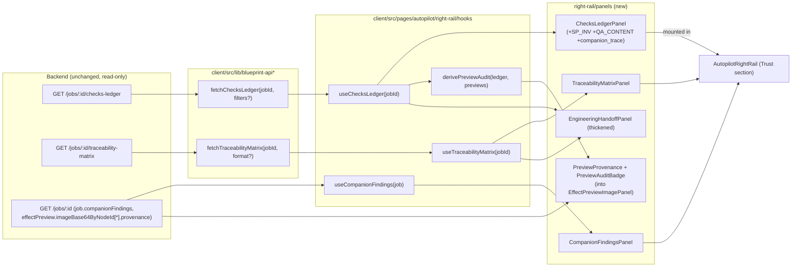

# Design Document

## Overview

This feature adds the v4 **trust-layer** UI to the `/autopilot` cockpit. It is a **read-only,
additive** frontend layer: it fetches data the backend already produces (checks ledger,
traceability matrix), derives data from existing payloads (companion findings, image
provenance), and renders new panels into the existing right rail without changing the main
flow or any backend code.

The design follows three constraints from the requirements:

1. **Aggregation hub** — the Checks Ledger panel is the convergence point for schema /
   invariant / content_quality / companion_trace / preview_audit results.
2. **Human is the gate** — every surfaced check is a review signal; nothing in the UI implies
   auto-blocking.
3. **No new truth source** — new data is fetched via read-only wrappers or derived from the
   existing `job` payload and realtime store; no parallel mission/runtime state.

### Design goals

- Reuse the existing `@shared/blueprint/*` types verbatim (no redefinition).
- Mirror existing `blueprint-api` / panel / i18n / glass-panel conventions.
- Mount trust panels as a **cross-cutting "Trust" section** in the rail (not new linear
  sub-stages), because ledger/matrix/companion aggregate across stages rather than belonging to
  one stage.
- Every panel is independently testable with loading / empty / error / gates-off / stale states.

## Architecture

### Data-flow diagram



### Layering

| Layer | Location | Responsibility |
| ----- | -------- | -------------- |
| API wrappers | `client/src/lib/blueprint-api/checks-ledger.ts`, `.../traceability-matrix.ts` (re-exported from `blueprint-api.ts`) | Typed read-only fetch + 404/error normalization |
| Fetch hooks | `client/src/pages/autopilot/right-rail/hooks/` | jobId-keyed fetch + loading/error/empty state, abort on unmount |
| Derivation (pure) | `client/src/pages/autopilot/right-rail/trust/` (pure `.ts`) | Group/filter ledger; derive preview-audit verdict; classify provenance; read companion findings |
| Panels | `client/src/pages/autopilot/right-rail/panels/` | Presentational components consuming hooks + pure derivations |
| Integration | `AutopilotRightRail.tsx` + `resolve-rail-sub-stage.ts` (Trust section) | Mount panels, gating by data availability |
| Copy | `client/src/lib/blueprint-copy.ts` | zh-CN / en-US strings |

## Components and Interfaces

### 1. API wrappers (Req 1)

Reuse shared types directly:

```ts
// client/src/lib/blueprint-api/checks-ledger.ts
import type {
  BlueprintChecksLedgerResponse,
  BlueprintCheckType,
  BlueprintCheckStatus,
} from "@shared/blueprint/checks-ledger/types";

export interface ChecksLedgerFilters {
  stage?: string;
  status?: BlueprintCheckStatus;
  checkType?: BlueprintCheckType;
}
export type FetchChecksLedgerResult =
  | { ok: true; data: BlueprintChecksLedgerResponse }
  | { ok: false; error: ApiRequestError };

export async function fetchChecksLedger(
  jobId: string,
  filters?: ChecksLedgerFilters,
  options?: RequestInit,
): Promise<FetchChecksLedgerResult>;
```

```ts
// client/src/lib/blueprint-api/traceability-matrix.ts
import type { TraceabilityMatrix } from "@shared/blueprint/traceability-matrix/types";

export type FetchTraceabilityMatrixResult =
  | { ok: true; data: TraceabilityMatrix; kind: "json" }
  | { ok: true; data: string; kind: "markdown" }
  | { ok: false; error: ApiRequestError; notGenerated: boolean };

export async function fetchTraceabilityMatrix(
  jobId: string,
  format?: "json" | "markdown",
  options?: RequestInit,
): Promise<FetchTraceabilityMatrixResult>;
```

- Both use `fetchJsonSafe` from `api-client` and the `/api/blueprint/jobs/:jobId/...` pattern.
- 404 with body `matrix_not_generated` → `{ ok:false, notGenerated:true }` so the panel renders
  "not generated yet" distinctly from transport errors.
- Re-exported from `blueprint-api.ts` so call sites keep the single import surface.

### 2. Fetch hooks (Req 13)

```ts
// useChecksLedger(jobId, filters?) → { status: "idle"|"loading"|"ready"|"error"|"empty",
//   data?, summary?, error?, reload() }
// useTraceabilityMatrix(jobId) → { status: ...|"not_generated"|"stale", matrix?, reload() }
```

- Keyed by `jobId`; abort in-flight requests on jobId change / unmount via `AbortController`.
- `empty` distinguishes gates-off (`summary.total === 0 && entries.length === 0`) from `loading`.
- Hooks do not write to the realtime store (no new truth source); they hold local state.
- Companion findings need no fetch hook — `useCompanionFindings(job)` is a pure selector over
  `job.companionFindings` (already in the job payload).

### 3. Pure derivations (`right-rail/trust/`)

```ts
// group-ledger.ts
groupLedgerByStage(entries): Record<stage, BlueprintChecksLedgerEntry[]>
selectByCheckType(entries, checkType): BlueprintChecksLedgerEntry[]   // SP_INV / QA_CONTENT presets
sortWarnFailFirst(entries): BlueprintChecksLedgerEntry[]

// preview-audit.ts
derivePreviewAuditVerdict(ledgerEntries): {
  batchStatus, retryCount, exhausted, findings: PreviewAuditFinding-like[]
}   // from checkType==="preview_audit" entries + checkName patterns

// provenance.ts
classifyProvenance(p: BlueprintPreviewProvenance): "model_ok" | "fallback" | "failed"
isPreviewUnverified(): true   // always-on label

// companion.ts
selectCompanionFindings(job): CompanionFinding[]
sortBySeverity(findings): CompanionFinding[]   // error > warn > info
```

All pure (no IO, no Date.now), so they are PBT/unit-testable in isolation — mirroring the
existing `resolve-rail-sub-stage.ts` purity discipline.

### 4. ChecksLedgerPanel (Req 2, 3, 4) — QA_LEDGER hub

- Header: summary badges `total / pass / warn / fail / skip` (non-color-only encoding: icon + label).
- Body: entries grouped by `stage`; within group, `sortWarnFailFirst`.
- Filter bar: `checkType` chips (schema / invariant / content_quality / companion_trace /
  preview_audit) + `status` chips. Client-side filter over fetched entries (no refetch needed;
  optional server filter via wrapper for large sets).
- **SP_INV section** (Req 3): preset filter `checkType==="invariant"` showing
  `business_requirement_coverage`, `business_node_evidence`, structural guard; skip reasons shown.
- **QA_CONTENT section** (Req 4): preset filter `checkType==="content_quality"` showing
  substance + EARS results.
- States: loading / empty(`gates-off → "校验台账未启用"`) / error(retry).
- Non-blocking framing copy ("以下为评审信号，不自动拦截").

### 5. TraceabilityMatrixPanel (Req 7) — EP_MATRIX

- Coverage ring rendering `coverage.coveragePercent` + per-dimension counts.
- Gap list from `coverage.gaps` / `uncoveredRequirements` (each requirement + missing dims).
- Five-column table: requirement → designSections → taskIds → evidenceSources → testCases.
- `stale` badge when `matrix.stale`.
- `not_generated` empty state (404) with guidance.
- Markdown export button → `fetchTraceabilityMatrix(jobId,"markdown")` → blob download
  (reuse the download helper pattern from `exportSpecDocuments.ts`).

### 6. Preview provenance + audit (Req 5, 6) — EP_VIS_GEN ◆ / EP_VIS_AUDIT ◆◆

Modify `client/src/components/autopilot/EffectPreviewImagePanel.tsx` (and surface in
`right-rail/panels/EffectPreviewPanel.tsx`):

- `PreviewProvenanceChip` per image from `imageBase64ByNodeId[nodeId].provenance` via
  `classifyProvenance`: `model_ok` (success), `fallback`/`failed` (distinct). Shows `modelUsed`,
  `retryCount`, `errorIndicators`.
- Persistent **"预览·未验证 / preview · unverified"** label on every preview image.
- Nodes in `failedProvenanceByNodeId` → "缺图 / no image" state, **no placeholder image**.
- `PreviewAuditBadge` (Req 6): batch verdict + fraud categories
  (fallback_pretending / fake_success / duplicate_content) + reforge `retryCount` /
  `retry exhausted`, derived from `derivePreviewAuditVerdict(ledger)`.
- Strictly additive: existing image / `architectureSvgDraft` rendering and existing tests untouched.

### 7. CompanionFindingsPanel (Req 8) — CO

- Reads `job.companionFindings` (no socket). Cards grouped by `stage`, sorted by severity.
- Each card: `role` (critic/grounding), `severity`, `findings[]`, `suggestedActions[]`,
  `citations[]`, and `repoFilesRead[]` (Grounding evidence) when present.
- warn/error prioritized (R2.8); info collapsible.
- Cross-link: the same findings also appear in ChecksLedgerPanel via `companion_trace` entries.

### 8. Thickened handoff bundle (Req 9) — EP_HAND

Extend `EngineeringHandoffPanel.tsx`:

- Add sections/links for: checks ledger summary, traceability matrix (+ markdown export),
  visual previews with provenance source labels.
- "未决项 / open items" section = ledger `warn`/`fail` + matrix gaps.
- Keep existing spec md/zip export (`exportSpecDocuments.ts`) intact.
- Omit sections gracefully when trust artifacts unavailable.

### 9. Rail integration (Req 10)

- Add a **Trust** grouping in `AutopilotRightRail.tsx`: ChecksLedger / TraceabilityMatrix /
  Companion become available as cross-cutting tabs/sections, not new `AutopilotRailSubStage`
  values (keeping `resolve-rail-sub-stage.ts`'s 8-substage contract and its purity tests intact).
- Availability gating: ledger/companion after spec_tree exists; matrix after spec docs; preview
  audit within effect-preview. Before then → empty states.
- New panels re-exported from `right-rail/panels/index.ts` barrel (named exports, props types),
  consistent with the existing 8 panels.
- `resolveActiveAutopilotPage` / `readAutopilotWorkflowStage` behavior unchanged.

### 10. RT_GATE / ESC / QA_MERGE (Req 11)

- **RT_GATE**: explicit confirm-gate affordance at route-selection (wire to existing
  `selectBlueprintRoute` confirm semantics; presentational emphasis only).
- **ESC**: abort/escalate control wired to existing replan/escalation where available; otherwise
  a clearly-labeled informational placeholder (no fabricated success).
- **QA_MERGE**: read-only merge-gate status derived from ledger test + content_quality results,
  framed as human-judged.

## Data Models

No new persisted models. Frontend consumes existing shared types:

- `BlueprintChecksLedgerResponse` / `BlueprintChecksLedgerEntry` / `BlueprintCheckType` /
  `BlueprintCheckStatus` — `@shared/blueprint/checks-ledger/types`
- `TraceabilityMatrix` / `TraceabilityMatrixEntry` / `TraceabilityCoverage` /
  `TraceabilityGap` — `@shared/blueprint/traceability-matrix/types`
- `BlueprintPreviewProvenance` / `PreviewImageMeta` / `PreviewAuditFinding` /
  `PreviewAuditResult` — `@shared/blueprint/preview-audit/types`
- `CompanionFinding` — `@shared/blueprint/companion/types`

New **view-model** types (frontend-only, in `right-rail/trust/`): `LedgerStageGroup`,
`PreviewAuditVerdict`, `ProvenanceClass`, `CompanionFindingGroup`. These are derived, not fetched.

## Error Handling

- All wrappers non-throwing (`fetchJsonSafe` → `{ ok, data | error }`).
- 404 `matrix_not_generated` / `job_not_found` → `notGenerated` empty state, not error.
- Gates-off → `empty` "未启用" state (distinct from "no data yet").
- Transport/HTTP error → panel error state with retry; rail never crashes (existing
  `CardErrorBoundary` wraps panels).
- Pure derivations never throw on malformed input (defensive reads, default to empty).

## Testing Strategy

- **Unit (wrappers)**: success / 404-not-generated / transport-error, URL+query encoding —
  follow `blueprint-api.test.ts`.
- **Unit/PBT (pure derivations)**: `groupLedgerByStage`, `sortWarnFailFirst`,
  `derivePreviewAuditVerdict`, `classifyProvenance`, `selectCompanionFindings` — example-based +
  property tests (idempotence / totality) mirroring `resolve-rail-sub-stage` discipline.
- **Component**: each panel's loading / empty / gates-off / error / stale states; provenance
  chip variants; matrix coverage + gaps; companion severity ordering.
- **Regression**: existing autopilot panel tests stay green; `node --run check` gains no new
  errors attributable to this feature; no `server/**` change.

## Faithfulness & Accessibility (Req 15)

- UI mirrors v4 edges: ledger aggregation (94-98, 112-118), matrix derivation (110), audit→
  reforge loop (116-118).
- Status encoded by icon+label+shape, not color alone; controls keyboard-focusable with semantic
  roles; glass-panel/token styling consistent with existing rail.

## Requirements Traceability

| Requirement | Design element |
| ----------- | -------------- |
| 1 API wrappers | §Components 1 |
| 2 Checks ledger | §Components 4 (ChecksLedgerPanel) |
| 3 SP_INV | §Components 4 (invariant section) |
| 4 QA_CONTENT | §Components 4 (content-quality section) |
| 5 EP_VIS_GEN provenance | §Components 6 (PreviewProvenanceChip + unverified label) |
| 6 EP_VIS_AUDIT | §Components 6 (PreviewAuditBadge + reforge) |
| 7 EP_MATRIX | §Components 5 (TraceabilityMatrixPanel) |
| 8 CO companion | §Components 7 (CompanionFindingsPanel) |
| 9 EP_HAND | §Components 8 (thickened handoff) |
| 10 Rail integration | §Components 9 |
| 11 RT_GATE/ESC/QA_MERGE | §Components 10 |
| 12 i18n | §Layering (blueprint-copy) |
| 13 states | §Components 2 + §Error Handling |
| 14 no-regression | §Testing Strategy |
| 15 faithfulness/a11y | §Faithfulness & Accessibility |

## File-by-file change map (the "关节位置")

**New files**
- `client/src/lib/blueprint-api/checks-ledger.ts`
- `client/src/lib/blueprint-api/traceability-matrix.ts`
- `client/src/pages/autopilot/right-rail/hooks/use-checks-ledger.ts`
- `client/src/pages/autopilot/right-rail/hooks/use-traceability-matrix.ts`
- `client/src/pages/autopilot/right-rail/trust/group-ledger.ts`
- `client/src/pages/autopilot/right-rail/trust/preview-audit.ts`
- `client/src/pages/autopilot/right-rail/trust/provenance.ts`
- `client/src/pages/autopilot/right-rail/trust/companion.ts`
- `client/src/pages/autopilot/right-rail/panels/ChecksLedgerPanel.tsx`
- `client/src/pages/autopilot/right-rail/panels/TraceabilityMatrixPanel.tsx`
- `client/src/pages/autopilot/right-rail/panels/CompanionFindingsPanel.tsx`
- `client/src/components/autopilot/PreviewProvenanceChip.tsx`
- `client/src/components/autopilot/PreviewAuditBadge.tsx`
- (+ co-located `*.test.ts(x)` for each)

**Edited files (additive)**
- `client/src/lib/blueprint-api.ts` — re-export new wrappers
- `client/src/pages/autopilot/right-rail/panels/index.ts` — barrel re-export new panels
- `client/src/pages/autopilot/right-rail/AutopilotRightRail.tsx` — mount Trust section
- `client/src/components/autopilot/EffectPreviewImagePanel.tsx` — provenance chip + unverified label + no-image state
- `client/src/pages/autopilot/right-rail/panels/EffectPreviewPanel.tsx` — surface audit badge
- `client/src/pages/autopilot/right-rail/panels/EngineeringHandoffPanel.tsx` — thicken bundle
- `client/src/lib/blueprint-copy.ts` — zh/en strings

**Not touched**: anything under `server/`, backend contracts, the five env gates, existing
main-flow panel behavior.

## Correctness Properties

The pure derivation functions in `right-rail/trust/` are the property-based-testing targets
(they are total, deterministic, IO-free — same discipline as `resolve-rail-sub-stage.ts`).

### Property 1: `groupLedgerByStage` partition integrity
*For any* array of ledger entries, the union of all stage groups equals the input multiset
(no entry dropped, none duplicated): `sum(group.length) === entries.length` and every output
entry is an input entry.

**Validates: Requirements 2.3**

### Property 2: `sortWarnFailFirst` is a stable, status-priority ordering
*For any* entries, the output is a permutation of the input where every `warn`/`fail` entry
precedes every `pass`/`skip` entry, and relative order within the same priority bucket is
preserved (stable). Idempotent: sorting twice equals sorting once.

**Validates: Requirements 2.4**

### Property 3: `classifyProvenance` totality + fraud rule
*For any* `BlueprintPreviewProvenance`, the result is exactly one of `model_ok | fallback |
failed`; `model_ok` iff (`source==="model"` AND `ok===true`); a `source==="fallback"` AND
`ok===true` input never classifies as `model_ok` (fallback-fraud is never shown as success).

**Validates: Requirements 5.2, 5.3, 6.2**

### Property 4: `derivePreviewAuditVerdict` reflects ledger faithfully
*For any* set of `preview_audit` ledger entries, `batchStatus` is `fail` iff at least one entry
has `status==="fail"`, else `warn` iff any `warn`, else `pass`; `exhausted===true` iff a
`retry_exhausted` entry exists; the function never throws on entries lacking optional fields.

**Validates: Requirements 6.1, 6.2, 6.4**

### Property 5: `selectCompanionFindings` + `sortBySeverity` ordering & filter safety
*For any* job payload (including missing/empty `companionFindings`), the selector returns an
array (never throws); after `sortBySeverity`, every `error` precedes every `warn`, which
precedes every `info`, and the result is a permutation of the selected findings.

**Validates: Requirements 8.1, 8.4**

### Property 6: filter composition is order-independent
*For any* entries and any combination of `checkType`/`status` filters, applying the filters in
either order yields the same set (filters commute and are idempotent).

**Validates: Requirements 2.5**
