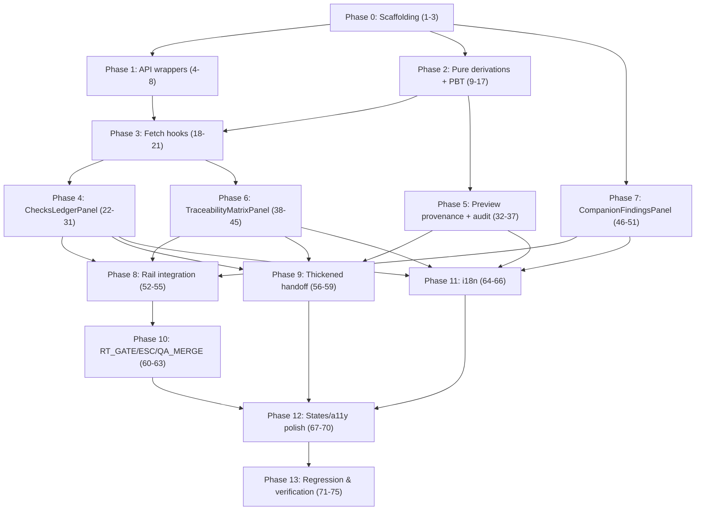

# Implementation Plan

## Overview

Read-only, additive frontend feature surfacing the v4 trust layer in the `/autopilot` cockpit.
Constraints for every task: do NOT modify `server/**`, backend contracts, or the five env gates;
reuse `@shared/blueprint/*` types; keep existing autopilot panel tests green; route all
user-facing strings through i18n. Each task is independently verifiable. Co-locate `*.test.ts(x)`
next to each new module. Phases are ordered for incremental, low-risk delivery: contracts →
wrappers → pure derivations → hooks → panels → integration → polish → verification.

## Tasks

## Phase 0 — Scaffolding & contracts

- [x] 1. Create the `right-rail/trust/` directory with a barrel `index.ts` and a co-located README header comment describing the read-only/pure discipline.
  - _Requirements: 14.2, 15.1_
- [x] 2. Add a `client/src/pages/autopilot/right-rail/trust/types.ts` for frontend-only view-model types.
  - [x] 2.1 Define `LedgerStageGroup`, `LedgerFilterState`.
  - [x] 2.2 Define `PreviewAuditVerdict`, `ProvenanceClass`.
  - [x] 2.3 Define `CompanionFindingGroup`.
  - [x] 2.4 Re-export the consumed `@shared/blueprint/*` types for a single import surface.
  - _Requirements: 1.5, 5.1, 6.1, 7.1, 8.1_
- [x] 3. Verify `@shared/blueprint/checks-ledger/types`, `/traceability-matrix/types`, `/preview-audit/types`, `/companion/types` are importable from `client/` (tsconfig path alias) with a throwaway type-only import test, then remove it.
  - _Requirements: 1.5, 14.4_

## Phase 1 — Read-only API wrappers (Req 1)

- [x] 4. Create `client/src/lib/blueprint-api/checks-ledger.ts`.
  - [x] 4.1 Implement `fetchChecksLedger(jobId, filters?, options?)` using `fetchJsonSafe`.
  - [x] 4.2 Build the URL `/api/blueprint/jobs/:jobId/checks-ledger` with `encodeURIComponent(jobId)`.
  - [x] 4.3 Append `stage`/`status`/`checkType` query params only when provided.
  - [x] 4.4 Return `{ ok:true, data } | { ok:false, error }`; type `data` as `BlueprintChecksLedgerResponse`.
  - [x] 4.5 Export `ChecksLedgerFilters` and `FetchChecksLedgerResult` types.
  - _Requirements: 1.1, 1.2, 1.5, 1.6_
- [x] 5. Create `client/src/lib/blueprint-api/traceability-matrix.ts`.
  - [x] 5.1 Implement `fetchTraceabilityMatrix(jobId, format?, options?)`.
  - [x] 5.2 JSON branch returns `{ ok:true, kind:"json", data: TraceabilityMatrix }`.
  - [x] 5.3 Markdown branch (`format==="markdown"`) returns `{ ok:true, kind:"markdown", data: string }`.
  - [x] 5.4 On 404 body `matrix_not_generated`/`job_not_found`, return `{ ok:false, notGenerated:true, error }`.
  - [x] 5.5 Export `FetchTraceabilityMatrixResult` type.
  - _Requirements: 1.3, 1.4, 1.6_
- [x] 6. Re-export `fetchChecksLedger`, `fetchTraceabilityMatrix` and their types from `client/src/lib/blueprint-api.ts`.
  - _Requirements: 1.1, 1.3_
- [x] 7. Unit tests for `fetchChecksLedger`.
  - [x] 7.1 Success path asserts URL + parsed response.
  - [x] 7.2 Filter params asserted in URL (stage/status/checkType, encoded).
  - [x] 7.3 Transport error path returns `{ ok:false }`.
  - _Requirements: 1.7_
- [x] 8. Unit tests for `fetchTraceabilityMatrix`.
  - [x] 8.1 JSON success.
  - [x] 8.2 Markdown success (correct Accept/branch + string body).
  - [x] 8.3 404 → `notGenerated:true`.
  - [x] 8.4 Transport error → `{ ok:false, notGenerated:false }`.
  - _Requirements: 1.7_

## Phase 2 — Pure derivations + property tests (Req 2–8, Correctness Properties)

- [x] 9. Create `right-rail/trust/group-ledger.ts`.
  - [x] 9.1 `groupLedgerByStage(entries)`.
  - [x] 9.2 `selectByCheckType(entries, checkType)`.
  - [x] 9.3 `sortWarnFailFirst(entries)` (stable, status-priority).
  - [x] 9.4 `applyLedgerFilters(entries, filterState)` (checkType + status, commutative).
  - _Requirements: 2.3, 2.4, 2.5, 3.1, 4.1_
- [x] 10. Property + unit tests for `group-ledger.ts`.
  - [x] 10.1 Property 1 — partition integrity (`groupLedgerByStage`).
  - [x] 10.2 Property 2 — stable status-priority ordering + idempotence (`sortWarnFailFirst`).
  - [x] 10.3 Property 6 — filter composition order-independence (`applyLedgerFilters`).
  - _Requirements: 2.3, 2.4, 2.5_
- [x] 11. Create `right-rail/trust/provenance.ts`.
  - [x] 11.1 `classifyProvenance(p)` → `model_ok | fallback | failed`.
  - [x] 11.2 `isPreviewUnverified()` constant-true label helper.
  - [x] 11.3 Defensive reads (never throw on partial/undefined provenance).
  - _Requirements: 5.1, 5.2, 5.3, 5.6_
- [x] 12. Property + unit tests for `provenance.ts`.
  - [x] 12.1 Property 3 — totality + fallback-fraud never `model_ok`.
  - _Requirements: 5.2, 5.3, 6.2_
- [x] 13. Create `right-rail/trust/preview-audit.ts`.
  - [x] 13.1 `derivePreviewAuditVerdict(ledgerEntries)` from `checkType==="preview_audit"`.
  - [x] 13.2 Parse fraud categories (fallback_pretending / fake_success / duplicate_content) from `checkName`/`output`.
  - [x] 13.3 Derive `retryCount` + `exhausted` from `preview_audit_retry_exhausted`/retry entries.
  - _Requirements: 6.1, 6.2, 6.3, 6.4_
- [x] 14. Property + unit tests for `preview-audit.ts`.
  - [x] 14.1 Property 4 — verdict reflects ledger, no-throw on missing optionals.
  - _Requirements: 6.1, 6.2, 6.4_
- [x] 15. Create `right-rail/trust/companion.ts`.
  - [x] 15.1 `selectCompanionFindings(job)` (safe on missing field).
  - [x] 15.2 `groupCompanionByStage(findings)`.
  - [x] 15.3 `sortBySeverity(findings)` (error > warn > info).
  - _Requirements: 8.1, 8.4, 8.6_
- [x] 16. Property + unit tests for `companion.ts`.
  - [x] 16.1 Property 5 — selector never throws + severity permutation ordering.
  - _Requirements: 8.1, 8.4_
- [x] 17. Export all derivations from `right-rail/trust/index.ts` barrel.
  - _Requirements: 14.4_

## Phase 3 — Fetch hooks (Req 13)

- [x] 18. Create `right-rail/hooks/use-checks-ledger.ts`.
  - [x] 18.1 jobId-keyed fetch via `fetchChecksLedger`; `AbortController` cleanup on jobId change/unmount.
  - [x] 18.2 State machine `idle|loading|ready|empty|error` (`empty` when `summary.total===0 && entries.length===0`).
  - [x] 18.3 `reload()` affordance.
  - [x] 18.4 No writes to the realtime store.
  - _Requirements: 13.1, 13.2, 13.3, 14.2_
- [x] 19. Create `right-rail/hooks/use-traceability-matrix.ts`.
  - [x] 19.1 jobId-keyed fetch; states `idle|loading|ready|not_generated|stale|error`.
  - [x] 19.2 `stale` derived from `matrix.stale`.
  - [x] 19.3 `reload()`.
  - _Requirements: 7.5, 7.6, 13.1, 13.3_
- [x] 20. Create `right-rail/hooks/use-companion-findings.ts` (pure selector over `job`, memoized).
  - _Requirements: 8.1, 14.2_
- [x] 21. Tests for hooks (loading→ready, jobId-change abort, empty/error/not_generated transitions) using existing hook test patterns.
  - _Requirements: 13.4_

## Phase 4 — ChecksLedgerPanel: QA_LEDGER hub (Req 2, 3, 4)

- [x] 22. Create `right-rail/panels/ChecksLedgerPanel.tsx` shell with props `{ jobId, locale }`.
  - _Requirements: 2.1_
- [x] 23. Summary header: `total/pass/warn/fail/skip` badges (icon+label, non-color-only).
  - _Requirements: 2.2, 15.3_
- [x] 24. Stage-grouped entry list via `groupLedgerByStage` + `sortWarnFailFirst`.
  - [x] 24.1 Render `checkName`, `checkType`, `status`, `validator`, `output` per entry.
  - [x] 24.2 warn/fail visual highlight.
  - _Requirements: 2.3, 2.4_
- [x] 25. Filter bar (checkType chips + status chips) wired to `applyLedgerFilters`.
  - _Requirements: 2.5_
- [x] 26. SP_INV section (preset `checkType==="invariant"`).
  - [x] 26.1 Show structural guard + `business_requirement_coverage` + `business_node_evidence`.
  - [x] 26.2 Render skip reasons from `output`.
  - _Requirements: 3.1, 3.2, 3.3, 3.4_
- [x] 27. QA_CONTENT section (preset `checkType==="content_quality"`): substance + EARS results.
  - _Requirements: 4.1, 4.2, 4.3_
- [x] 28. companion_trace cross-reference row inside ledger (links to Companion panel).
  - _Requirements: 8.7_
- [x] 29. States: loading / empty("校验台账未启用") / error(retry).
  - _Requirements: 2.6, 2.7, 13.1, 13.2, 13.3_
- [x] 30. Non-blocking framing copy ("评审信号，不自动拦截").
  - _Requirements: 2.8, 15.2_
- [x] 31. Component tests: summary, grouping, warn/fail highlight, filters, SP_INV/QA_CONTENT sections, gates-off empty, error.
  - _Requirements: 2.x, 3.x, 4.x, 13.4_

## Phase 5 — Preview provenance + audit (Req 5, 6)

- [x] 32. Create `client/src/components/autopilot/PreviewProvenanceChip.tsx` using `classifyProvenance`.
  - [x] 32.1 `model_ok` success variant.
  - [x] 32.2 `fallback`/`failed` non-success variant (distinct, non-color-only).
  - [x] 32.3 Surface `modelUsed`, `retryCount`, `errorIndicators`.
  - _Requirements: 5.1, 5.2, 5.3, 5.4, 15.3_
- [x] 33. Create `client/src/components/autopilot/PreviewAuditBadge.tsx` using `derivePreviewAuditVerdict`.
  - [x] 33.1 Batch verdict pass/fail.
  - [x] 33.2 Fraud categories chips.
  - [x] 33.3 Reforge status + `retryCount` + "回炉耗尽" state.
  - [x] 33.4 "用户自跑" accountability framing copy.
  - _Requirements: 6.1, 6.2, 6.3, 6.4, 6.6_
- [x] 34. Edit `EffectPreviewImagePanel.tsx` — additive integration.
  - [x] 34.1 Render `PreviewProvenanceChip` per image from `imageBase64ByNodeId[*].provenance`.
  - [x] 34.2 Persistent "预览·未验证 / preview · unverified" label on every image.
  - [x] 34.3 `failedProvenanceByNodeId` → "缺图/no image" state, NO placeholder image.
  - [x] 34.4 Do not alter existing image / `architectureSvgDraft` rendering.
  - _Requirements: 5.1, 5.5, 5.6, 5.7_
- [x] 35. Surface `PreviewAuditBadge` in `right-rail/panels/EffectPreviewPanel.tsx`.
  - [x] 35.1 Empty state when no preview_audit entries.
  - _Requirements: 6.1, 6.5_
- [x] 36. Component tests: provenance variants, unverified label, no-image (no placeholder), audit verdict + reforge + exhausted, empty.
  - _Requirements: 5.x, 6.x, 13.4_
- [x] 37. Regression: existing `EffectPreviewImagePanel` / effect-preview tests still pass unchanged.
  - _Requirements: 5.7, 14.3_

## Phase 6 — TraceabilityMatrixPanel (Req 7)

- [x] 38. Create `right-rail/panels/TraceabilityMatrixPanel.tsx` shell consuming `useTraceabilityMatrix`.
  - _Requirements: 7.1_
- [x] 39. Coverage indicator: `coveragePercent` ring + per-dimension counts.
  - _Requirements: 7.2_
- [x] 40. Five-column requirement↔design↔task↔evidence↔test table.
  - _Requirements: 7.3_
- [x] 41. Gap list from `coverage.gaps`/`uncoveredRequirements` (requirement + missing dims).
  - _Requirements: 7.4_
- [x] 42. Stale indicator when `matrix.stale`.
  - _Requirements: 7.5_
- [x] 43. `not_generated` empty state (404) with guidance.
  - _Requirements: 7.6, 13.2_
- [x] 44. Markdown export button → `fetchTraceabilityMatrix(jobId,"markdown")` → blob download (reuse `exportSpecDocuments.ts` download helper).
  - _Requirements: 7.7_
- [x] 45. Component tests: coverage render, table, gaps, stale, not-generated, export trigger, error.
  - _Requirements: 7.x, 13.4_

## Phase 7 — CompanionFindingsPanel (Req 8)

- [x] 46. Create `right-rail/panels/CompanionFindingsPanel.tsx` consuming `useCompanionFindings`.
  - _Requirements: 8.1_
- [x] 47. Finding card: role, severity, stage, findings, suggestedActions, citations.
  - _Requirements: 8.2_
- [x] 48. Grounding evidence: render `repoFilesRead[]` when present.
  - _Requirements: 8.3_
- [x] 49. Severity ordering (error/warn first) + stage grouping; info collapsible.
  - _Requirements: 8.4, 8.6_
- [x] 50. Empty state when no findings.
  - _Requirements: 8.5, 13.2_
- [x] 51. Component tests: card fields, repoFilesRead, severity order, stage grouping, empty.
  - _Requirements: 8.x, 13.4_

## Phase 8 — Right-rail integration (Req 10)

- [x] 52. Add new panels to `right-rail/panels/index.ts` barrel (named exports + props types).
  - _Requirements: 10.1, 14.4_
- [x] 53. Add a cross-cutting "Trust" section/tab group to `AutopilotRightRail.tsx` mounting ChecksLedger / TraceabilityMatrix / Companion.
  - [x] 53.1 Do NOT add new `AutopilotRailSubStage` values (preserve `resolve-rail-sub-stage.ts` contract + purity tests).
  - [x] 53.2 Availability gating: ledger/companion after spec_tree; matrix after spec docs; before then → empty states.
  - [x] 53.3 Wrap each panel in existing `CardErrorBoundary`.
  - _Requirements: 10.1, 10.2, 13.3_
- [x] 54. Confirm `resolveActiveAutopilotPage` / `readAutopilotWorkflowStage` unchanged; existing panels intact.
  - _Requirements: 10.3, 10.4, 14.3_
- [x] 55. Integration tests: Trust tabs appear with availability gating; existing rail tabs unaffected.
  - _Requirements: 10.x, 14.3_

## Phase 9 — Thickened handoff bundle (Req 9)

- [x] 56. Edit `right-rail/panels/EngineeringHandoffPanel.tsx` — add Trust bundle sections.
  - [x] 56.1 Checks-ledger summary section.
  - [x] 56.2 Traceability matrix section (+ markdown export).
  - [x] 56.3 Visual previews with provenance source labels.
  - _Requirements: 9.1, 9.3_
- [x] 57. "未决项 / open items" section = ledger warn/fail + matrix gaps.
  - _Requirements: 9.2_
- [x] 58. Keep existing spec md/zip export intact; graceful omission when artifacts unavailable.
  - _Requirements: 9.4, 9.5_
- [x] 59. Component tests for thickened bundle + graceful omission.
  - _Requirements: 9.x, 13.4_

## Phase 10 — RT_GATE / ESC / QA_MERGE (Req 11)

- [x] 60. RT_GATE: explicit route confirm-gate affordance at route-selection (presentational emphasis over existing `selectBlueprintRoute`).
  - _Requirements: 11.1_
- [x] 61. ESC: abort/escalate control wired to existing replan/escalation where available; else clearly-labeled informational placeholder (no fabricated success).
  - _Requirements: 11.2, 11.4_
- [x] 62. QA_MERGE: read-only merge-gate status derived from ledger test + content_quality results, framed as human-judged.
  - _Requirements: 11.3_
- [x] 63. Component tests for the three controls incl. informational-only states.
  - _Requirements: 11.x, 13.4_

## Phase 11 — Internationalization (Req 12)

- [x] 64. Add all new zh-CN/en-US strings to `client/src/lib/blueprint-copy.ts` preserving v4 terminology.
  - _Requirements: 12.1, 12.3_
- [x] 65. Audit new panels for hard-coded literals; route every user-facing string through i18n.
  - _Requirements: 12.2_
- [x] 66. Test: snapshot both locales for each new panel header/labels.
  - _Requirements: 12.1_

## Phase 12 — States, accessibility, faithfulness polish (Req 13, 15)

- [x] 67. Verify each panel implements loading/empty/error/(stale) and gates-off "未启用" distinct from "no data".
  - _Requirements: 13.1, 13.2_
- [x] 68. Accessibility pass: semantic roles, keyboard focus, contrast, non-color-only status on all new chips/badges/controls.
  - _Requirements: 15.3_
- [x] 69. Styling consistency pass: glass-panel/token usage matches existing rail panels.
  - _Requirements: 15.4_
- [x] 70. Faithfulness review against v4 diagram (ledger aggregation, audit→reforge loop, human-is-the-gate framing).
  - _Requirements: 15.1, 15.2_

## Phase 13 — Regression & verification (Req 14)

- [x] 71. Confirm zero changes under `server/**` and no backend-contract edits (git diff scope check).
  - _Requirements: 14.1_
- [x] 72. Confirm no new realtime-store truth source introduced (hooks hold local state only).
  - _Requirements: 14.2_
- [x] 73. Run the autopilot client test suite; confirm existing tests green and new tests pass.
  - _Requirements: 14.3, 14.4_
- [x] 74. Run `node --run check`; confirm no new TypeScript errors attributable to this feature.
  - _Requirements: 14.4_
- [x] 75. Manual smoke against `/autopilot` with a real gates-on job: ledger/matrix/companion/provenance/audit all render with real data; gates-off renders "未启用".
  - _Requirements: 2.x, 5.x, 6.x, 7.x, 8.x, 13.2_

## Task Dependency Graph



Critical path: P0 → P2 → P3 → P4 → P8 → P9 → P12 → P13. Phases 5/6/7 can proceed in parallel
once their upstream (P2/P3) is ready. P11 (i18n) folds in continuously but is gated as a sweep
after the panels exist.

```json
{
  "waves": [
    { "wave": 1, "tasks": ["1", "2", "3"] },
    { "wave": 2, "tasks": ["4", "5", "6", "7", "8", "9", "10", "11", "12", "13", "14", "15", "16", "17"] },
    { "wave": 3, "tasks": ["18", "19", "20", "21"] },
    { "wave": 4, "tasks": ["22", "23", "24", "25", "26", "27", "28", "29", "30", "31", "32", "33", "34", "35", "36", "37", "38", "39", "40", "41", "42", "43", "44", "45", "46", "47", "48", "49", "50", "51"] },
    { "wave": 5, "tasks": ["52", "53", "54", "55"] },
    { "wave": 6, "tasks": ["56", "57", "58", "59", "60", "61", "62", "63"] },
    { "wave": 7, "tasks": ["64", "65", "66"] },
    { "wave": 8, "tasks": ["67", "68", "69", "70"] },
    { "wave": 9, "tasks": ["71", "72", "73", "74", "75"] }
  ]
}
```

## Notes

- **Read-only guarantee**: no task edits `server/**`, backend contracts, or env gates (enforced
  by task 71's git-scope check).
- **Type reuse**: all data types come from `@shared/blueprint/{checks-ledger,traceability-matrix,preview-audit,companion}/types`; frontend only adds view-model types.
- **Purity discipline**: everything under `right-rail/trust/` is IO-free, deterministic, and
  total — these are the property-based-testing targets (design §Correctness Properties).
- **Non-blocking framing**: panels present `warn`/`fail` as review signals; never imply
  auto-block (v4 "人是闸").
- **Gates-off**: each panel renders an explicit "未启用 / not enabled" state distinct from
  "no data yet".
- **No new truth source**: fetch hooks hold local state; companion findings derive from the
  existing job payload; nothing writes a parallel mission/runtime store.
- **Verification gate**: Phase 13 must pass (existing tests green, `node --run check` no new
  errors, real gates-on smoke) before the feature is considered done.
