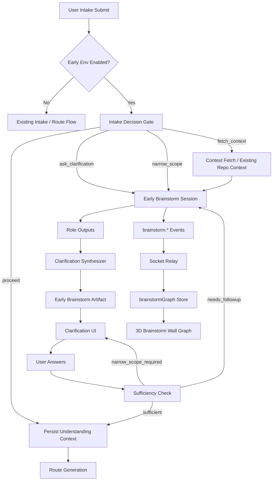

# Design Document: Early Intake Clarification Brainstorm

## Overview

本设计在 input / clarification 阶段新增完整早期多智能体会话，并将会话过程接入页面 3D 可视化图谱。目标不是替换现有 route generation，而是在 route generation 之前先完成需求理解、风险识别、澄清问题生成与充分性判断。

现有 `brainstorm-pipeline-hookup` 处理后续产物阶段，本设计新增 early-stage controller。early controller 复用现有 brainstorm orchestrator、event bus、memory store、socket relay 与前端 graph store/graph component，但不复用 `wrapTypedBlueprintStage()`，因为 input / clarification 输出不是普通 stage string，而是决策与问题集合。

## Architecture



## Key Decisions

| Decision | Choice | Rationale |
| --- | --- | --- |
| Scope | input + clarification + 3D graph in v1 | Matches product need: early reasoning must be visible. |
| Gating | Separate `BLUEPRINT_EARLY_BRAINSTORM_*` env vars | Early behavior differs from stage wrapper and needs independent rollout. |
| Backend boundary | New early-stage controller | Avoid forcing input / clarification into typed stage wrapper semantics. |
| Visualization | Mount `BrainstormWallGraphConnected` in default scene | User should see collaboration without debug toggles. |
| Degradation | Existing clarification flow fallback | Early brainstorm must never block blueprint generation. |

## Backend Components

### Early Config Resolver

File: `server/routes/blueprint/brainstorm/early-stage-config.ts`

Responsibilities:

- Resolve master and per-stage early switches.
- Disable by default in `BUILD_TARGET=test`.
- Expose `isEarlyInputBrainstormEnabled()` and `isEarlyClarificationBrainstormEnabled()`.

### Intake Decision Gate

File: `server/routes/blueprint/brainstorm/early-intake-decision-gate.ts`

Input:

- Raw intake target text.
- Github URLs / project context / clarification session if present.
- Existing context fetch summary when available.

Output:

```ts
interface EarlyIntakeDecision {
  action:
    | "proceed_to_route_generation"
    | "ask_clarification"
    | "narrow_scope"
    | "fetch_context";
  reason: string;
  missingInformation: string[];
  confidence: number;
}
```

The gate should bias toward existing behavior when confidence is low.

### Early Session Orchestrator

File: `server/routes/blueprint/brainstorm/early-session-orchestrator.ts`

Responsibilities:

- Start a brainstorm session with early roles.
- Reuse existing `BrainstormOrchestrator` where possible.
- Emit normal `brainstorm.*` events through `BlueprintEventBus`.
- Enforce timeout and degradation.

Roles:

- `product_strategist`
- `system_architect`
- `risk_auditor`
- `delivery_planner`
- `ux_interviewer`

### Clarification Synthesizer

File: `server/routes/blueprint/brainstorm/early-clarification-synthesizer.ts`

Output:

```ts
interface EarlyClarificationSynthesis {
  understandingSummary: string;
  assumptions: string[];
  openQuestions: EarlyClarificationQuestion[];
  riskNotes: string[];
  recommendedNextAction:
    | "ask_clarification"
    | "proceed_to_route_generation"
    | "narrow_scope";
}
```

It deduplicates questions, caps user-facing questions, and converts low-priority ambiguity into assumptions or risk notes.

### Sufficiency Check

File: `server/routes/blueprint/brainstorm/early-sufficiency-check.ts`

Input:

- Original request.
- Generated questions.
- User answers.
- Current assumptions and risk notes.

Output:

```ts
interface EarlySufficiencyResult {
  status: "sufficient" | "needs_followup" | "narrow_scope_required";
  reason: string;
  followUpQuestions: EarlyClarificationQuestion[];
  contextPackage?: EarlyRouteContextPackage;
}
```

### Artifact and Replay

File: `server/routes/blueprint/brainstorm/early-brainstorm-artifact.ts`

Artifact type: `early_brainstorm`

The artifact stores session result and is referenced by downstream route generation. Replay can reuse the existing brainstorm memory store endpoint shape when possible.

## API Changes

Recommended routes:

```txt
POST /api/blueprint/intake/:intakeId/early-brainstorm
POST /api/blueprint/clarifications/:sessionId/brainstorm
POST /api/blueprint/clarifications/:sessionId/answers
GET  /api/blueprint/jobs/:jobId/brainstorm/:sessionId
```

The existing clarification answer route may remain the public entrypoint if it can invoke sufficiency checks internally without changing its response contract.

## Frontend Design

### Event Store Wiring

Files:

- `client/src/lib/brainstorm-graph-store.ts`
- `client/src/lib/blueprint-realtime-store.ts`

The realtime layer should route `brainstorm.*` events to `useBrainstormGraphStore`. The store must tolerate duplicates and out-of-order updates.

### 3D Graph Mount

Files:

- `client/src/components/three/scene-fusion/BrainstormWallGraph.tsx`
- `client/src/components/three/BlueprintRuntimeAgents.tsx`

Mount `BrainstormWallGraphConnected` in the default blueprint scene. It should render only when the graph store status is not `idle`.

Placement requirements:

- The graph should sit on the blueprint wall plane or another stable background surface.
- It must not overlap runtime pets, stage labels, or connection lines in a way that makes the scene unreadable.
- It must be visible in the normal input / clarification flow.

### Clarification UI

The existing clarification panel should render generated questions with:

- Question text.
- Priority.
- Optional concise reason.
- Optional default assumption action.

The UI should still show fallback questions when brainstorm degrades.

## Data Flow

1. User submits intake.
2. Router checks early env flags.
3. Decision gate selects action.
4. If clarification is needed, early session starts.
5. Events flow through `BlueprintEventBus` and Socket.IO.
6. Frontend graph store consumes events.
7. 3D graph renders live session state.
8. Synthesizer emits structured clarification questions.
9. User answers.
10. Sufficiency check creates route context package.
11. Route generation consumes the package.

## Error Handling

- Gate failure: log warn, use existing flow.
- Session timeout: emit `brainstorm.degraded`, show fallback questions.
- Synthesizer invalid output: emit degraded event, use existing clarification generator.
- Socket/graph failure: page remains usable; questions still render as normal UI.
- Route context package parse failure: ignore early context and continue route generation.

## Testing Strategy

Unit tests:

- Early config resolver.
- Intake decision gate parse/degrade behavior.
- Clarification question synthesis and dedupe.
- Sufficiency check.
- Artifact serialization.

Property tests:

- Question dedupe never increases unique semantic keys.
- Duplicate/out-of-order brainstorm events do not corrupt graph store.
- Disabled flags preserve existing behavior.

Integration tests:

- Intake with early brainstorm enabled creates session and artifact.
- Clarification answers run sufficiency check.
- Degraded session falls back.
- Route generation receives early context package.

Frontend tests:

- Graph store handles started/node/completed/degraded.
- `BrainstormWallGraphConnected` renders non-idle sessions.
- Scene includes graph component when session is active.
- Clarification UI displays synthesized questions.

## Rollout

Default disabled.

Enable sequence:

1. `BLUEPRINT_EARLY_BRAINSTORM_ENABLED=true`
2. `BLUEPRINT_EARLY_BRAINSTORM_CLARIFICATION_ENABLED=true`
3. `BLUEPRINT_EARLY_BRAINSTORM_INPUT_ENABLED=true`

Start with clarification-only in staging if latency is high, but the v1 implementation includes both input and clarification plus 3D graph support.

