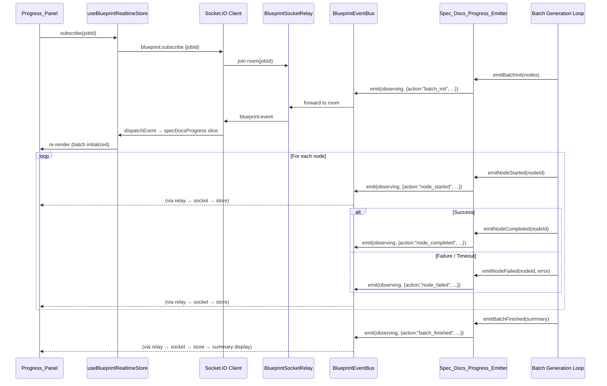
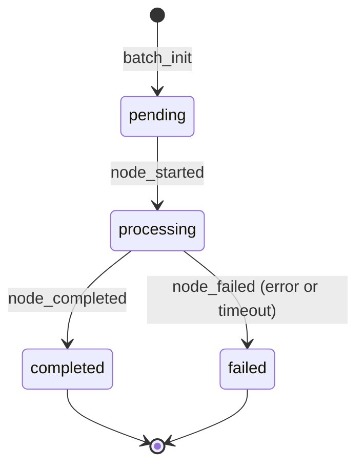

# Design Document: Spec Docs Generation Progress Feedback

## Overview

This design extends the existing `BlueprintEventBus` → `BlueprintSocketRelay` → `useBlueprintRealtimeStore` real-time pipeline to provide per-node progress feedback during batch spec document generation ("全部生成"). The system introduces a `Spec_Docs_Progress_Emitter` on the server that emits structured per-node lifecycle events (`pending → processing → completed/failed`) through the existing `spec_docs` stage, and a frontend `Progress_Panel` that consumes these events via a new `specDocsProgress` slice in the realtime store.

Key design decisions:
- **Reuse existing infrastructure**: No new socket channels or event families. All progress events flow through the existing `role.agent.observing` event type within the `role` family, using structured `payload` metadata to encode per-node state transitions.
- **Separation of concerns**: The HTTP response format (`BlueprintSpecDocumentsResponse`) remains unchanged. Progress metadata is delivered exclusively via WebSocket events.
- **Error resilience**: Individual node failures are caught, emitted as `node-failed` events, and the batch loop continues processing remaining nodes.
- **Single-node compatibility**: When a single node is generated (explicit `nodeId`), no batch progress events are emitted.

## Architecture

### System Diagram



### Component Architecture

```
Server Side:
  spec-docs-llm-generation.ts (batch loop)
    └── createSpecDocsProgressEmitter(eventBus, jobId)
          ├── emitBatchInit(totalCount, nodeIds)
          ├── emitNodeStarted(nodeId, title, position)
          ├── emitNodeCompleted(nodeId, completedCount)
          ├── emitNodeFailed(nodeId, errorSummary, completedCount)
          └── emitBatchFinished(completedCount, failedCount, elapsedMs)

Client Side:
  useBlueprintRealtimeStore
    └── specDocsProgress slice
          ├── batchStatus: "idle" | "running" | "finished"
          ├── totalCount: number
          ├── completedCount: number
          ├── processedCount: number
          ├── nodes: Map<nodeId, NodeProgressEntry>
          └── summary: BatchSummary | null

  SpecDocsProgressPanel (new component)
    ├── CompletionCounter ("3/8 已完成")
    ├── NodeProgressList
    │     ├── NodeProgressItem (pending | processing | completed | failed)
    │     └── ErrorTooltip (on failed nodes)
    └── BatchSummaryLine (on finish)
```

## Components and Interfaces

### Server: Spec Docs Progress Emitter

**File:** `server/routes/blueprint/spec-docs-progress-emitter.ts`

The emitter delegates to the existing `createStageProgressEmitter` utility's `observing()` method, extending it with structured `payload` metadata for per-node progress. This avoids bypassing the typed event infrastructure and eliminates the need for `as never` casts.

**Required extension to `StageProgressEmitter`:** The existing `observing(success, summary)` method must be extended to accept an optional third argument `extraPayload?: Record<string, unknown>` which is merged into the event's `payload` field alongside the standard `iteration`, `roleId`, `stageId` fields. This is a backward-compatible additive change — existing callers that pass only 2 arguments continue to work unchanged.

**No-op strategy:** The factory requires a valid `eventBus` — it does NOT accept `undefined`. The calling site (`generateSpecDocuments`) is responsible for the no-op path via `isBatchRequest && ctx?.eventBus ? createSpecDocsProgressEmitter(...) : undefined` with optional chaining on all method calls. This matches the existing pattern used by other stage emitters in the codebase.

```typescript
import type { BlueprintEventBus } from "./event-bus.js";
import { createStageProgressEmitter, type StageProgressEmitter } from "./stage-progress-emitter.js";

/**
 * Per-node progress action types encoded in the observing event payload.
 */
export type SpecDocsProgressAction =
  | "batch_init"
  | "node_started"
  | "node_completed"
  | "node_failed"
  | "batch_finished";

export interface SpecDocsProgressEmitter {
  /** Emit batch initialization with total node count and ordered node IDs. */
  emitBatchInit(totalCount: number, nodeIds: string[]): void;
  /** Emit that a specific node has started processing. */
  emitNodeStarted(nodeId: string, title: string, position: number): void;
  /** Emit that a specific node completed successfully. */
  emitNodeCompleted(nodeId: string, completedCount: number): void;
  /** Emit that a specific node failed with processedCount. */
  emitNodeFailed(nodeId: string, errorSummary: string, processedCount: number): void;
  /** Emit that the entire batch has finished. */
  emitBatchFinished(completedCount: number, failedCount: number, elapsedMs: number): void;
}

/**
 * Creates a spec docs progress emitter that wraps the existing
 * createStageProgressEmitter and encodes per-node metadata in the
 * observing event's structured payload.
 *
 * Uses stage="spec_docs", role="generator" to match existing conventions.
 * All events use the `observing()` method from StageProgressEmitter which
 * internally emits `BlueprintEventName.RoleAgentObserving` events through
 * the typed event bus — no `as never` casts needed.
 *
 * The structured `payload` is passed as the third argument to `observing()`,
 * which the existing StageProgressEmitter merges into the event payload.
 *
 * @param eventBus Required — must be a valid BlueprintEventBus instance.
 *   Callers use optional chaining when eventBus may be absent.
 * @param jobId The blueprint job ID for event correlation.
 */
export function createSpecDocsProgressEmitter(
  eventBus: BlueprintEventBus,
  jobId: string,
): SpecDocsProgressEmitter {
  const baseEmitter: StageProgressEmitter = createStageProgressEmitter(
    eventBus, jobId, "spec_docs", "generator"
  );

  return {
    emitBatchInit(totalCount: number, nodeIds: string[]) {
      baseEmitter.observing(true, `开始批量生成 ${totalCount} 个节点的规格文档`, {
        progressAction: "batch_init",
        totalCount,
        nodeIds,
      });
    },

    emitNodeStarted(nodeId: string, title: string, position: number) {
      baseEmitter.observing(true, `[${position}] 正在生成: ${title.slice(0, 200)}`, {
        progressAction: "node_started",
        nodeId,
        nodeTitle: title.slice(0, 200),
        position,
      });
    },

    emitNodeCompleted(nodeId: string, completedCount: number) {
      baseEmitter.observing(true, `✓ 节点完成 (${completedCount} 已完成)`, {
        progressAction: "node_completed",
        nodeId,
        completedCount,
      });
    },

    emitNodeFailed(nodeId: string, errorSummary: string, processedCount: number) {
      baseEmitter.observing(false, `✗ 节点失败: ${errorSummary.slice(0, 400)}`, {
        progressAction: "node_failed",
        nodeId,
        errorSummary: errorSummary.slice(0, 400),
        processedCount,
      });
    },

    emitBatchFinished(completedCount: number, failedCount: number, elapsedMs: number) {
      baseEmitter.observing(true, `批量生成完成: ${completedCount} 成功, ${failedCount} 失败, 耗时 ${elapsedMs}ms`, {
        progressAction: "batch_finished",
        completedCount,
        failedCount,
        elapsedMs,
      });
    },
  };
}
```

### Server: Integration with Batch Generation Loop

**File:** `server/routes/blueprint.ts` — inside `generateSpecDocuments()` (NOT inside `spec-docs-llm-generation.ts`)

The integration point is the `generateSpecDocuments()` function which is the single entry point for both batch ("全部生成") and single-node generation. The key distinction:
- **Batch request**: `request.nodeId == null` — progress events are emitted
- **Single-node request**: `request.nodeId != null` — no progress events (Req 5.1)

This ensures progress feedback works regardless of whether the LLM factory path is enabled, disabled, or unavailable. The emitter wraps the entire `Promise.all(targetNodes.flatMap(...buildSpecDocument))` loop, not just the LLM sub-path.

```typescript
// Inside generateSpecDocuments(), AFTER targetNodes is computed,
// BEFORE the LLM batch and Promise.all:

const isBatchRequest = request.nodeId == null;
const progressEmitter = isBatchRequest && ctx?.eventBus
  ? createSpecDocsProgressEmitter(ctx.eventBus, job.id)
  : undefined;

// Zero-node early exit (Req 1.6)
if (isBatchRequest && targetNodes.length === 0) {
  progressEmitter?.emitBatchFinished(0, 0, 0);
  // ... return empty response
}

// Batch init (Req 1.1) — emitted before any generation starts
if (progressEmitter) {
  progressEmitter.emitBatchInit(
    targetNodes.length,
    targetNodes.map(n => n.id),
  );
}

const batchStartTime = Date.now();
let completedCount = 0;
let failedCount = 0;

// Replace the existing Promise.all with a sequential loop for batch,
// preserving Promise.all for single-node (no progress needed):
const documents: BlueprintSpecDocument[] = [];

if (progressEmitter) {
  // Batch path: sequential per-node with progress events and timeout
  for (let i = 0; i < targetNodes.length; i++) {
    const node = targetNodes[i];
    progressEmitter.emitNodeStarted(node.id, node.title ?? node.id, i + 1);

    try {
      const nodeDocuments = await Promise.race([
        Promise.all(
          targetTypes.map(type =>
            buildSpecDocument(ctx, { job, specTree, node, type, createdAt, ... })
          )
        ),
        createNodeTimeout(120_000), // 120s timeout per node (Req 6.5)
      ]);

      if (nodeDocuments === TIMEOUT_SENTINEL) {
        throw new Error("节点生成超时 (120s)");
      }

      documents.push(...nodeDocuments);
      completedCount++;
      progressEmitter.emitNodeCompleted(node.id, completedCount);
    } catch (err) {
      failedCount++;
      const errorMsg = err instanceof Error ? err.message : String(err);
      const processedCount = completedCount + failedCount;
      progressEmitter.emitNodeFailed(node.id, errorMsg, processedCount);
      // Continue to next node (Req 6.1)
    }
  }

  // Batch finished (Req 1.5)
  const elapsedMs = Date.now() - batchStartTime;
  progressEmitter.emitBatchFinished(completedCount, failedCount, elapsedMs);
} else {
  // Single-node path OR no eventBus: existing Promise.all behavior unchanged
  const allDocs = await Promise.all(
    targetNodes.flatMap(node =>
      targetTypes.map(type => buildSpecDocument(ctx, { job, specTree, node, type, createdAt, ... }))
    )
  );
  documents.push(...allDocs);
}
```

**Key design decisions for integration point:**
1. The emitter lives at `generateSpecDocuments()` level, NOT inside `specDocsLlmGeneration.generate()`. This ensures progress works for template-only, LLM-only, and mixed paths.
2. `isBatchRequest` is determined by `request.nodeId == null` — this is the only reliable signal. A batch with 1 node still gets progress events; an explicit single-node request never does.
3. The LLM factory (`specDocsLlmGeneration.generate()`) is called BEFORE the per-node loop if enabled, producing `llmNodeOutputById`. The per-node loop then uses those outputs (or falls back to template) — progress events wrap the final document assembly regardless of source.

### Client: Realtime Store — specDocsProgress Slice

**File:** `client/src/lib/blueprint-realtime-store.ts` (extension)

```typescript
// ─── Spec Docs Progress Types ─────────────────────────────────────────────

export type SpecDocsNodeStatus = "pending" | "processing" | "completed" | "failed";

export interface SpecDocsNodeEntry {
  nodeId: string;
  title: string;
  position: number;
  status: SpecDocsNodeStatus;
  errorSummary?: string;
}

export interface SpecDocsBatchSummary {
  completedCount: number;
  failedCount: number;
  elapsedMs: number;
}

export interface SpecDocsProgressState {
  batchStatus: "idle" | "running" | "finished";
  totalCount: number;
  completedCount: number;
  processedCount: number;
  nodeOrder: string[];  // Ordered list of node IDs
  nodes: Record<string, SpecDocsNodeEntry>;
  summary: SpecDocsBatchSummary | null;
  dismissed: boolean;   // User explicitly dismissed the panel (Req 3.7)
}

const INITIAL_SPEC_DOCS_PROGRESS: SpecDocsProgressState = {
  batchStatus: "idle",
  totalCount: 0,
  completedCount: 0,
  processedCount: 0,
  nodeOrder: [],
  nodes: {},
  summary: null,
  dismissed: false,
};

// ─── State Machine Transitions ────────────────────────────────────────────

const VALID_TRANSITIONS: Record<SpecDocsNodeStatus, SpecDocsNodeStatus[]> = {
  pending: ["processing"],
  processing: ["completed", "failed"],
  completed: [],
  failed: [],
};

function isValidTransition(from: SpecDocsNodeStatus, to: SpecDocsNodeStatus): boolean {
  return VALID_TRANSITIONS[from].includes(to);
}
```

### Client: specDocsProgress Dispatch Logic

```typescript
// Inside dispatchEvent handler, detect spec_docs progress events:

function handleSpecDocsProgressEvent(event: RelayedEvent, set: SetState, get: GetState): void {
  const payload = event.payload as Record<string, unknown> | undefined;
  if (!payload || payload.stageId !== "spec_docs" || !payload.progressAction) return;

  const action = payload.progressAction as SpecDocsProgressAction;

  switch (action) {
    case "batch_init": {
      const totalCount = Math.min(Number(payload.totalCount) || 0, 200);
      const nodeIds = Array.isArray(payload.nodeIds) ? payload.nodeIds as string[] : [];
      const nodes: Record<string, SpecDocsNodeEntry> = {};
      for (const id of nodeIds) {
        nodes[id] = { nodeId: id, title: "", position: 0, status: "pending" };
      }
      set({
        specDocsProgress: {
          batchStatus: "running",
          totalCount,
          completedCount: 0,
          processedCount: 0,
          nodeOrder: nodeIds,
          nodes,
          summary: null,
          dismissed: false, // Reset dismiss state on new batch (Req 2.6)
        },
      });
      break;
    }

    case "node_started": {
      const { nodeId, nodeTitle, position } = payload as any;
      const state = get().specDocsProgress;
      if (!state.nodes[nodeId]) break; // Unknown node (Req 2.8)
      if (!isValidTransition(state.nodes[nodeId].status, "processing")) break; // (Req 2.7)
      set({
        specDocsProgress: {
          ...state,
          nodes: {
            ...state.nodes,
            [nodeId]: {
              ...state.nodes[nodeId],
              status: "processing",
              title: String(nodeTitle ?? "").slice(0, 200),
              position: Number(position) || 0,
            },
          },
        },
      });
      break;
    }

    case "node_completed": {
      const { nodeId, completedCount } = payload as any;
      const state = get().specDocsProgress;
      if (!state.nodes[nodeId]) break;
      if (!isValidTransition(state.nodes[nodeId].status, "completed")) break;
      set({
        specDocsProgress: {
          ...state,
          completedCount: Number(completedCount) || state.completedCount + 1,
          processedCount: state.processedCount + 1,
          nodes: {
            ...state.nodes,
            [nodeId]: { ...state.nodes[nodeId], status: "completed" },
          },
        },
      });
      break;
    }

    case "node_failed": {
      const { nodeId, errorSummary } = payload as any;
      const state = get().specDocsProgress;
      if (!state.nodes[nodeId]) break;
      if (!isValidTransition(state.nodes[nodeId].status, "failed")) break;
      set({
        specDocsProgress: {
          ...state,
          processedCount: state.processedCount + 1,
          nodes: {
            ...state.nodes,
            [nodeId]: {
              ...state.nodes[nodeId],
              status: "failed",
              errorSummary: String(errorSummary ?? "").slice(0, 500),
            },
          },
        },
      });
      break;
    }

    case "batch_finished": {
      const { completedCount, failedCount, elapsedMs } = payload as any;
      const state = get().specDocsProgress;
      set({
        specDocsProgress: {
          ...state,
          batchStatus: "finished",
          summary: {
            completedCount: Number(completedCount) || 0,
            failedCount: Number(failedCount) || 0,
            elapsedMs: Number(elapsedMs) || 0,
          },
        },
      });
      break;
    }
  }
}
```

### Client: Progress Panel Component

**File:** `client/src/pages/autopilot/right-rail/spec-docs-progress/SpecDocsProgressPanel.tsx`

```typescript
import { useBlueprintRealtimeStore } from "@/lib/blueprint-realtime-store";
import type { SpecDocsNodeStatus } from "@/lib/blueprint-realtime-store";

export function SpecDocsProgressPanel(): JSX.Element | null {
  const progress = useBlueprintRealtimeStore(s => s.specDocsProgress);
  const dismissProgress = useBlueprintRealtimeStore(s => s.dismissSpecDocsProgress);

  // Panel hidden when idle or explicitly dismissed (Req 3.7)
  if (progress.batchStatus === "idle" || progress.dismissed) return null;

  return (
    <div className="spec-docs-progress-panel glass-panel">
      <div className="progress-header">
        <CompletionCounter
          processed={progress.processedCount}
          total={progress.totalCount}
        />
        {progress.batchStatus === "finished" && (
          <button
            className="dismiss-btn"
            onClick={dismissProgress}
            aria-label="关闭进度面板"
          >
            ✕
          </button>
        )}
      </div>
      <NodeProgressList
        nodeOrder={progress.nodeOrder}
        nodes={progress.nodes}
      />
      {progress.batchStatus === "finished" && progress.summary && (
        <BatchSummaryLine summary={progress.summary} />
      )}
    </div>
  );
}

function CompletionCounter({ processed, total }: { processed: number; total: number }) {
  return (
    <div className="completion-counter">
      <span className="count">{processed}/{total}</span>
      <span className="label"> 已完成</span>
    </div>
  );
}

function NodeProgressList({ nodeOrder, nodes }: {
  nodeOrder: string[];
  nodes: Record<string, { status: SpecDocsNodeStatus; title: string; errorSummary?: string }>;
}) {
  return (
    <ul className="node-progress-list">
      {nodeOrder.map(nodeId => {
        const node = nodes[nodeId];
        if (!node) return null;
        return (
          <li key={nodeId} className={`node-item node-${node.status}`}>
            <StatusIndicator status={node.status} />
            <span className="node-title">{node.title || nodeId}</span>
            {node.status === "failed" && node.errorSummary && (
              <ErrorTooltip message={node.errorSummary.slice(0, 200)} />
            )}
          </li>
        );
      })}
    </ul>
  );
}

function BatchSummaryLine({ summary }: { summary: { completedCount: number; failedCount: number; elapsedMs: number } }) {
  const formatted = formatElapsedTime(summary.elapsedMs);
  return (
    <div className="batch-summary">
      <span className="success">{summary.completedCount} 成功</span>
      {summary.failedCount > 0 && <span className="failure">, {summary.failedCount} 失败</span>}
      <span className="elapsed"> · {formatted}</span>
    </div>
  );
}

function formatElapsedTime(ms: number): string {
  const totalSeconds = Math.floor(ms / 1000);
  const hours = Math.floor(totalSeconds / 3600);
  const minutes = Math.floor((totalSeconds % 3600) / 60);
  const seconds = totalSeconds % 60;
  if (hours > 0) return `${hours}:${String(minutes).padStart(2, "0")}:${String(seconds).padStart(2, "0")}`;
  return `${minutes}:${String(seconds).padStart(2, "0")}`;
}
```

**Store action for dismiss (Req 3.7):**

```typescript
// Added to useBlueprintRealtimeStore actions:
dismissSpecDocsProgress: () => {
  set(state => ({
    specDocsProgress: { ...state.specDocsProgress, dismissed: true },
  }));
},
```

The panel remains visible after batch finishes until:
1. User clicks the dismiss button (sets `dismissed: true`)
2. User navigates away (component unmounts)
3. A new batch starts (resets entire slice including `dismissed: false`)

## Data Models

### Event Payload Schema (Server → Client via Socket.IO)

All spec docs progress events are encoded as `role.agent.observing` events (emitted via `StageProgressEmitter.observing()`) with the following structured `payload`:

```typescript
interface SpecDocsProgressPayload {
  /** Discriminator for the progress action type. */
  progressAction: SpecDocsProgressAction;
  /** Stage identifier — always "spec_docs" (injected by StageProgressEmitter). */
  stageId: "spec_docs";
  /** Role identifier — always "generator" (injected by StageProgressEmitter). */
  roleId: "generator";
  /** Current iteration counter from base emitter (injected by StageProgressEmitter). */
  iteration: number;

  // ─── batch_init ─────────────────────────────────────────────
  totalCount?: number;       // Total nodes in batch (max 200)
  nodeIds?: string[];        // Ordered list of node IDs

  // ─── node_started ───────────────────────────────────────────
  nodeId?: string;           // Node being processed
  nodeTitle?: string;        // Truncated to 200 chars
  position?: number;         // 1-indexed position in queue

  // ─── node_completed ─────────────────────────────────────────
  // nodeId (reused)
  completedCount?: number;   // Updated completed count (success only)

  // ─── node_failed ────────────────────────────────────────────
  // nodeId (reused)
  errorSummary?: string;     // Truncated to 400 chars
  processedCount?: number;   // completedCount + failedCount so far

  // ─── batch_finished ─────────────────────────────────────────
  completedCount?: number;   // Total successful nodes
  failedCount?: number;      // Total failed nodes
  elapsedMs?: number;        // Total batch duration in ms
  // Invariant: completedCount + failedCount === totalCount
}
```

**Counter terminology:**
- `completedCount`: Number of nodes that finished successfully (only incremented on success)
- `failedCount`: Number of nodes that failed (error or timeout)
- `processedCount`: `completedCount + failedCount` — total nodes that have reached a terminal state
- Invariant at batch_finished: `completedCount + failedCount === totalCount`
- The `node_failed` event carries `processedCount` (not `completedCount`) to avoid confusion

### State Machine: Node Status Transitions



Valid transitions are strictly enforced in the store (Req 2.7):
- `pending` → `processing` (only)
- `processing` → `completed` or `failed` (only)
- Terminal states (`completed`, `failed`) accept no further transitions

### Store Reset Behavior (Req 2.6)

When a new batch generation is initiated for the same job, the store resets the `specDocsProgress` slice to `INITIAL_SPEC_DOCS_PROGRESS` before processing the new `batch_init` event. This is triggered by receiving a `batch_init` action while `batchStatus` is not `"idle"`.

## Correctness Properties

*A property is a characteristic or behavior that should hold true across all valid executions of a system — essentially, a formal statement about what the system should do. Properties serve as the bridge between human-readable specifications and machine-verifiable correctness guarantees.*

### Property 1: Emitter event payload correctness with truncation

*For any* valid emitter call (emitBatchInit, emitNodeStarted, emitNodeCompleted, emitNodeFailed, emitBatchFinished) with arbitrary input strings and numbers, the emitted event SHALL contain a `payload.progressAction` matching the call type, all required fields for that action type, `nodeTitle` truncated to at most 200 characters, and `errorSummary` truncated to at most 400 characters.

**Validates: Requirements 1.1, 1.2, 1.3, 1.4, 1.5**

### Property 2: Store initialization and reset from batch_init

*For any* list of node IDs (length 1–200), dispatching a `batch_init` event SHALL result in a store state where `batchStatus` is `"running"`, `totalCount` equals the node count (capped at 200), all listed nodes have status `"pending"`, and both `completedCount` and `processedCount` are 0. If the store already has existing progress state, it SHALL be fully reset before applying the new initialization.

**Validates: Requirements 2.1, 2.6**

### Property 3: Valid state transitions update status and counters correctly

*For any* node currently in `pending` status, dispatching `node_started` SHALL transition it to `processing`. *For any* node currently in `processing` status, dispatching `node_completed` SHALL transition it to `completed` and increment both `completedCount` and `processedCount` by 1. *For any* node currently in `processing` status, dispatching `node_failed` SHALL transition it to `failed`, store the error summary (truncated to 500 chars), and increment `processedCount` by 1.

**Validates: Requirements 2.2, 2.3, 2.4**

### Property 4: Invalid transitions and unknown nodes are rejected

*For any* event referencing a node whose current status does not permit the requested transition (e.g., `completed` → `processing`, `pending` → `completed`), or referencing a node ID not present in the current progress slice, the store state SHALL remain completely unchanged after dispatching that event.

**Validates: Requirements 2.7, 2.8**

### Property 5: Elapsed time formatting

*For any* non-negative integer representing elapsed milliseconds, `formatElapsedTime` SHALL produce a string in `MM:SS` format when total time is under 60 minutes, or `HH:MM:SS` format when total time is 60 minutes or more, where minutes and seconds are zero-padded to 2 digits.

**Validates: Requirements 3.5**

### Property 6: Node display order preservation

*For any* ordered list of node IDs provided in `batch_init`, the `nodeOrder` array in the store and the rendered node list in the Progress Panel SHALL preserve that exact ordering throughout the batch lifecycle.

**Validates: Requirements 3.6**

### Property 7: Non-interference with other stage events

*For any* interleaved sequence of `spec_docs` progress events and events from other stages (`intake`, `route_generation`, `spec_tree`), dispatching the `spec_docs` progress events SHALL not modify the `rolePhases`, `agentReasoning.entries` (for non-spec_docs stages), `capabilityStatuses`, or `logEntries` slices of the store.

**Validates: Requirements 4.3**

### Property 8: Batch continues after node failure

*For any* batch of N nodes where K nodes (0 ≤ K ≤ N) are configured to fail, the batch loop SHALL process all N nodes, emit exactly N `node_started` events and exactly N terminal events (`node_completed` or `node_failed` for each), and emit exactly one `batch_finished` event where `completedCount + failedCount === N`.

**Validates: Requirements 6.1, 6.4**

### Property 9: No-op when eventBus is absent (caller-side optional chaining)

*For any* call site where `ctx?.eventBus` is `undefined`, the conditional `isBatchRequest && ctx?.eventBus ? createSpecDocsProgressEmitter(...) : undefined` SHALL produce `undefined`, and all subsequent `progressEmitter?.emitX(...)` calls SHALL be no-ops that complete without throwing errors and without blocking execution. The `createSpecDocsProgressEmitter` factory itself always requires a valid `eventBus` — the no-op behavior is achieved by the caller not creating the emitter.

**Validates: Requirements 7.2**

## Error Handling

### Server-Side Error Handling

| Error Scenario | Handling Strategy | User Impact |
|---|---|---|
| Single node generation throws | Catch error, emit `node_failed` event with truncated message, continue to next node | Failed node shown in panel, batch continues |
| Single node exceeds 120s timeout | `Promise.race` with timeout sentinel, treat as failure | Timeout error shown, batch continues |
| `eventBus.emit` throws internally | Silent catch in emitter (try/catch around every emit), generation continues | No progress feedback for that event, but generation unaffected |
| eventBus is undefined (test mode) | Conditional `?.` operator — all emit calls are no-ops | No progress panel, generation works normally |
| All nodes fail | Batch still emits `batch_finished` with `completedCount=0`, `failedCount=N` | Summary shows all failures |
| Socket disconnects mid-batch | Backend continues generating, events are lost but artifacts persist | Panel may show stale state; refresh shows final result |
| Store receives event for unknown nodeId | Event is silently ignored (Req 2.8) | No visible effect |
| Store receives invalid state transition | Event is silently ignored (Req 2.7) | No visible effect |

### Frontend Error Handling

| Error Scenario | Handling Strategy | User Impact |
|---|---|---|
| `batch_init` with > 200 nodes | Cap `totalCount` at 200, only track first 200 node IDs | Large batches still show progress for first 200 |
| Malformed payload (missing fields) | Defensive `Number()` / `String()` coercion with fallbacks | Graceful degradation, no crashes |
| Panel rendered with no progress data | Return `null` (batchStatus === "idle") | Panel not visible |
| Error summary too long for tooltip | Truncate to 200 chars in UI display | User sees abbreviated error |

## Testing Strategy

### Property-Based Tests (fast-check)

The following property-based tests validate the correctness properties defined above. Each test runs a minimum of 100 iterations using `fast-check`.

**Library:** `fast-check` (already in project dependencies)
**Runner:** `vitest`
**Minimum iterations:** 100 per property

| Property | Test File | What It Validates |
|---|---|---|
| Property 1 | `server/routes/blueprint/__tests__/spec-docs-progress-emitter.property.test.ts` | Emitter output correctness and truncation |
| Property 2 | `client/src/lib/__tests__/spec-docs-progress-store.property.test.ts` | Store initialization and reset |
| Property 3 | `client/src/lib/__tests__/spec-docs-progress-store.property.test.ts` | Valid state transitions |
| Property 4 | `client/src/lib/__tests__/spec-docs-progress-store.property.test.ts` | Invalid transition rejection |
| Property 5 | `client/src/pages/autopilot/right-rail/spec-docs-progress/__tests__/format-elapsed-time.property.test.ts` | Time formatting |
| Property 6 | `client/src/lib/__tests__/spec-docs-progress-store.property.test.ts` | Order preservation |
| Property 7 | `client/src/lib/__tests__/spec-docs-progress-store.property.test.ts` | Non-interference |
| Property 8 | `server/routes/blueprint/__tests__/spec-docs-batch-resilience.property.test.ts` | Error resilience |
| Property 9 | `server/routes/blueprint/__tests__/spec-docs-progress-emitter.property.test.ts` | Caller-side no-op via optional chaining |

### Unit Tests (example-based)

| Test Area | Test File | Coverage |
|---|---|---|
| Zero-node edge case (Req 1.6) | `server/routes/blueprint/__tests__/spec-docs-progress-emitter.test.ts` | Verify only batch_finished emitted with zeros |
| All-nodes-fail edge case (Req 6.4) | `server/routes/blueprint/__tests__/spec-docs-batch-resilience.test.ts` | Verify batch_finished with completedCount=0 |
| 120s timeout (Req 6.5) | `server/routes/blueprint/__tests__/spec-docs-batch-timeout.test.ts` | Verify timeout triggers node_failed |
| Single-node no-emit (Req 5.1) | `server/routes/blueprint/__tests__/spec-docs-single-node.test.ts` | Verify no progress events for single node |
| Panel visibility (Req 3.1, 5.2) | `client/src/pages/autopilot/right-rail/spec-docs-progress/__tests__/SpecDocsProgressPanel.test.tsx` | Render states |
| Summary display (Req 3.5, 6.3) | `client/src/pages/autopilot/right-rail/spec-docs-progress/__tests__/BatchSummaryLine.test.tsx` | Format and display |
| Error tooltip (Req 3.4) | `client/src/pages/autopilot/right-rail/spec-docs-progress/__tests__/ErrorTooltip.test.tsx` | Tooltip content and truncation |

### Integration Tests

| Test Area | Test File | Coverage |
|---|---|---|
| End-to-end event flow | `server/routes/blueprint/__tests__/spec-docs-progress-e2e.test.ts` | Emitter → EventBus → SocketRelay → Store |
| Response format preservation (Req 8.1-8.4) | `server/routes/blueprint/__tests__/spec-docs-response-format.test.ts` | HTTP response shape unchanged |
| Test mode compatibility (Req 7.1, 7.3) | `server/routes/blueprint/__tests__/spec-docs-test-mode.test.ts` | BUILD_TARGET=test behavior |

### Test Configuration

```typescript
// Property test tag format:
// Feature: spec-docs-generation-progress-feedback, Property {N}: {title}

// Example:
it.prop([fc.array(fc.uuid(), { minLength: 1, maxLength: 200 })], { numRuns: 100 })(
  "Feature: spec-docs-generation-progress-feedback, Property 2: Store initialization and reset",
  (nodeIds) => { /* ... */ }
);
```

