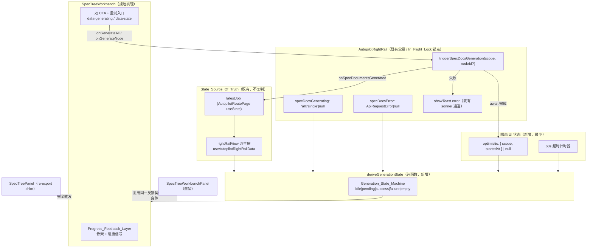

<!--
 * @Author: wangchunji
 * @Description: SPEC 树生成感知性能与状态一致性增强 — 技术设计
-->

# Design Document

## Overview

本设计在现有 React 19 + Vite + TypeScript + Zustand 主干上，为 SPEC 树生成流程补齐**感知性能（perceived performance）**与**状态一致性（state consistency）**两块能力，目标是让长 LLM 调用（数秒到数十秒）在主观体验上不再"卡死"，并让多个并行的 spec-tree 实现呈现一致的生成反馈。

设计遵循 compatibility-first 与最小侵入原则，明确不做：

- 不引入第二套 job / spec 状态真相源（State_Source_Of_Truth 仍为 `latestJob` + `rightRailView` 派生层）。
- 不改服务端生成契约（`generateBlueprintSpecDocuments` → `buildSpecTreeFromRouteSet` 不动）。
- 不改 `/tasks` 深链、不重做设计系统。
- 不 fork 既有投影 / 轮询语义（复用 `projectJobForAutopilotPage`、`rightRailView`、`waitForRouteSelectionSnapshot` / `hasPersistedSpecTree` 一类的快照判定）。

核心改动是三件互相咬合的小事：

1. 把当前散落在按钮上的"按钮文案翻转 + disabled"loading 表达，提升为一个**显式的、可派生的生成状态机（Generation_State_Machine）**：`idle | pending | success | failure | empty`。
2. 在 `pending` 状态下渲染一个**进度反馈层（Progress_Feedback_Layer）**：骨架占位 + 动态进度信号，区别于 `idle`，并在点击的同步事件内、绘制下一帧之前出现（乐观反馈）。
3. 把这套状态机与反馈层收敛到规范实现 `SpecTreeWorkbench`，让 shim（`SpecTreePanel`）完全转发、让父级 `triggerSpecDocsGeneration` 继续作为唯一 In_Flight_Lock 与回写入口（`onSpecDocumentsGenerated`）。

设计中可直接复用的本地范式：`SpecTreeWorkbench` 内已有的 `BulkExportButton`（`idle | downloading | error` 局部状态机 + `data-export-state` testid 约定）是一个良好的、与本设计同构的"小状态机"参照样板。

## Architecture

### 状态归属总览

感知性能增强的关键在于**区分两类状态**，并让它们在同一渲染帧内有确定的优先级：

- **权威业务状态（authoritative）**：来自 `latestJob` 与 `rightRailView` 派生层（specTree / specDocuments）。是唯一真相源，本设计只读、不复制。
- **瞬态 UI 状态（transient optimistic）**：仅用于在权威状态尚未传播到位时填补"点击 → 可见变化"之间的空窗，限于 `pending` 范围、骨架可见性、进度值、动画计时与文案。它不持久化业务数据、不回写真相源。

Generation_State_Machine 是一个**派生值**：它由"父级 In_Flight_Lock（`specDocsGenerating`）/ 父级错误（`specDocsError`）"这类既有状态，叠加"权威 specTree / specDocuments 是否就绪"，再叠加"瞬态乐观标记 + 超时计时"，经一个纯函数 `deriveGenerationState(...)` 折算得到。它本身不是新的真相源，而是对既有状态的一次只读投影。



### 数据通路与时序

一次"生成整棵树"的完整时序（`single` 范围同构）：

```mermaid
sequenceDiagram
  participant U as 用户
  participant W as SpecTreeWorkbench
  participant R as AutopilotRightRail
  participant API as generateBlueprintSpecDocuments
  participant P as AutopilotRoutePage (latestJob)

  U->>W: 点击 CTA（同步事件）
  Note over W: 同一事件内设置 optimistic={scope,startedAt}<br/>派生状态立即 = pending
  W->>W: 下一帧前渲染 Progress_Feedback_Layer（≤100ms）
  W->>R: onGenerateAll()
  R->>R: specDocsGenerating=scope（In_Flight_Lock 上锁）
  R->>API: await generate(jobId,{locale})
  Note over W: pending 期间持续渲染骨架，<br/>不回退 idle（即使投影未传播）
  alt 成功
    API-->>R: { job, specTree, documents }
    R->>R: specDocsGenerating=null
    R->>P: onSpecDocumentsGenerated(response)
    P->>P: setLatestJob(response.job)
    Note over W: 权威状态在同一帧取代 optimistic<br/>派生 = success / empty
  else 失败
    API-->>R: { ok:false, error }
    R->>R: specDocsGenerating=null; specDocsError=error
    R->>R: showToast.error(可读原因 / Locale 兜底)
    Note over W: 派生 = failure；保留旧内容；CTA 恢复 enabled（重试入口）
  end
```

### 三个关键判定点

1. **`pending` 的同步置入**：在 CTA 的 `onClick` 同步处理内立刻写入瞬态 `optimistic`，再调用父级回调。`deriveGenerationState` 把 `optimistic !== null` 视为强 `pending` 信号，因此即使父级 `specDocsGenerating` 的 `setState` 与投影传播尚未完成，下一帧也已经是 `pending`。
2. **`pending` 的稳态维持**：只要 In_Flight_Lock 仍持锁、或权威终态尚未到达且未超时，派生恒为 `pending`。投影层的中间快照（缺 `specTree` / `specDocuments`、或 job 未达终态）一律判为中间态，绝不回退 `idle` 或误判 `empty`（复用 `hasPersistedSpecTree` 语义）。
3. **乐观 → 权威的单帧交接**：权威状态就绪后，`optimistic` 在同一次渲染内被清除，派生改由权威 specTree / specDocuments 决定 `success` / `empty`，保证乐观态与权威态并存不超过一帧、且中间无 `idle` / 空白帧。

## Components and Interfaces

### 1. `deriveGenerationState`（纯函数，新增）

放在 `client/src/pages/autopilot/right-rail/spec-tree-workbench/derive-generation-state.ts`。这是本设计的逻辑核心，也是 PBT 的主要目标。

```ts
export type GenerationScope = "all" | "single";

export type GenerationPhase =
  | "idle"
  | "pending"
  | "success"
  | "failure"
  | "empty";

/** 瞬态乐观标记。仅 UI，不入真相源。 */
export interface OptimisticMark {
  scope: GenerationScope;
  /** performance.now() 时间戳，用于 60s 超时判定 */
  startedAt: number;
}

export interface DeriveGenerationStateInput {
  /** 父级 In_Flight_Lock：'all'|'single'|null */
  inFlight: GenerationScope | null;
  /** 父级既有错误（来自 specDocsError），存在即 failure 候选 */
  error: { message?: string; detail?: string } | null;
  /** 瞬态乐观标记（点击同步置入） */
  optimistic: OptimisticMark | null;
  /** 权威：当前 scope 下是否已存在任何节点文档 */
  authoritativeHasDocs: boolean;
  /** 权威：specTree 是否就绪（hasPersistedSpecTree 语义） */
  authoritativeSpecTreeReady: boolean;
  /** 权威：本次请求结果是否已被确认（job 版本/文档计数前进） */
  authoritativeSettled: boolean;
  /** 当前时间（performance.now()），用于超时判定，便于测试注入 */
  now: number;
  /** 超时阈值，默认 60000ms */
  timeoutMs?: number;
}

export interface GenerationStateView {
  phase: GenerationPhase;
  /** 当前进行中范围，用于 CTA disabled 与重试范围记忆 */
  scope: GenerationScope | null;
  /** 是否因超时落入 failure（驱动 toast 文案分支） */
  timedOut: boolean;
}

export function deriveGenerationState(
  input: DeriveGenerationStateInput
): GenerationStateView;
```

折算规则（优先级自上而下）：

1. 有 `error` → `failure`（保留旧内容）。
2. 有 `optimistic` 或 `inFlight !== null`：
   - 若 `optimistic` 且 `now - optimistic.startedAt >= timeoutMs` → `failure`（`timedOut = true`）。
   - 否则 → `pending`。
3. 已 `authoritativeSettled`：`authoritativeHasDocs ? success : empty`。
4. 其余 → `idle`。

> 关键不变式：只要处于第 2 档（in-flight / optimistic 未超时），无论权威投影是否还在中间态，结果恒为 `pending`，从而满足 R4.2 / R4.3 / R4.4 的"不回退 idle、不误判 empty"。

### 2. `Progress_Feedback_Layer`（新增组件）

放在 `.../spec-tree-workbench/SpecTreeProgressLayer.tsx`。在 `phase === "pending"` 时渲染，提供超出按钮文案翻转的进行中信号：

- **骨架占位**：覆盖在节点行列表区域上方/之内的骨架行（沿用现有冷灰板 + 既有 Tailwind 类风格），不清空 / 不卸载已渲染的真实内容（满足 R2.11 不 blank-out）。
- **动态进度信号**：可消费既有 `useBlueprintRealtimeStore` 的 `specDocsProgress`（`batchStatus` / `processedCount` / `totalCount`）作为只读进度来源；当 socket 进度缺失时退化为不确定型（indeterminate）动画进度条。它只读 store，不写 store。
- 暴露 `data-testid="spec-tree-progress-layer"` 与 `data-progress-kind="skeleton|determinate|indeterminate"`。

```ts
export interface SpecTreeProgressLayerProps {
  locale: AppLocale;
  scope: GenerationScope;
  /** 只读：来自 specDocsProgress 的派生进度，缺失时 indeterminate */
  progress?: { processed: number; total: number } | null;
}
```

### 3. `SpecTreeWorkbench`（规范实现，改造）

在既有 props 基础上做**加法式**扩展，保留 `generating` prop 以维持向后兼容，新增结果态与重试入口：

```ts
export interface SpecTreeWorkbenchProps {
  // —— 既有 props 保持不变 ——
  jobId: string;
  job: BlueprintGenerationJob | null;
  specTree: BlueprintSpecTree | null;
  specDocuments?: ReadonlyArray<BlueprintSpecDocument>;
  locale: AppLocale;
  /** 既有 In_Flight_Lock 展示信号，继续保留 */
  generating: SpecTreeWorkbenchGenerateScope | null;
  onGenerateAll: () => void;
  onGenerateNode: (nodeId: string) => void;

  // —— 新增（全部可选，缺省时退化为既有行为） ——
  /** 父级错误（来自 specDocsError），用于派生 failure */
  generationError?: { message?: string; detail?: string } | null;
  /** 重试：父级以"上次失败的 scope"重新发起 */
  onRetry?: (scope: GenerationScope, nodeId?: string) => void;
}
```

组件内部：

- 维护瞬态 `optimistic` 与一个 `now` 计时（`requestAnimationFrame` / `setInterval(1000)` 仅用于推进超时判定，不持业务数据）。
- 调用 `deriveGenerationState(...)` 得到 `phase`，据此：
  - 设置容器 `data-state={phase}`、保留既有 `data-generating`；
  - `phase==="pending"` 渲染 `<SpecTreeProgressLayer>`；
  - `phase==="failure"` 渲染重试入口（CTA 恢复 enabled，点击走 `onRetry(lastScope)`）；
  - `phase==="empty"` 渲染空结果说明文案（保留既有树/节点内容不清空）；
  - `phase==="success"` 正常渲染文档内容。
- CTA disabled 判定改为 `phase === "pending"`（等价于既有 `anyGenerating`，但语义统一）。重复点击同范围在 `pending` 下因 disabled 天然被忽略（R1.5）；跨范围点击因父级 In_Flight_Lock 早返回而被拒绝（R1.6 / R3.5）。

### 4. `SpecTreePanel`（shim，约束）

保持纯 re-export 转发到 `SpecTreeWorkbench`，**不**实现独立状态机或反馈层（R3.3）。本设计仅在测试中加固这一约束（见 Testing Strategy）。

### 5. `SpecTreeWorkbenchPanel`（遗留，二选一收敛）

遗留面板用于树结构操作（`actionState` / `saveState`），不含 generate loading。本设计采用**文档化变体**策略：

- 若遗留面板暴露生成动作：复用同一 `deriveGenerationState` + `Progress_Feedback_Layer`，经父级统一 In_Flight_Lock。
- 若遗留面板仅做结构操作、不触发 spec 文档生成：在代码注释与本设计中明确标注为"**故意保留的结构操作变体**，不承载 Generation_State_Machine"，避免被误判为不一致实现（满足 R3 的"一致或显式变体"要求）。

### 6. `AutopilotRightRail`（父级，最小改造）

`triggerSpecDocsGeneration` 继续作为唯一 In_Flight_Lock + API + 回写锚点，本设计只增加两点：

- 向 `SpecTreeWorkbench` 透传 `generationError={specDocsError}` 与 `onRetry`。
- `onRetry(scope, nodeId?)` 直接复用 `triggerSpecDocsGeneration(scope, nodeId)`，并在进入时 `setSpecDocsError(null)`，把 `failure → pending` 的转换交还给既有路径（R2.7）。

既有的失败 toast（`showToast.error` + Locale 兜底文案）原样保留作为 R2.3 / R2.4 的反馈通道，不新增通道。

## Data Models

本设计**不新增任何持久化或共享契约模型**。所有新增类型都是组件本地的瞬态 UI 类型：

```ts
// 瞬态乐观标记（组件内 useState，不入 store、不入 latestJob）
interface OptimisticMark {
  scope: "all" | "single";
  startedAt: number; // performance.now()
}

// 生成状态机的派生视图（纯函数返回值，非状态）
interface GenerationStateView {
  phase: "idle" | "pending" | "success" | "failure" | "empty";
  scope: "all" | "single" | null;
  timedOut: boolean;
}
```

既有真相源类型保持不变并被只读消费：

- `BlueprintGenerationJob` / `BlueprintSpecTree` / `BlueprintSpecDocument`（来自 `@shared/blueprint/contracts`）。
- `SpecDocsProgressState`（来自 `blueprint-realtime-store`）——仅作为进度信号只读来源。
- `ApiRequestError`（来自 `api-client`）——映射为 `generationError`。

权威"是否就绪 / 是否为空 / 是否已确认"的判定，复用既有派生：

- `authoritativeSpecTreeReady` ← `hasPersistedSpecTree(snapshot)` 同语义（`specTree.nodes.length > 0`）。
- `authoritativeHasDocs` ← 既有 `docsByNodeId` 是否存在任意非空文档（组件内已有 `hasAnyDocs` 计算）。
- `authoritativeSettled` ← `onSpecDocumentsGenerated` 触发 `setLatestJob` 后，`rightRailView` 重算出的文档计数 / job 版本前进。

## Correctness Properties

*属性（property）是指在系统所有合法执行中都应成立的特征或行为——本质上是关于系统"应该做什么"的形式化陈述。属性是人类可读规范与机器可验证正确性保证之间的桥梁。*

本特性的核心逻辑 `deriveGenerationState` 是一个纯函数，输入空间大（权威投影字段、并发锁、错误、乐观标记、时间戳的任意组合），且存在明确的不变式（互斥、反闪烁、优先级、超时边界），因此适合属性化测试。In_Flight_Lock 的并发语义同样是可属性化的纯逻辑。下述属性均针对这两部分；纯渲染断言、i18n 文案、结构约束与 toast 行为归入示例测试（见 Testing Strategy）。

经 prework 去冗余后，保留以下 8 条互不冗余的属性。

### Property 1: 乐观反馈同步置入即 pending

*对任意* `deriveGenerationState` 输入，只要存在未超时的乐观标记（`optimistic !== null` 且 `now - optimistic.startedAt < timeoutMs`）且无 `error`，派生 `phase` 恒为 `pending`，与权威投影字段、并发锁是否传播无关。

**Validates: Requirements 1.1, 4.1**

### Property 2: in-flight 期间恒 pending（反闪烁核心）

*对任意* 权威投影字段组合（`authoritativeSettled` / `authoritativeSpecTreeReady` / `authoritativeHasDocs` 任意取值），当存在未超时的乐观标记或 `inFlight !== null` 且无 `error` 时，派生 `phase` 恒为 `pending`，绝不为 `idle` 或 `empty`。

**Validates: Requirements 4.2, 4.4**

### Property 3: error 优先级 → 恒 failure

*对任意* 输入，只要 `error !== null`，派生 `phase` 恒为 `failure`，与乐观标记、并发锁、权威投影字段均无关；只有显式清除 `error` 后才可能转移到其他状态。

**Validates: Requirements 2.3, 2.5, 4.6, 5.6**

### Property 4: settled 决定终态、绝不 idle

*对任意* 输入，当 `authoritativeSettled === true` 时，派生 `phase` 必属于 `{pending, success, failure, empty}` 而绝不为 `idle`；进一步地，当此时不存在 in-flight / 未超时乐观标记且无 `error` 时，`phase` 由 `authoritativeHasDocs` 唯一决定（`true → success`，`false → empty`）。

**Validates: Requirements 2.1, 2.2, 2.8, 4.3, 5.4**

### Property 5: 超时边界 → failure（timedOut）

*对任意* 乐观标记与时间戳，当 `optimistic !== null` 且 `now - optimistic.startedAt >= timeoutMs` 时，派生 `phase` 为 `failure` 且 `timedOut === true`；当 `now - optimistic.startedAt < timeoutMs` 时不因超时落入 `failure`。

**Validates: Requirements 4.5, 5.5**

### Property 6: pending 与终态互斥

*对任意* 输入，派生 `phase === "pending"` 当且仅当处于 in-flight / 未超时乐观档（且无 `error`）；因此进行中信号（Progress_Feedback_Layer）在任一终态（`success` / `failure` / `empty`）下必然关闭，不存在 `pending` 与终态并存的派生结果。

**Validates: Requirements 2.9**

### Property 7: failure → retry → 同范围 pending

*对任意* 处于 `failure(scope = s)` 的状态，触发重试（清除 `error` 并以范围 `s` 置入乐观标记）后，下一次派生为 `pending` 且 `scope === s`。

**Validates: Requirements 2.7**

### Property 8: In_Flight_Lock 并发幂等

*对任意* 生成触发序列，当 In_Flight_Lock 已被某范围标记为进行中（`specDocsGenerating !== null`）时，后续任意范围（相同或不同）的触发都不改变当前锁、且不产生新的生成 API 调用，直至当前请求结束。

**Validates: Requirements 1.5, 1.6, 3.5**

## Error Handling

| 场景 | 触发来源 | 处理 | 对应需求 |
| --- | --- | --- | --- |
| 生成请求返回失败（有原因） | `triggerSpecDocsGeneration` 的 `result.error` | `setSpecDocsError(error)` → 派生 `failure`；`showToast.error(可读 detail/message)`；保留旧内容；CTA 恢复 enabled | 2.3, 2.6, 2.11 |
| 生成请求返回失败（无原因） | `result.error` 无 detail/message | 派生 `failure`；toast 使用 Locale 兜底文案（既有 zh/en 文案原样保留） | 2.4, 2.10 |
| 投影轮询长时间无结果 | 乐观标记存活超过 60s | 派生 `failure`（`timedOut`）；结束乐观；CTA 恢复 enabled；toast 超时原因；不向真相源写入部分结果 | 4.5, 5.5 |
| 轮询返回中间态 / 缺字段 | `!authoritativeSettled` 且仍 in-flight | 判中间态，保持 `pending`，不误判 `empty`/`idle`（复用 `hasPersistedSpecTree` 语义） | 4.4 |
| 回写 `onSpecDocumentsGenerated` 失败 | 回调内部抛错 | 视为生成失败：派生 `failure` + toast；不留部分写入 | 5.6 |
| 成功但无文档 | `settled && !hasDocs` | 派生 `empty`，呈现空结果说明，保留既有树内容 | 2.8, 2.11 |
| 重复 / 跨范围点击 | In_Flight_Lock 持锁 | CTA disabled + 父级 early return 双重拦截，静默忽略 | 1.5, 1.6, 3.5 |

错误处理一律不新增 toast 通道、不新增错误状态源：失败统一映射为 `generationError`，由派生函数转为 `failure`。超时计时器在组件卸载或 `phase` 离开 `pending` 时清理，避免泄漏。

## Testing Strategy

测试采用 **Vitest** + **fast-check（PBT）** 双层策略，沿用项目既有 testid 约定（`spec-tree-workbench`、`data-generating`、`data-state`，新增 `spec-tree-progress-layer` / `data-progress-kind`）。

### 属性测试（fast-check）

- 目标：纯函数 `deriveGenerationState` 与 In_Flight_Lock 并发逻辑。
- 每个属性测试至少运行 **100** 次迭代（fast-check 默认 `numRuns >= 100`）。
- 每个测试以注释标注其设计属性，标签格式：
  `// Feature: spec-generation-perceived-performance, Property {number}: {property_text}`
- 文件：`client/src/pages/autopilot/right-rail/spec-tree-workbench/__tests__/derive-generation-state.property.test.ts`
- 生成器要点：
  - `scope ∈ {"all","single"}`、`inFlight ∈ {"all","single",null}`、`error ∈ {null, {message?,detail?}}`、`optimistic ∈ {null, {scope, startedAt}}`、布尔权威字段、`now`/`startedAt` 用整数生成并覆盖 `timeoutMs` 两侧边界。
  - 8 条属性各以单一 property test 实现，与 Correctness Properties 一一对应。

### 示例 / 单元测试（Vitest + Testing Library）

覆盖 prework 中归类为 EXAMPLE 的渲染与结构断言：

- `pending` 渲染 `spec-tree-progress-layer`、两个 CTA 同时 disabled（1.2 / 1.3）。
- 点击后同一 `act` 内 `data-state="pending"` 且 CTA disabled（1.4，免异步等待验证 100ms 内的同步可见变化）。
- `failure` 渲染重试入口、CTA 恢复 enabled，点击 `onRetry` 以上次 scope 调用（2.6）。
- `failure` / `empty` 保留既有树/节点内容容器不清空（2.11）。
- 三态文案随 `zh-CN` / `en-US`（2.10）；失败 toast 兜底文案随 locale（2.4）。
- shim `SpecTreePanel` 渲染输出等价于 `SpecTreeWorkbench`，且不含独立状态机（3.1 / 3.3）。
- 触发均经父级 `triggerSpecDocsGeneration`，组件不维护独立业务并发标志（3.2 / 5.1 / 5.2）。
- 成功路径调用 `onSpecDocumentsGenerated` 回写（5.3）；回写失败映射为 failure（5.6）。

### 回归保护

复用既有 `spec-docs-progress-store.property.test.ts` 与 `spec-docs-progress-assembled.test.ts`，确认 Progress_Feedback_Layer 只读 `specDocsProgress` 不改变其既有不变式。

## 约束：无服务端契约改动 / 无第二真相源

本节为显式约束，任何实现都不得违反：

1. **不改服务端生成契约**：`generateBlueprintSpecDocuments` → `buildSpecTreeFromRouteSet` 的请求/响应形态不变；不新增端点、不改 payload。
2. **不引入第二套真相源**：job / specTree / specDocuments 仅从 `latestJob` + `rightRailView` 派生层读取。新增状态仅限组件本地瞬态 UI（`optimistic` 标记、超时计时、骨架可见性、进度值、`pending` 文案）。
3. **乐观状态是临时的**：乐观标记不持久化、不入 store、不入 `latestJob`，并在权威状态就绪后于同一渲染帧内被清除（并存不超过一帧）。
4. **回写走既有桥**：成功结果经既有 `onSpecDocumentsGenerated` → `setLatestJob` 回写，不旁路、不新增回写路径。
5. **In_Flight_Lock 单一锚点**：并发控制只存在于父级 `triggerSpecDocsGeneration` 的 `specDocsGenerating`，子组件与 shim 不维护独立并发标志。
6. **不 fork 投影 / 轮询语义**：中间态判定复用 `hasPersistedSpecTree` 一类既有快照判定；不另写一套轮询循环。
7. **不改 `/tasks` 深链、不重做设计系统**：进度反馈层沿用既有冷灰板与 Tailwind 工具类。

这些约束保证本次增强是 compatibility-first 且最小侵入的：它只是在既有数据流上叠加了一层只读的状态投影与一块瞬态 UI，不改变任何既有的权威状态与服务端行为。
