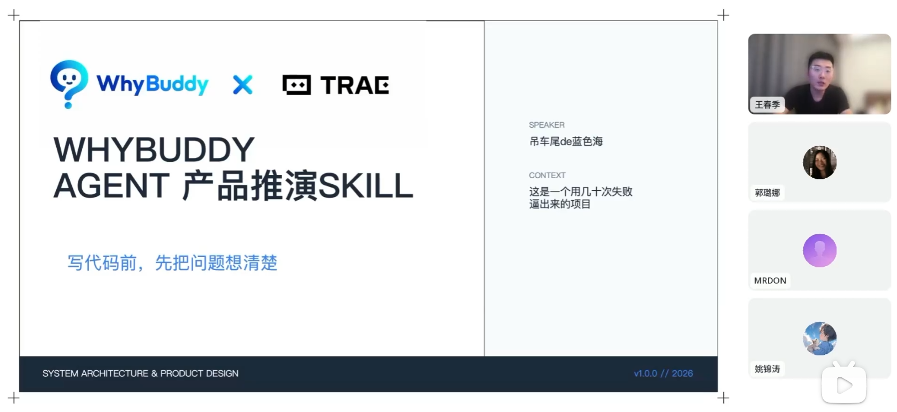
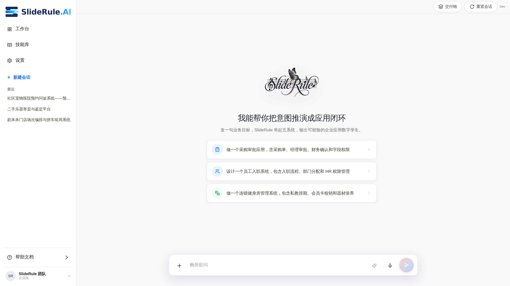
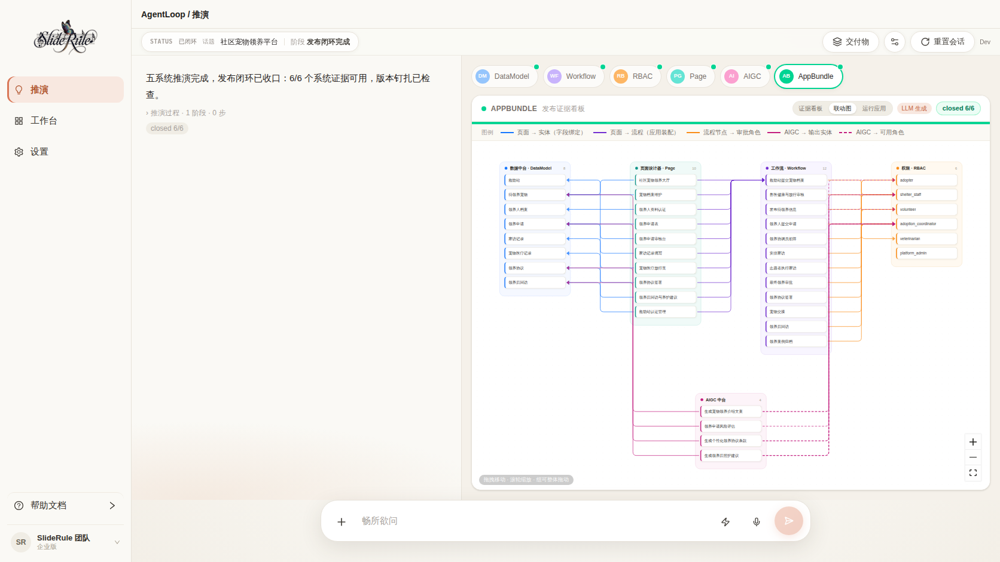
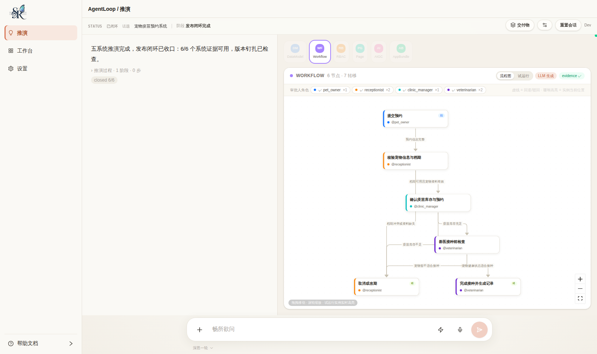
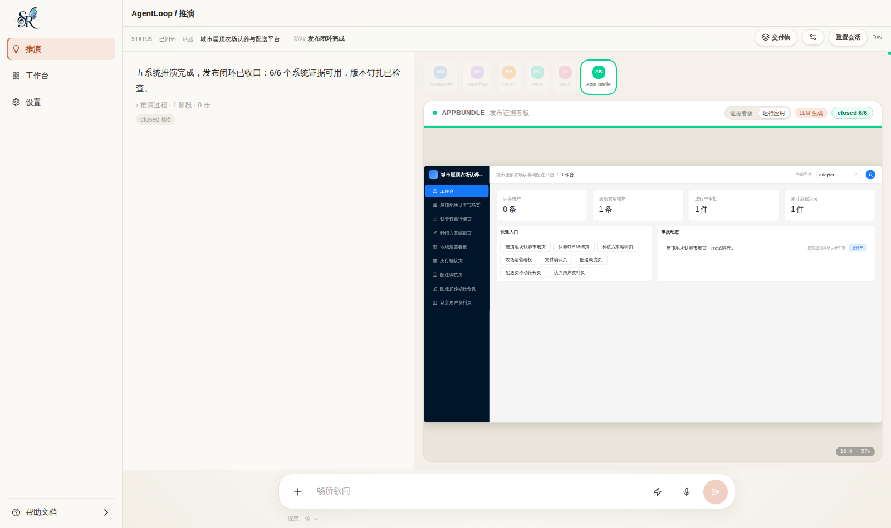

<p align="center">
  
</p>

<p align="center">
  <strong>A Simple and Universal Product Rehearsal Engine, Speccing Anything.
简洁通用的产品推演引擎，推演万物。</strong>
</p>

<p align="center">
  <sub>TRAE Skill Challenge / Community Showcase Project · formerly known as <strong>WhyBuddy</strong> (renamed 2026-06)</sub>
</p>

<p align="center">
  <a href="https://forum.trae.cn/t/topic/69450"></a>
</p>

<p align="center">
  <sub>🏆 Winner of the <strong>Pioneer Skill Award (先锋技能奖)</strong> at the TRAE「一切皆可 Skill · SOLO 技能创作赛」— judged "outstanding in practicality and completeness, with strong promotion value". Entry: <a href="https://forum.trae.cn/t/topic/17058">From one sentence to executable specs: WhyBuddy × TRAE SOLO full product-rehearsal automation</a> · <a href="https://forum.trae.cn/t/topic/69450">official announcement</a></sub>
</p>

<blockquote>
<strong>Progress note (updated 2026-07):</strong> The engineered app now runs the full golden path end to end — one-sentence intent → LLM-generated five-system model (validated by deterministic gates) → publish closure (6/6 evidence) → <strong>a browser live runtime that actually operates the rehearsed app</strong> (multi-device Pro shell, RBAC role preview, approval state machine, editable data, real AIGC try-runs, a five-system linkage graph) → exportable delivery package with the rehearsal data snapshot attached. Verified across 10+ novel domains (<a href="./docs/five-system-generation-eval.md">generation eval report</a>); see the <a href="./docs/LIVE_SYSTEMS_BLUEPRINT.md">live-runtime blueprint</a>. The portable <a href="./skills/sliderule.zip">SlideRule Skill</a> remains available for agent hosts.
</blockquote>

<blockquote>
<strong>🧭 Direction (settled 2026-07):</strong> The single main line is <strong>SlideRule</strong> (<code>/sliderule</code>, intent → application). <code>/autopilot</code> is the legacy v4 demo (archived, no further investment); <code>/agent-loop/workbench</code> is the main line's execution-observation panel. See the <a href="./docs/NORTH_STAR.md">North Star doc</a>.
</blockquote>

<p align="center">
  <a href="./README.md"><strong>English</strong></a> ·
  <a href="./README.zh-CN.md"><strong>简体中文</strong></a>
</p>

<p align="center">
  <a href="https://sliderule.ai"></a>
  <a href="https://github.com/xiaojilele-glitch/SlideRule"></a>
  <a href="./ROADMAP.md"></a>
  <a href="./CONTRIBUTING.md"></a>
</p>

<p align="center">
  
  
  
  
  
  
</p>

---

## ⚡ 30 Second Overview

> **You enter one sentence. The system rehearses a complete product plan for you.**
>
> Spec documents · System architecture · Route planning · Prompt pack · Effect preview
>
> Fully visible. Fully exportable. Fully backed by an evidence trail.

<br/>

<table>
<tr>
<td width="50%">

### 🎯 Pain

You spend **days** writing a PRD, **weeks** aligning the team, and **months** before you know whether the direction is right.

</td>
<td width="50%">

### 💡 Solution

Enter an idea → **one coffee's worth of real LLM deliberation, every step visible** → full rehearsal → decide whether it is worth building → if not, move to the next idea.

</td>
</tr>
</table>

---

## Product Screens

A consolidated 16-screen photo wall from SlideRule example rehearsals.


**Watch the Full Rehearsal Demo**

TRAE SOLO-based product rehearsal automation: from a one-sentence idea to executable specs.

[](https://www.bilibili.com/video/BV1BbEA6RE8a/?spm_id_from=333.1007.top_right_bar_window_history.content.click&vd_source=f07b7d222ea8a4494ad17a2a3911b1ae)

Click the video cover above to open the Bilibili demo.

---

## 🕹️ Browser Live Runtime (New · 2026-07)

The rehearsed model is no longer just diagrams — **the browser renders it into an operable system**, ECharts-style: the five-system JSON is the schema, zero backend, zero database.

|                                                                                                                                                                                                                           |                                                                                                                                                                                                                           |
| ------------------------------------------------------------------------------------------------------------------------------------------------------------------------------------------------------------------------- | ------------------------------------------------------------------------------------------------------------------------------------------------------------------------------------------------------------------------- |
|  <br/> <sub>Restyled studio — brand sidebar, system pills, guided examples</sub>                                                              |  <br/> <sub>**Linkage graph** — five grouped systems, every member expanded, semantic-colored cross-references</sub>                  |
|  <br/> <sub>**Live workflow** — role-colored nodes, condition edges; running instances light up their current node in real time</sub> |  <br/> <sub>**Run the app** — Ant Design Pro shell rendered from the model: dashboard charts, tables, forms, approval submissions</sub> |

What you can actually do after a topic closes (all state lives in the browser, per-session):

- **Run the app** — desktop / tablet / phone frames (16:9 scaled canvas), create records with typed forms, click a row for the detail drawer, submit it into the approval flow.
- **Switch roles** — the RBAC model locks menus and buttons live; the RBAC screen's role preview and the running app stay in sync both ways.
- **Drive approvals** — start / approve / reject / branch on the workflow state machine (semantics aligned with a real workflow engine); the workflow diagram doubles as a live monitor.
- **Edit data in place** — the DataModel screen's data table writes the same runtime rows the app reads.
- **Try AIGC for real** — declared AI capabilities run once through the same LLM channel used for generation; failures surface honestly (`LLM_GENERATE_DISABLED` / `LLM_GENERATE_FAILED`).
- **Rich tables out of the box** — every table derives sorting (by field type), filters (real values of enum / low-cardinality fields), and a column-settings gear (pick columns from the entity's full field list) straight from the model schema. No designer panel needed.
- **See AI orchestration as a flow** — declared capability pipelines render as a read-only flow (step cards wired by data-model fields) and can be dry-run end-to-end with an in-browser flow executor; nodes light up as they run, failures stop the chain honestly.
- **Export with evidence** — the delivery package appends a rehearsal-runtime snapshot (entity rows, instance logs, exporting role), format unchanged.

**5-minute demo script**: `npm run dev:all` → send “做一个连锁健身房管理系统…” → watch the live LLM stream close 6/6 → AppBundle ▸ _联动图_ for the full cross-system picture → _运行应用_, create a record, submit for approval, switch to the phone frame → Workflow ▸ _试运行_, approve a step and watch the diagram highlight move → 交付物 ▸ export, find the snapshot appendix at the bottom.

---

## 🧩 The `sliderule` Skill Package (Portable · Embeddable in Any Agent)

Besides the full app, SlideRule also ships a **self-contained Skill package** that can be dropped into Trae, Claude, or any host that supports Agent Skills. One sentence in → a reviewable, deliverable spec package out, with every gate **actually run by scripts** instead of merely claimed by the model.

> **Guarantee the floor, not the ceiling.** Deterministic scripts guarantee the _floor_ — valid structure, success criteria covered by requirements, EARS acceptance, cited evidence, gate results logged, every artifact provenance-labeled. They do not promise the _ceiling_; real depth still needs a real repo and a human. Everything it generates is labeled with how much you can trust it.

### How to Use

The ready-to-import Skill archive is included at [`skills/sliderule.zip`](./skills/sliderule.zip). Unzip it, then drop the resulting `sliderule/` folder into your agent host's skills directory (Trae: Skills · Claude: skill). See [`skills/README.md`](./skills/README.md) for the exact directory layout.

```bash
# 1. From the repo root, unzip the canonical Skill package.
unzip skills/sliderule.zip

# 2. Drop the resulting sliderule/ folder into your agent host's skills directory
#    (Trae: Skills · Claude: skill)
# 3. Give it a one-sentence idea - it produces the full spec package below
# 4. For image previews, provide an image endpoint key:
export IMAGE_API_KEY=sk-...           # or fill image_config.json -> api_key
# default: gpt-image-2 · 2K · 16:9 · 600s timeout (all configurable)

# Generate or regenerate images yourself at any time, one per module.
# Run these from inside the extracted skill folder:
cd sliderule
python scripts/finalize_previews.py           # module images from spec_tree
python scripts/batch_images.py prompts.txt    # batch generation against your endpoint

# Audit any image run in one command, catching fake, fallback, or duplicated images:
python scripts/check_previews_real.py
```

### Image Generation Configuration

All image settings live in a single file: **`image_config.json`** at the project root.

```jsonc
{
  "enabled": true,
  "mode": "http", // "http" | "dry_run" | "mcp" | "command"
  "model": "gpt-image-2", // ← change model here
  "api_key": "", // ← put your key here (or use env var below)
  "timeout": 600, // seconds per image request
  "out_dir": "previews",
  "http": {
    "url": "", // ← put your endpoint URL here
    "method": "POST",
    "headers": {
      "Content-Type": "application/json",
      "Authorization": "Bearer ${IMAGE_API_KEY}", // resolves from env
    },
    "body_template": {
      "model": "${MODEL}", // auto-filled from top-level "model"
      "prompt": "${PROMPT}", // auto-filled per module
      "response_format": "b64_json",
      "image_size": "2K", // "512" | "1K" | "2K" | "4K"
      "aspect_ratio": "16:9",
      "n": 1,
    },
  },
}
```

**Three things to configure:**

| What             | Where                                                                  | Example                                                                     |
| :--------------- | :--------------------------------------------------------------------- | :-------------------------------------------------------------------------- |
| **API Key**      | Env var `IMAGE_API_KEY` (recommended) OR `image_config.json → api_key` | `export IMAGE_API_KEY=sk-abc123...`                                         |
| **Endpoint URL** | `image_config.json → http.url`                                         | `https://api.openai.com/v1/images/generations`                              |
| **Model**        | `image_config.json → model`                                            | `gpt-image-2` / `gemini-2.5-flash-image` / `gemini-3.1-flash-image-preview` |

> Priority: environment variable `IMAGE_API_KEY` > config file `api_key`. If both are empty, image generation is skipped and the gate records "no key".

### Use Cases

| Category                                | Examples                                                                                           |
| :-------------------------------------- | :------------------------------------------------------------------------------------------------- |
| 🆕 Build a product from zero            | AI meeting minutes · income dashboard · OKR tracker · lightweight CRM · resume optimizer           |
| 🤖 Build an AI agent                    | PRD generator · issue triage · code review · investment research · sentiment analysis              |
| 🧩 Add a feature to an existing project | RBAC for React · i18n for Next.js · audit logging for a Node API · OpenAPI enhancement for FastAPI |

### Output Package Structure

```text
<project-name>/
├─ spec_tree.json            ← structure source; docs / matrix / images all derive from it
├─ clarified_brief.json      goal · constraints · numbered success criteria
├─ route_options.json · selected_route.json · decision_mode.json
├─ traceability_matrix.json  traceability matrix: requirement ↔ design ↔ task ↔ evidence ↔ test case
├─ docs/
│  ├─ requirements.md · design.md · tasks.md
│  ├─ interface_contracts.md · test_cases.md · open_items.md
│  └─ prompt_pack.md · effect_preview.md · architecture.mmd
├─ checks_ledger.json        every gate's real script + exit code + output (not hand-waved)
├─ companion_log.json        companion trace: what the critic flagged · which real sources were cited
├─ handoff_manifest.json     delivery manifest: every artifact carries source + confidence labels
├─ previews/                 per-module UI mockups ("preview · unverified") + provenance.json
└─ scripts/                  deterministic scripts — the floor itself
   ├─ gate.py                     ledger wrapper: run any check and record the result
   ├─ validate_spec_tree.py       SPEC tree validation: structure · coverage · EARS · evidence sources
   ├─ check_content_quality.py    document validation: required sections · length · EARS acceptance
   ├─ check_companion.py          companion trace must be real
   ├─ finalize_previews.py        image gate: generate real module images, judged by real success count
   ├─ check_previews_real.py      audit: catch fake / fallback / duplicate images
   ├─ batch_images.py             standalone batch image generation
   └─ fallback_tree.py            naturally valid minimal tree when the LLM is unavailable
```

### How to Know It Is Not Faking It

- **`checks_ledger.json`** — what ran, exit code, and output. Written automatically by scripts.
- **`companion_log.json`** — what the critic flagged and which real sources the grounding cited.
- **Provenance labels** — `previews/*.png` are marked "preview · unverified"; `interface_contracts.md` is marked "draft · unverified".
- **`check_previews_real.py`** — one command tells you whether images are real generations or placeholders.

---

## 🔄 Workflow

The closed-loop route follows the v4 architecture diagram: solid lines are the main delivery path; dashed lines are runtime support, feedback, invalidation, and recovery.

```text
User idea / repo / file / screenshot
        │
        ▼
01 Input
   Raw input → repo URL gate → deep GitHub ingestion or fallback → normalized project context
        │
        ▼
02 Clarification
   Missing info → questions → readiness gate → clarified brief with goals, constraints, success criteria
        │
        ▼
03 Route Planning
   Standard / deep / upgraded routes → compare risk and cost → route selection → confirm gate
        │
        ▼
Decision & Collaboration
   Simple work stays single-agent; complex work enters brainstorm mode with roles, synthesis, and tools
        │
        ▼
04 SPEC Tree Core
   Prompt builder → redaction → LLM JSON → schema validator → invariant guard → provenance → SPEC tree
        │
        ▼
05 SPEC Documents
   requirements.md · design.md · tasks.md, tied back to acceptance, evidence, and tests
        │
        ▼
06 Preview & Handoff
   prompt pack · effect preview · generated UI mockups · rendered Mermaid architecture · traceability matrix · ZIP/MD export
        │
        ▼
Review & Feedback Loop
   accept and ship, or feed changes back into clarification, route planning, dependency invalidation, and re-generation
```

The runtime layer runs beside the main path: job/artifact store, event bus, socket relay, realtime store, derived node status, and replay. The quality gate closes the loop with tests, content checks, merge checks, and a checks ledger that records real script output.

---

## 🤖 FSD Agent Fleet

The v4 diagram no longer treats the team as a fixed meeting room of roles. SlideRule switches between a single-agent path and a multi-role collaboration path through the **Decision Gate**.

| Role layer           | When it appears                                          | Responsibility                                                       |
| :------------------- | :------------------------------------------------------- | :------------------------------------------------------------------- |
| **Single Agent**     | The route is simple and low-risk                         | Runs the direct path from clarified brief to SPEC tree and documents |
| **Brainstorm Board** | The route is complex or ambiguous                        | Opens discussion, voting, division of labor, and audit mode          |
| **Decision**         | Before expensive generation                              | Chooses standard / deep / upgraded routes and records confidence     |
| **Planning**         | Route and dependency work                                | Breaks the goal into staged work, fallback paths, and replan budgets |
| **Architecture**     | SPEC tree and handoff design                             | Keeps requirements, design, tasks, evidence, and interfaces aligned  |
| **Execution**        | Tool-backed work is needed                               | Uses Docker, MCP, GitHub, and Skills through the tool proxy          |
| **Audit**            | Quality or evidence risk appears                         | Checks invariants, provenance, ledger output, and review gaps        |
| **UI**               | Preview or delivery surface is needed                    | Turns specs into generated mockups and visible handoff artifacts     |
| **Critic**           | Triggered by ambiguity, real repo risk, or weak evidence | Finds holes, missing evidence, and overconfident assumptions         |
| **Grounding**        | Triggered when claims must touch real code or sources    | Reads the repo and forces real citations into the result             |
| **Synthesizer**      | After multi-role work                                    | Merges proposals, confidence scores, and dissent into one route      |

All roles use the same tool proxy, but the companion roles are deliberately **on-demand**: they cut across input, clarification, route planning, and SPEC generation only when risk justifies the extra loop.

---

## ✨ Core Capabilities

<table>
<tr>
<td width="33%" valign="top">

### 01 Grounded Input

Raw ideas can include a sentence, repository, files, or screenshots. Repo URLs trigger deep ingestion; inaccessible sources become explicit fallback states instead of silent failure.

</td>
<td width="33%" valign="top">

### 02 Route Decision

SlideRule compares standard, deep, and upgraded routes before generation. The confirmation gate makes cost, risk, and takeover points visible early.

</td>
<td width="33%" valign="top">

### 03 SPEC Tree Guard

The SPEC tree is not just model output. Schema validation, stable ID normalization, invariant guards, provenance, and deterministic fallback protect the structure.

</td>
</tr>
<tr>
<td width="33%" valign="top">

### 04 Delivery Traceability

Requirements, design, tasks, evidence, tests, prompt packs, previews, interfaces, open items, and exports are tied through a traceability matrix and handoff manifest.

</td>
<td width="33%" valign="top">

### 05 Runtime Truth

Job store, artifact store, event bus, socket relay, realtime store, derived node status, and replay keep the visible workflow synced with persisted artifacts.

</td>
<td width="33%" valign="top">

### 06 Feedback & Invalidation

Reviews, user edits, dependency invalidation, stale indexes, auto-recompute, escalation, and replan budgets make iteration part of the system, not an afterthought.

</td>
</tr>
<tr>
<td width="33%" valign="top">

### 07 Companion Review

Critic and grounding roles are triggered by ambiguity, real-repo risk, and evidence gaps, then force the flow to cite sources and expose weak assumptions.

</td>
<td width="33%" valign="top">

### 08 Preview Split

Generated UI mockups are labeled as previews, while structural architecture diagrams are rendered deterministically from the SPEC tree instead of image-model guesses.

</td>
<td width="33%" valign="top">

### 09 Quality Ledger

Tests, content checks, merge gates, and ledger entries record the script, exit code, and output behind each quality claim.

</td>
</tr>
</table>

---

## 🚀 Quick Start

```bash
git clone https://github.com/xiaojilele-glitch/SlideRule.git && cd SlideRule
pnpm install
pnpm run dev:all          # full stack: frontend + server + executor
```

<details>
<summary>💻 <strong>Browser-only mode</strong> (no server, no .env)</summary>

```bash
pnpm run dev:frontend     # open localhost:5173
```

Or open the repository at [xiaojilele-glitch/SlideRule](https://github.com/xiaojilele-glitch/SlideRule).

</details>

<details>
<summary>📋 <strong>Requirements</strong></summary>

- Node.js 22+
- pnpm
- Docker (optional, for full executor mode)

</details>

---

## 🐳 Docker 一键部署 (One-Command Deploy)

无需本地 Node / Python 环境，一条命令拉起全栈（前端 + Node 服务 + Python 推演引擎 + MySQL）：

```bash
git clone https://github.com/xiaojilele-glitch/WhyBuddy.git && cd WhyBuddy

# 1. 准备环境变量：至少填 LLM_API_KEY（OpenAI 兼容端点）和 SESSION_SECRET
cp .env.example .env

# 2. 一键构建并启动（首次构建约 5-10 分钟）
docker compose up -d --build

# 3. 打开工作台
open http://localhost:3000/agent-loop/workbench
```

**服务拓扑**（`docker-compose.yml`）：

| 服务     | 端口                    | 职责                                                                 |
| :------- | :---------------------- | :------------------------------------------------------------------- |
| `app`    | `3000` (宿主) → `3001`  | Node 服务 + 打包好的前端；SlideRule API 薄代理到 Python              |
| `python` | `9700`（仅容器网络内） | V5 推演引擎：五系统生成、证据信任门、E17 证据上下文管道、发布闭环     |
| `mysql`  | `3306`                  | 账号 / 持久化存储（MySQL 8，数据在命名卷 `sliderule-mysql-data`）    |

会话与推演产物持久化在命名卷 `sliderule-python-data`（对应容器内 `/app/data`），
容器重建不丢数据。

**常用操作**：

```bash
docker compose logs -f app python   # 跟日志
docker compose up -d --build        # 代码更新后重建
docker compose down                 # 停止（保留数据卷）
docker compose down -v              # 停止并清空数据（会话/数据库全删）
```

<details>
<summary>📌 <strong>部署须知</strong></summary>

- **必填环境变量**：`.env` 中的 `LLM_API_KEY` / `LLM_BASE_URL` / `LLM_MODEL`
  （任意 OpenAI 兼容供应商）与 `SESSION_SECRET`（生产环境换成 64 位随机
  hex）。不填 LLM key 服务也能启动，但推演走确定性模板回退。
- **可选能力**：`WEB_SEARCH_API_KEY`（evidence.search 全网检索）、
  `E2B_API_KEY`（code.run 沙盒执行）——不填对应工具自动不可用（fail-closed）。
- **端口冲突**：改 `docker-compose.yml` 里 `app` 的 `ports`（如
  `"8080:3001"`）；MySQL 对宿主的 `3306` 映射可按需删除。
- **企业内网（TLS 拦截代理）**：把企业根证书（PEM，`.crt`）放进
  `docker/certs/` 再构建，两个镜像会自动并入信任链（详见
  `docker/certs/README.md`）；证书已被 .gitignore 排除，不会入库。
- **不包含在 compose 内**：Lobster Executor（需 Docker-in-Docker，单独
  opt-in）、Redis（默认关闭）、飞书集成（默认 mock）。
- `.env` 绝不会被打进镜像（`.dockerignore` 排除），运行时经
  `env_file` 注入容器。

</details>

---

## 📝 Rehearsal Examples

> Every rehearsal is a shareable piece of content. **50 rehearsals = 50 distribution opportunities.**

| 💬 Input                          | 📦 Output                                                                    |
| :-------------------------------- | :--------------------------------------------------------------------------- |
| "AI comic platform"               | 6 SPEC modules · content pipeline · monetization model · system architecture |
| "Permission management SaaS"      | 8 SPEC modules · RBAC · multi-tenant · API contracts                         |
| "Sentiment analysis tool"         | 5 SPEC modules · data pipeline · model selection · alert engine              |
| "Indie developer bookkeeping app" | 4 SPEC modules · local-first · sync plan · privacy compliance                |
| "Enterprise knowledge base"       | 7 SPEC modules · RAG pipeline · permission model · incremental indexing      |
| "Cross-border product picker"     | 6 SPEC modules · data sources · scoring algorithm · competitor analysis      |

---

## 🏗️ System Architecture

```
┌─────────────────────────────────────────────────────────────────┐
│  🌐 Entry Layer       Browser · Feishu Relay · destination input│
├─────────────────────────────────────────────────────────────────┤
│  🖥️ Frontend Layer    3D scene · task cockpit · route view      │
│                       drive state · takeover panel · replay     │
├─────────────────────────────────────────────────────────────────┤
│  🧠 Cube Brain        10-stage workflow · Mission Runtime       │
│                       dynamic roles · cost governance · review  │
├─────────────────────────────────────────────────────────────────┤
│  🔮 Projection Layer  Mission→Destination · Workflow→Route      │
│                       State→DriveState · Decision→Takeover      │
├─────────────────────────────────────────────────────────────────┤
│  💡 Intelligence      3-level memory · knowledge graph · RAG    │
│                       self-evolution · LLM multi-provider       │
├─────────────────────────────────────────────────────────────────┤
│  🛡️ Trust Layer       hash-chain audit · lineage DAG · evidence │
├─────────────────────────────────────────────────────────────────┤
│  ⚙️ Execution Layer   Docker containers · HMAC · sandbox · TTY  │
├─────────────────────────────────────────────────────────────────┤
│  🔗 Interop Layer     A2A protocol · Swarm · Guest Agent market │
└─────────────────────────────────────────────────────────────────┘
```

---

<!-- BEGIN SLIDERULE_SKILL_ARCH -->

Source: [SlideRule Skill closed-loop architecture v4](./docs/assets/SlideRuleArc/SlideRuleSkill%E9%97%AD%E7%8E%AF%E6%80%BB%E5%9B%BE_%E6%94%B9%E8%BF%9B%E7%89%88v4.md)

```mermaid
flowchart TB

U["用户想法 / User Idea<br/>一句话目标 · 仓库 · 文件 · 截图"]:::entry

subgraph S1["01 输入层 / Input"]
  direction TB
  IN_RAW["原始输入 / Raw Input"]:::input
  IN_GH{"有 GitHub 链接? / Has repo URL?"}:::gate
  IN_INGEST["★ GitHub 深度解析 / Deep Ingestion<br/>文件 · 符号 · 接口契约"]:::input
  IN_FALL["降级状态 / Fallback<br/>权限失败 · 仓库不可访问"]:::fallback
  IN_NORM["归一化 / Normalize<br/>去重 · 证据 · 失败状态"]:::input
  IN_CTX["项目上下文 / Project Context<br/>目标 · 摘要 · 来源 · 证据"]:::input
end

subgraph S2["02 澄清层 / Clarification"]
  direction TB
  CL_GAP["缺失信息 / Missing Info<br/>阻塞 · 非阻塞"]:::clarify
  CL_Q["澄清问题 / Questions"]:::clarify
  CL_READY{"就绪度 / Readiness<br/>可规划? 还是继续补充?"}:::gate
  CL_BRIEF["澄清简报 / Clarified Brief<br/>目标 · 约束 · 成功标准"]:::clarify
end

subgraph S3["03 路线规划 / Route Planning"]
  direction TB
  RT_GEN["多路线生成 / Multi-Route<br/>标准 · 深度 · 升级"]:::route
  RT_CMP["对比 · 风险 / Compare · Risk"]:::route
  RT_SEL["路线选择 / Route Selection"]:::route
  RT_GATE{"轻量确认闸 / Confirm Gate"}:::gate
end

subgraph DG["决策与协作 / Decision and Collaboration"]
  direction TB
  D_GATE{"决策门 / Decision Gate<br/>简单 or 复杂?"}:::decision
  D_SA["单 Agent / Single-Agent"]:::decision
  D_BO["头脑风暴 / Brainstorm<br/>模式: 讨论 · 投票 · 分工 · 审计"]:::decision
  D_ROLES["多角色 / Roles<br/>决策 · 规划 · 架构 · 执行 · 审计 · UI"]:::decision
  D_SYN["综合器 / Synthesizer<br/>方案 · 信心分 · 分歧意见"]:::decision
  D_TOOLS["工具代理 / Tool Proxy<br/>Docker · MCP · GitHub · Skills"]:::tool
  D_DEG["降级兜底 / Degradation"]:::fallback
end

subgraph CO["★ 伴随式审查与接地 / Companion · 按需触发：模糊度·真仓库·风险"]
  direction TB
  CO_CRIT["★ 挑刺者 / Critic<br/>找漏洞 · 证据不足处"]:::companion
  CO_GROUND["★ 接地者 / Grounding<br/>读真代码 · 逼挂真实出处"]:::companion
end

subgraph S4["04 规格树生成核心 / SPEC Tree Generation Core"]
  direction TB
  SP_PROMPT["★ 提示词构造 / Prompt Builder<br/>成功标准→需求 · 验收用 EARS"]:::spec
  SP_REDACT["脱敏 / Redaction"]:::spec
  SP_LLM["LLM JSON 生成 / callJson<br/>retryAttempts = 1"]:::spec
  SP_SCHEMA{"Schema 校验 / Validator"}:::gate
  SP_NORM["归一化 / Normalizer<br/>稳定 ID 重映射"]:::spec
  SP_INV{"★ 不变量守卫 / Invariant Guard<br/>唯一根 · 父可达 · 深度 · 无环<br/>+ 需求覆盖成功标准 · 每节点挂证据"}:::gate
  SP_FALL["确定性兜底 / Deterministic Fallback<br/>已预先满足不变量"]:::fallback
  SP_PROV["来源追踪 / Provenance<br/>llm · llm_fallback · template"]:::spec
  SP_TREE["规格树 / SPEC Tree<br/>Requirements · Design · Tasks · Evidence(带真实出处)"]:::artifact
end

subgraph S5["05 规格文档 / SPEC Document"]
  direction TB
  SD_GEN["文档生成器 / Doc Generator"]:::doc
  SD_DOCS["文档 / Docs<br/>requirements.md · design.md · tasks.md"]:::doc
  SD_ACC["验收 · 证据 · 用例 / Acceptance · Evidence · Tests"]:::doc
end

subgraph S6["06 效果预览与交付 / Preview and Handoff"]
  direction TB
  EP_PACK["提示词包 / Prompt Pack"]:::preview
  EP_PREV["效果预览 / Effect Preview"]:::preview
  EP_VIS_GEN["◆ 视觉预览·生成 / Gen Preview<br/>按模块(每需求一页)→生图模型<br/>只认真成功张数·防复制·禁兜底·503重试<br/>UI 草样 · 标『预览·未验证』"]:::preview
  EP_VIS_REND["★ 结构图·渲染 / Rendered<br/>规格树→Mermaid 确定性出图<br/>架构总图 · 不交给生图模型"]:::preview
  EP_VIS_AUDIT["◆◆ 出图审计 / check_previews_real<br/>查 provenance：兜底·假成功(ok却带error)·复制充数<br/>用户自跑，agent 改不了这步"]:::companion
  EP_MATRIX["★ 可追溯矩阵 / Traceability<br/>需求↔设计↔任务↔证据↔用例"]:::preview
  EP_HAND["交付包 · 导出 / Handoff · Export<br/>md·zip · 接口契约(草稿·待核) · 验收用例<br/>未决项登记 · 校验台账 · 视觉预览(标来源)"]:::preview
end

subgraph S7["07 运行时与状态 / Runtime and State"]
  direction TB
  WF_JOB["任务仓 · 产物 / Job · Artifact Store"]:::runtime
  WF_EVT["事件总线 / Event Bus<br/>每阶段产出都落事件"]:::runtime
  WF_SOCK["实时推送 / Socket Relay"]:::runtime
  WF_STORE["实时状态仓 / Realtime Store<br/>按 sessionId 隔离"]:::runtime
  WF_DERIVE["状态派生器 / deriveNodeStatus<br/>实时进度 + 已存文档 → 单一真相"]:::runtime
  WF_ROW["节点行 / Node Row<br/>待生成 · 生成中 · 完成 · 失败 · 重试成功"]:::runtime
  WF_REPLAY["回放 / Replay"]:::runtime
end

subgraph S8["08 失效与依赖 / Invalidation and Dependency"]
  direction TB
  DEP["依赖图 / Dependency Graph<br/>上游变更 → 下游影响"]:::danger
  INV["失效引擎 / Invalidation Engine"]:::danger
  STALE["失效索引 / Stale Index<br/>staleSince · reason · fromStage"]:::danger
  RECOMP["自动重算 / Auto-Recompute<br/>沿依赖链重建下游"]:::danger
end

subgraph S9["评审与反馈闭环 / Review and Feedback"]
  direction TB
  RV{"评审 / Review<br/>交付 or 回炉?"}:::feedback
  FB["反馈 / Feedback"]:::feedback
  RP{"重规划 / Replan<br/>预算 · 收敛阈值"}:::feedback
  ESC["失败 · 中止 · 转人工 / Fail · Abort · Escalate"]:::fallback
  ITER["用户修改再推演 / User Iterate"]:::feedback
end

subgraph QA["质量门 / Quality Gate"]
  direction TB
  QA_TEST["测试 / Tests<br/>状态 · SSR · E2E · 截图"]:::qa
  QA_CONTENT["★ 内容质量校验 / Content Check<br/>规格成立 · 验收为 EARS 句式"]:::qa
  QA_MERGE{"合并门槛 / Merge Gate<br/>自动断言 + 人工目检"}:::gate
  QA_LEDGER["★ 校验台账 / Checks Ledger<br/>脚本 · 退出码 · 输出"]:::ledger
end

DONE["交付完成 / Shipped"]:::artifact

subgraph LEGEND["图例 / Legend （颜色与连线一致）"]
  direction TB
  LG_B["蓝 实线 / Blue<br/>主流程 Main flow"]:::pBlue
  LG_O["橙 实线 / Orange<br/>决策与协作 Decision"]:::pOrange
  LG_P["紫 实线 / Purple<br/>规格树生成核心 SPEC core"]:::pPurple
  LG_G["绿 实线 / Green<br/>产物 · 文档 · 交付 Artifacts"]:::pGreen
  LG_GR["灰 虚线 / Gray dashed<br/>运行时 · 工具 · 支撑 Runtime"]:::pGray
  LG_R["红 虚线 / Red dashed<br/>失效 · 回炉 · 反馈 Loops"]:::pRed
  LG_NEW["★ 青虚线 / Teal dashed<br/>新增：伴随角色·视觉·矩阵·台账"]:::pLedger
end

%% ===== 蓝色 主流程 (0-14) =====
U --> IN_RAW
IN_RAW --> IN_GH
IN_GH -->|有仓库 / yes| IN_INGEST
IN_GH -->|无仓库·直接跳过 / no| IN_NORM
IN_INGEST --> IN_NORM
IN_NORM --> IN_CTX
IN_CTX --> CL_GAP
CL_GAP --> CL_Q
CL_Q --> CL_READY
CL_READY -->|就绪 / ready| CL_BRIEF
CL_BRIEF --> RT_GEN
RT_GEN --> RT_CMP
RT_CMP --> RT_SEL
RT_SEL --> RT_GATE
RT_GATE -->|确认 / confirm| D_GATE

%% ===== 橙色 决策与协作 (15-20) =====
D_GATE -->|简单 / simple| D_SA
D_GATE -->|复杂 / complex| D_BO
D_BO --> D_ROLES
D_ROLES --> D_SYN
D_SA --> SP_PROMPT
D_SYN --> SP_PROMPT

%% ===== 紫色 规格树生成核心 (21-28) =====
SP_PROMPT --> SP_REDACT
SP_REDACT --> SP_LLM
SP_LLM --> SP_SCHEMA
SP_SCHEMA -->|结构通过| SP_NORM
SP_NORM --> SP_INV
SP_INV -->|不变量通过| SP_PROV
SP_FALL --> SP_PROV
SP_PROV --> SP_TREE

%% ===== 绿色 产物·文档·交付 (29-40) =====
SP_TREE --> SD_GEN
SD_GEN --> SD_DOCS
SD_DOCS --> SD_ACC
SD_ACC --> EP_PACK
SD_DOCS --> EP_PACK
SP_TREE --> EP_PREV
EP_PACK --> EP_HAND
EP_PREV --> EP_HAND
SP_TREE --> WF_JOB
SD_DOCS --> WF_JOB
EP_HAND --> RV
RV -->|通过·交付| DONE

%% ===== 灰色虚线 运行时·工具·支撑 (41-60) =====
D_SA -. 调用工具 .-> D_TOOLS
D_ROLES -. 调用工具 .-> D_TOOLS
D_TOOLS -. 证据返回 .-> D_ROLES
WF_JOB -. 事件 .-> WF_EVT
WF_EVT -.-> WF_SOCK
WF_SOCK -.-> WF_STORE
WF_STORE -.-> WF_DERIVE
WF_JOB -. 已存文档 .-> WF_DERIVE
WF_DERIVE -.-> WF_ROW
WF_JOB -.-> WF_REPLAY
WF_REPLAY -. 按会话隔离 .-> WF_STORE
WF_ROW -. 驱动预览 .-> EP_PREV
WF_ROW -. 失效提示 .-> RV
CL_BRIEF -. 成功标准派生验收 .-> SD_ACC
WF_ROW -.-> QA_TEST
WF_STORE -.-> QA_TEST
SP_TREE -. 内容质量校验 .-> QA_CONTENT
QA_TEST -.-> QA_MERGE
QA_CONTENT -.-> QA_MERGE
QA_MERGE -. 放行发布 .-> DONE

%% ===== 红色虚线 失效·回炉·反馈 (61-92) =====
IN_INGEST -. 权限失败 .-> IN_FALL
IN_FALL -.-> IN_NORM
CL_READY -. 未就绪·回去补充 .-> CL_GAP
RT_GATE -. 调整·退回 .-> RT_SEL
D_GATE -. 失败·超时 .-> D_DEG
D_BO -. 异常 .-> D_DEG
D_TOOLS -. 不可达 .-> D_DEG
D_DEG -. 兜底→单Agent .-> D_SA
D_BO -. 可回灌路线 .-> RT_GEN
D_BO -. 可回灌澄清 .-> CL_GAP
SP_LLM -. 超时·非JSON·先重试 .-> SP_LLM
SP_SCHEMA -. 结构失败 .-> SP_FALL
SP_INV -. 不变量失败 .-> SP_FALL
DEP -. 计算下游影响 .-> INV
INV -.-> STALE
STALE -. 同步前端 .-> WF_STORE
STALE -.-> RECOMP
RECOMP -. 重建规格树 .-> SP_PROMPT
RECOMP -. 重建文档 .-> SD_GEN
RECOMP -. 重建预览 .-> EP_PREV
RV -. 回炉 .-> FB
FB -.-> RP
FB -. 上游变更 .-> INV
RP -. 回到澄清 .-> CL_GAP
RP -. 回到路线 .-> RT_GEN
RP -. 回到规格树 .-> SP_PROMPT
RP -. 重判模式 .-> D_GATE
RP -. 使下游失效 .-> INV
RP -. 超预算·不收敛 .-> ESC
EP_PREV -. 用户不满 .-> ITER
ITER -. 再推演 .-> RP
QA_MERGE -. 不通过·回炉 .-> FB

%% ===== ★ v1 改动 青虚线 (93-100) =====
CL_BRIEF -. 成功标准派生需求 .-> SP_PROMPT
SP_SCHEMA -. 校验结果 .-> QA_LEDGER
SP_INV -. 校验结果 .-> QA_LEDGER
QA_TEST -. 结果 .-> QA_LEDGER
QA_CONTENT -. 结果 .-> QA_LEDGER
QA_MERGE -. 结果 .-> QA_LEDGER
QA_LEDGER -. 随交付导出 .-> EP_HAND
QA_LEDGER -. 落盘存档 .-> WF_JOB

%% ===== ★ v2 新增：伴随角色 + 视觉分流 + 追溯矩阵 (101-111) =====
CO_CRIT -. 伴随挑刺 .-> CL_GAP
CO_GROUND -. 伴随接地 .-> IN_INGEST
CO_GROUND -. 伴随接地 .-> CL_BRIEF
CO_CRIT -. 伴随挑刺 .-> RT_CMP
CO_CRIT -. 伴随挑刺 .-> SP_PROMPT
SD_DOCS -. 转生图提示词 .-> EP_VIS_GEN
EP_VIS_GEN -.-> EP_HAND
SP_TREE -. 确定性渲染 .-> EP_VIS_REND
EP_VIS_REND -.-> EP_HAND
SP_TREE -. 汇总追溯 .-> EP_MATRIX
EP_MATRIX -.-> EP_HAND

%% ===== ◆ v3 新增：伴随留痕进台账 + 按模块出图 gate 进台账 (112-115) =====
CO_CRIT -. 留痕进台账 .-> QA_LEDGER
CO_GROUND -. 留痕进台账 .-> QA_LEDGER
SP_TREE -. 按模块驱动出图 .-> EP_VIS_GEN
EP_VIS_GEN -. 出图核验·进台账 .-> QA_LEDGER

%% ===== ◆◆ v4 新增：出图可信层 (116-118) =====
EP_VIS_GEN -. 出图后必审计 .-> EP_VIS_AUDIT
EP_VIS_AUDIT -. 审计结果进台账 .-> QA_LEDGER
EP_VIS_AUDIT -. 揪出假图·回炉重出 .-> EP_VIS_GEN

%% ===== 节点样式（按层）=====
classDef entry fill:#eef6ff,stroke:#2563eb,color:#0f172a,stroke-width:2px;
classDef input fill:#eff6ff,stroke:#2563eb,color:#111827,stroke-width:1.5px;
classDef clarify fill:#fff7ed,stroke:#f97316,color:#111827,stroke-width:1.5px;
classDef route fill:#fff7ed,stroke:#ea580c,color:#111827,stroke-width:1.5px;
classDef decision fill:#ecfeff,stroke:#0891b2,color:#111827,stroke-width:1.5px;
classDef tool fill:#cffafe,stroke:#0e7490,color:#111827,stroke-width:1.5px;
classDef spec fill:#f5f3ff,stroke:#7c3aed,color:#111827,stroke-width:1.5px;
classDef doc fill:#ecfdf5,stroke:#10b981,color:#111827,stroke-width:1.5px;
classDef preview fill:#ecfdf5,stroke:#16a34a,color:#111827,stroke-width:1.5px;
classDef runtime fill:#f8fafc,stroke:#64748b,color:#111827,stroke-width:1.5px;
classDef danger fill:#fff1f2,stroke:#ef4444,color:#111827,stroke-width:1.5px;
classDef feedback fill:#fff1f2,stroke:#ef4444,color:#111827,stroke-width:1.5px;
classDef fallback fill:#fee2e2,stroke:#dc2626,color:#111827,stroke-width:1.5px;
classDef artifact fill:#dcfce7,stroke:#16a34a,color:#111827,stroke-width:2px;
classDef qa fill:#f8fafc,stroke:#475569,color:#111827,stroke-width:1.5px;
classDef gate fill:#fffbeb,stroke:#d97706,color:#111827,stroke-width:2px;
classDef ledger fill:#ccfbf1,stroke:#0f766e,color:#0f172a,stroke-width:2px;
classDef companion fill:#ccfbf1,stroke:#0f766e,color:#0f172a,stroke-width:1.5px;

%% ===== 图例样式（描边=对应线色）=====
classDef pBlue fill:#eff6ff,stroke:#2563eb,color:#0f172a,stroke-width:3px;
classDef pOrange fill:#fff7ed,stroke:#ea580c,color:#0f172a,stroke-width:3px;
classDef pPurple fill:#f5f3ff,stroke:#7c3aed,color:#0f172a,stroke-width:3px;
classDef pGreen fill:#ecfdf5,stroke:#16a34a,color:#0f172a,stroke-width:3px;
classDef pGray fill:#f8fafc,stroke:#64748b,color:#0f172a,stroke-width:3px;
classDef pRed fill:#fff1f2,stroke:#ef4444,color:#0f172a,stroke-width:3px;
classDef pLedger fill:#ccfbf1,stroke:#0f766e,color:#0f172a,stroke-width:3px;

%% ===== 连线着色（按声明顺序，分段对应路径）=====
linkStyle 0,1,2,3,4,5,6,7,8,9,10,11,12,13,14 stroke:#2563eb,stroke-width:2.5px;
linkStyle 15,16,17,18,19,20 stroke:#ea580c,stroke-width:2.5px;
linkStyle 21,22,23,24,25,26,27,28 stroke:#7c3aed,stroke-width:2.5px;
linkStyle 29,30,31,32,33,34,35,36,37,38,39,40 stroke:#16a34a,stroke-width:2.5px;
linkStyle 41,42,43,44,45,46,47,48,49,50,51,52,53,54,55,56,57,58,59,60 stroke:#64748b,stroke-width:1.8px,stroke-dasharray:5 4;
linkStyle 61,62,63,64,65,66,67,68,69,70,71,72,73,74,75,76,77,78,79,80,81,82,83,84,85,86,87,88,89,90,91,92 stroke:#ef4444,stroke-width:1.8px,stroke-dasharray:6 4;
linkStyle 93,94,95,96,97,98,99,100 stroke:#0f766e,stroke-width:2.5px,stroke-dasharray:4 3;
linkStyle 101,102,103,104,105,106,107,108,109,110,111 stroke:#0f766e,stroke-width:2px,stroke-dasharray:4 3;
linkStyle 112,113,114,115 stroke:#db2777,stroke-width:2px,stroke-dasharray:3 3;
linkStyle 116,117,118 stroke:#dc2626,stroke-width:2px,stroke-dasharray:3 3;
```



<!-- END SLIDERULE_SKILL_ARCH -->

---

## 🛠️ Tech Stack

| Layer     | Technology                                                              |
| :-------- | :---------------------------------------------------------------------- |
| Frontend  | React 19 · Vite · TypeScript · Zustand · Three.js (R3F) · Framer Motion |
| Server    | Express · Socket.IO · TypeScript                                        |
| AI        | OpenAI-compatible APIs (any provider)                                   |
| Execution | Docker (dockerode) · browser runtime · native runtime                   |
| Testing   | Vitest · fast-check (PBT)                                               |
| Storage   | IndexedDB (browser) · JSON (server)                                     |

---

## 📊 Project Scale

| Metric               |   Count |
| :------------------- | ------: |
| Project files        |   5,457 |
| TypeScript/TSX files |   2,234 |
| TypeScript lines     | 575,591 |
| Test files           |     921 |
| Spec directories     |     303 |

---

## ⚔️ Comparison With Other Platforms

| Feature                                                  | Dify | n8n | CrewAI | LangGraph | **SlideRule** |
| :------------------------------------------------------- | :--: | :-: | :----: | :-------: | :-----------: |
| Open source                                              |  ✅  | ✅  |   ✅   |    ✅     |      ✅       |
| One sentence to a complete product                       |  ❌  | ❌  |   ❌   |    ❌     |      ✅       |
| Spec document generation (requirements + design + tasks) |  ❌  | ❌  |   ❌   |    ❌     |      ✅       |
| Multi-route planning                                     |  ❌  | ❌  |   ❌   |    ⚠️     |      ✅       |
| Multi-role agent fleet                                   |  ❌  | ❌  |   ✅   |    ✅     |      ✅       |
| Real-time 3D observability                               |  ❌  | ❌  |   ❌   |    ❌     |      ✅       |
| Human takeover governance                                |  ⚠️  | ⚠️  |   ❌   |    ❌     |      ✅       |
| Replay and audit                                         |  ❌  | ❌  |   ❌   |    ❌     |      ✅       |
| Docker sandbox                                           |  ❌  | ⚠️  |   ❌   |    ❌     |      ✅       |
| Export Markdown/ZIP                                      |  ❌  | ❌  |   ❌   |    ❌     |      ✅       |
| Browser-only demo                                        |  ❌  | ❌  |   ❌   |    ❌     |      ✅       |

---

## 🤝 Contributing

```bash
1. Fork & clone → pnpm install
2. pnpm run dev:frontend (UI) or pnpm run dev:all (full stack)
3. Before submitting: node --run check && pnpm run test
```

See [CONTRIBUTING.md](./CONTRIBUTING.md) for details.

---

## ⭐ Star History

> Every rehearsal generated by the engine is content that helps others discover new possibilities. Star this repository to help more people find it.

[](https://star-history.com/#xiaojilele-glitch/SlideRule&Date)

---

<p align="center">
  <a href="./LICENSE"><strong>MIT License</strong></a> · Hosted at <a href="https://github.com/xiaojilele-glitch/SlideRule">xiaojilele-glitch/SlideRule</a>
</p>
