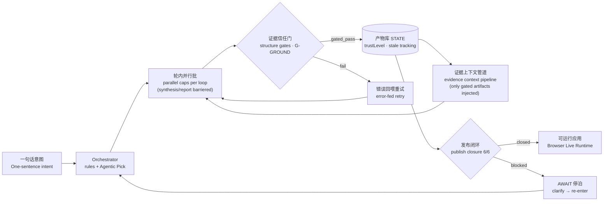
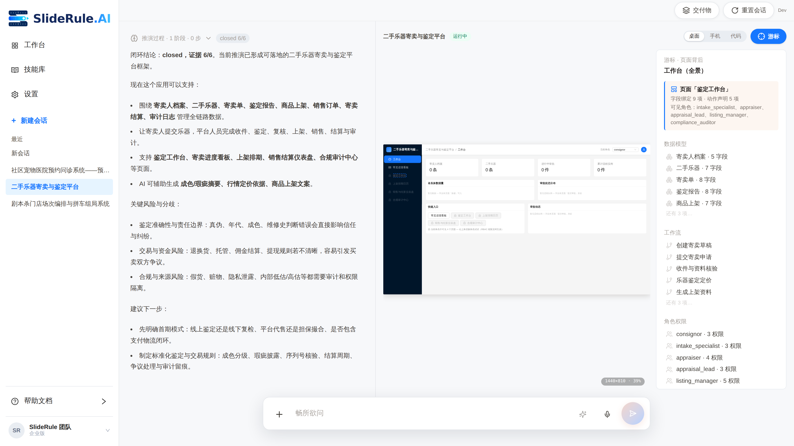

<p align="center">
  
</p>

<p align="center">
  <strong>A Simple and Universal Product Rehearsal Engine, Speccing Anything.
简洁通用的产品推演引擎，推演万物。</strong>
</p>

<p align="center">
  <sub>TRAE Skill Challenge / Community Showcase Project · product name <strong>SlideRule</strong> · hosted at <a href="https://github.com/xiaojilele-glitch/WhyBuddy">xiaojilele-glitch/WhyBuddy</a> (the repo keeps the project's original name)</sub>
</p>

<p align="center">
  <a href="https://forum.trae.cn/t/topic/69450"></a>
</p>

<p align="center">
  <sub>🏆 Winner of the <strong>Pioneer Skill Award (先锋技能奖)</strong> at the TRAE「一切皆可 Skill · SOLO 技能创作赛」— judged "outstanding in practicality and completeness, with strong promotion value". Entry: <a href="https://forum.trae.cn/t/topic/17058">From one sentence to executable specs</a> · <a href="https://forum.trae.cn/t/topic/69450">official announcement</a></sub>
</p>

<blockquote>
<strong>🧭 North Star:</strong> "An AI claiming something is done does not count. Only artifacts that pass deterministic gates count." The single main line is <strong>SlideRule</strong> (intent → evidence-gated application rehearsal); <code>/autopilot</code> is the archived v4 demo. See the <a href="./docs/NORTH_STAR.md">North Star doc</a>.
</blockquote>

<p align="center">
  <a href="./README.md"><strong>English</strong></a> ·
  <a href="./README.zh-CN.md"><strong>简体中文</strong></a>
</p>

<p align="center">
  <a href="https://xiaojilele-glitch.github.io/WhyBuddy/agent-loop/workbench"></a>
  <a href="https://github.com/xiaojilele-glitch/WhyBuddy"></a>
  <a href="./ROADMAP.md"></a>
  <a href="./CONTRIBUTING.md"></a>
</p>

<p align="center">
  
  
  
  
  
  
</p>

---

## ⚡ 30 Second Overview

> **You enter one sentence. The system rehearses a complete product plan for you.**
>
> Five-system model · Evidence-gated artifacts · Publish closure · A runnable app in the browser
>
> Fully visible. Fully exportable. Fully backed by an evidence trail.

<br/>

<table>
<tr>
<td width="50%">

### 🎯 Pain

You spend **days** writing a PRD, **weeks** aligning the team, and **months** before you know whether the direction is right.

</td>
<td width="50%">

### 💡 Solution

Enter an idea → **one coffee's worth of real LLM deliberation, every step visible** → full rehearsal → decide whether it is worth building → if not, move to the next idea.

</td>
</tr>
</table>

---

## 🎮 Try It Now (Zero Install)

The static demo runs entirely in your browser — no backend, no key, nothing to install:

- **Workbench (start here)** → <https://xiaojilele-glitch.github.io/WhyBuddy/agent-loop/workbench>
- **Rehearsal surface** → <https://xiaojilele-glitch.github.io/WhyBuddy/agent-loop/sliderule>

What you can do there:

- **Watch a full rehearsal** — the main demo card pre-fills a real project intent (community pet-clinic booking & triage system); press send and watch the engine reason through six skills to a 6/6 publish closure. The playback data was captured from a real end-to-end LLM run, not hand-written.
- **Open finished examples** — two gallery cards (second-hand instrument consignment & appraisal platform · script-murder venue scheduling system) open as fully closed rehearsals: read the report, run the generated app, switch roles, drive approvals.
- Bring your own OpenAI-compatible key (BYOK, stays in your browser) to run live rehearsals on new topics.

---

## Product Screens

A consolidated 16-screen photo wall from SlideRule example rehearsals.


**Watch the Full Rehearsal Demo**

TRAE SOLO-based product rehearsal automation: from a one-sentence idea to executable specs.

[](https://www.bilibili.com/video/BV1BbEA6RE8a/?spm_id_from=333.1007.top_right_bar_window_history.content.click&vd_source=f07b7d222ea8a4494ad17a2a3911b1ae)

Click the video cover above to open the Bilibili demo.

---

## ⚙️ The V5 Rehearsal Engine

One sentence in → the engine drives multi-loop reasoning over a **capability pool** (evidence search, risk analysis, counter-arguments, synthesis, reporting…), materializes a **five-system model** (data model · RBAC · workflow · pages · AIGC), and only ships when the **publish closure** holds 6/6 evidence. The core discipline, everywhere:

> **An AI claiming something is done does not count. Only artifacts that pass deterministic gates count.**



What makes it different from "an LLM with a long prompt":

| Mechanism                    | What it does                                                                                                                                             |
| :--------------------------- | :-------------------------------------------------------------------------------------------------------------------------------------------------------- |
| **Evidence trust gate**      | Every artifact passes structural + grounding gates before it earns `gated_pass`; failed generations are retried with the validator errors fed back        |
| **Evidence context pipeline** | Downstream reasoning (synthesis / report) is fed **only gated upstream artifacts**, priority-packed under budget with honest omission notes               |
| **Publish closure**          | The app ships only when all six skills (dataModel · RBAC · workflow · page · AIGC · appBundle) hold evidence — otherwise it parks at AWAIT for clarification |
| **Real tools**               | `web.search` (grounded evidence) and `code.run` (E2B sandbox, fail-closed without a key) via an MCP-style tool registry                                    |
| **Blind-judged upgrades**    | Engine changes ship with paired blind evaluations (A/B, position-swapped, double verdict) — e.g. agentic pick 4:0, evidence pipeline 2:0                   |

Deep dives: [V5.3 architecture (Chinese)](<./docs/SlideRule V5.3 架构图.md>) · [five-system generation eval](./docs/five-system-generation-eval.md) · [live-runtime blueprint](./docs/LIVE_SYSTEMS_BLUEPRINT.md)

---

## 🕹️ Browser Live Runtime

The rehearsed model is not just diagrams — **the browser renders it into an operable system**, ECharts-style: the five-system JSON is the schema, zero backend, zero database.

|                                                                                                                                                                                                                           |                                                                                                                                                                                                                           |
| ------------------------------------------------------------------------------------------------------------------------------------------------------------------------------------------------------------------------- | ------------------------------------------------------------------------------------------------------------------------------------------------------------------------------------------------------------------------- |
|  <br/> <sub>Studio home — brand sidebar, session gallery, guided examples</sub>                                                              |  <br/> <sub>**X-ray cursor (游标)** — hover any element in the running app and read the five-system declarations behind it: bound fields, visible roles, workflow nodes</sub>                  |
|  <br/> <sub>**Live workflow** — role-colored nodes, condition edges; running instances light up their current node in real time</sub> |  <br/> <sub>**Run the app** — Ant Design Pro shell rendered from the model: dashboard charts, tables, forms, approval submissions</sub> |

What you can actually do after a topic closes (all state lives in the browser, per-session):

- **Run the app** — desktop / tablet / phone frames, create records with typed forms, click a row for the detail drawer, submit it into the approval flow.
- **Switch roles** — the RBAC model locks menus and buttons live; the RBAC screen's role preview and the running app stay in sync both ways.
- **Drive approvals** — start / approve / reject / branch on the workflow state machine; the workflow diagram doubles as a live monitor.
- **Edit data in place** — the DataModel screen's data table writes the same runtime rows the app reads.
- **Try AIGC for real** — declared AI capabilities run once through the same LLM channel used for generation; failures surface honestly.
- **Export with evidence** — the delivery package appends a rehearsal-runtime snapshot (entity rows, instance logs, exporting role).

---

## 🚀 Quick Start

### Option A — Docker, one command (recommended)

Full stack (frontend + Node server + Python rehearsal engine + MySQL), no local Node/Python needed:

```bash
git clone https://github.com/xiaojilele-glitch/WhyBuddy.git && cd WhyBuddy

cp .env.example .env      # fill at least LLM_API_KEY (any OpenAI-compatible provider) + SESSION_SECRET
docker compose up -d --build

# open http://localhost:3000/agent-loop/workbench
```

| Service  | Port                     | Role                                                                                          |
| :------- | :----------------------- | :--------------------------------------------------------------------------------------------- |
| `app`    | `3000` (host) → `3001`   | Node server + bundled frontend; SlideRule API thin-proxies to Python                            |
| `python` | `9700` (network-internal) | V5 rehearsal engine: five-system generation, evidence trust gates, evidence pipeline, closure   |
| `mysql`  | `3306`                   | Accounts / persistence (MySQL 8, named volume `sliderule-mysql-data`)                           |

Sessions and artifacts persist in the named volume `sliderule-python-data` — container rebuilds keep your data.

```bash
docker compose logs -f app python   # follow logs
docker compose up -d --build        # rebuild after pulling updates
docker compose down                 # stop (keeps data volumes)
docker compose down -v              # stop and wipe data
```

<details>
<summary>📌 <strong>Deployment notes</strong></summary>

- **Required env**: `LLM_API_KEY` / `LLM_BASE_URL` / `LLM_MODEL` (any OpenAI-compatible provider) and `SESSION_SECRET` (use a 64-char random hex in production). Without an LLM key the stack still boots; rehearsals fall back to deterministic templates.
- **Optional**: `WEB_SEARCH_API_KEY` (grounded web evidence) and `E2B_API_KEY` (sandboxed `code.run`) — missing keys fail closed, the tools simply stay unavailable.
- **Port conflicts**: change `app`'s `ports` mapping in `docker-compose.yml` (e.g. `"8080:3001"`); the MySQL host mapping can be removed.
- **Corporate networks (TLS-intercepting proxies)**: drop your root CA (`.crt` PEM) into `docker/certs/` before building — both images merge it into their trust chain (see `docker/certs/README.md`). Certificates are gitignored.
- **Not in compose**: Lobster Executor (needs Docker-in-Docker, opt in separately), Redis (off by default), Feishu integration (mock by default).
- `.env` is never baked into images (`.dockerignore`); it is injected at runtime via `env_file`.

</details>

### Option B — Local development

```bash
git clone https://github.com/xiaojilele-glitch/WhyBuddy.git && cd WhyBuddy
pnpm install
pnpm run dev:all          # full stack: frontend + server + executor
```

Requirements: Node.js 22+ · pnpm · (optional) Python 3.11+ for the rehearsal engine · (optional) Docker for executor mode.

### Option C — Browser only (no server, no .env)

```bash
pnpm run dev:frontend     # open http://localhost:3000
```

Or just use the [hosted static demo](https://xiaojilele-glitch.github.io/WhyBuddy/agent-loop/workbench).

---

## 🧩 The `sliderule` Skill Package (Portable · Embeddable in Any Agent)

Besides the full app, SlideRule ships a **self-contained Skill package** for Trae, Claude, or any host that supports Agent Skills. One sentence in → a reviewable spec package out (requirements / design / tasks / traceability matrix / UI previews), with every gate **actually run by scripts** instead of merely claimed by the model — `checks_ledger.json` records each script, exit code, and output.

```bash
unzip skills/sliderule.zip
# drop the resulting sliderule/ folder into your agent host's skills directory
# (Trae: Skills · Claude: skill), then give it a one-sentence idea
```

Setup details, image-generation configuration, and the full output package layout: [`skills/README.md`](./skills/README.md).

---

## 📝 Rehearsal Examples

> Every rehearsal is a shareable piece of content. The three below are live in the [static demo](https://xiaojilele-glitch.github.io/WhyBuddy/agent-loop/workbench) — captured from real end-to-end engine runs.

| 💬 Input                                        | 📦 Output                                                                                     |
| :----------------------------------------------- | :--------------------------------------------------------------------------------------------- |
| "Community pet-clinic booking & triage system"    | Six-skill rehearsal playback · 6/6 publish closure · runnable booking/triage app               |
| "Second-hand instrument consignment & appraisal"  | Closed rehearsal · consignment ledger, appraisal workbench, listing calendar, compliance audit |
| "Script-murder venue scheduling & party matching" | Closed rehearsal · session board, store calendars, sign-up & carpool grouping                  |
| "Procurement approval with field-level permissions" | Five-system model · approval state machine · RBAC field locks · risk & counter-evidence report |

---

## 🏗️ System Architecture

Current engine architecture (V5.3, with per-increment commit provenance): [docs/SlideRule V5.3 架构图.md](<./docs/SlideRule V5.3 架构图.md>)

Historical versions: [V5.2](<./docs/SlideRule V5.2 架构图.md>) · [v4 Skill closed-loop diagram](./docs/assets/SlideRuleArc/SlideRuleSkill%E9%97%AD%E7%8E%AF%E6%80%BB%E5%9B%BE_%E6%94%B9%E8%BF%9B%E7%89%88v4.md) (the architecture behind the award-winning Skill package)

---

## 🛠️ Tech Stack

| Layer     | Technology                                                                           |
| :-------- | :------------------------------------------------------------------------------------ |
| Frontend  | React 19 · Vite · TypeScript · Tailwind · streamdown / assistant-ui · Three.js (R3F)   |
| Server    | Express · Socket.IO · TypeScript (thin proxy to the Python engine)                     |
| Engine    | Python 3.11 · FastAPI · deterministic gates + LLM capability pool                      |
| AI        | OpenAI-compatible APIs (any provider) · BYOK in the browser                            |
| Tools     | `web.search` (grounded evidence) · `code.run` (E2B sandbox) via MCP-style registry     |
| Testing   | Vitest · pytest · Playwright browser smokes · fast-check (PBT)                         |
| Storage   | JSON session store (file / named volume) · MySQL 8 (accounts) · IndexedDB (browser)    |
| Deploy    | Docker Compose (one command) · GitHub Pages static demo · GitHub Actions gate          |

---

## 📊 Project Scale

| Metric               |   Count |
| :------------------- | ------: |
| Project files        |   8,194 |
| TypeScript/TSX files |   2,926 |
| TypeScript lines     | 835,305 |
| Python lines         |  92,137 |
| Test files           |   1,322 |
| Spec directories     |     316 |

---

## ⚔️ Comparison With Other Platforms

| Feature                                                  | Dify | n8n | CrewAI | LangGraph | **SlideRule** |
| :------------------------------------------------------- | :--: | :-: | :----: | :-------: | :-----------: |
| Open source                                              |  ✅  | ✅  |   ✅   |    ✅     |      ✅       |
| One sentence to a complete product                       |  ❌  | ❌  |   ❌   |    ❌     |      ✅       |
| Spec document generation (requirements + design + tasks) |  ❌  | ❌  |   ❌   |    ❌     |      ✅       |
| Evidence-gated publish closure                           |  ❌  | ❌  |   ❌   |    ❌     |      ✅       |
| Multi-role agent orchestration                           |  ❌  | ❌  |   ✅   |    ✅     |      ✅       |
| Rehearsed model runs as an app in the browser            |  ❌  | ❌  |   ❌   |    ❌     |      ✅       |
| Human takeover governance                                |  ⚠️  | ⚠️  |   ❌   |    ❌     |      ✅       |
| Replay and audit                                         |  ❌  | ❌  |   ❌   |    ❌     |      ✅       |
| Sandboxed code execution                                 |  ❌  | ⚠️  |   ❌   |    ❌     |      ✅       |
| Export Markdown/ZIP                                      |  ❌  | ❌  |   ❌   |    ❌     |      ✅       |
| Browser-only demo                                        |  ❌  | ❌  |   ❌   |    ❌     |      ✅       |

---

## 🤝 Contributing

```bash
1. Fork & clone → pnpm install
2. pnpm run dev:frontend (UI) or pnpm run dev:all (full stack)
3. Before submitting: pnpm run check && pnpm run test
```

See [CONTRIBUTING.md](./CONTRIBUTING.md) for details.

---

## ⭐ Star History

> Every rehearsal generated by the engine is content that helps others discover new possibilities. Star this repository to help more people find it.

<p>
  <a href="https://github.com/xiaojilele-glitch/WhyBuddy/stargazers"></a>
  <a href="https://github.com/xiaojilele-glitch/WhyBuddy/forks"></a>
  <a href="https://github.com/xiaojilele-glitch/WhyBuddy/watchers"></a>
</p>

📈 [View the star growth curve on star-history.com →](https://star-history.com/#xiaojilele-glitch/WhyBuddy&Date)

---

<p align="center">
  <a href="./LICENSE"><strong>MIT License</strong></a> · Hosted at <a href="https://github.com/xiaojilele-glitch/WhyBuddy">xiaojilele-glitch/WhyBuddy</a>
</p>
