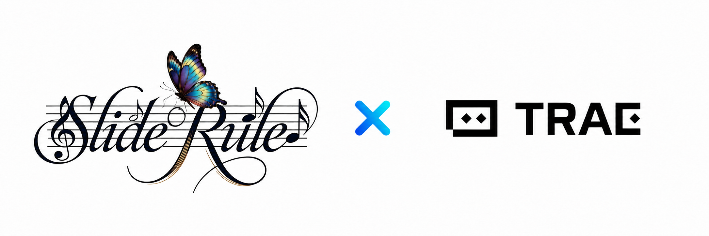
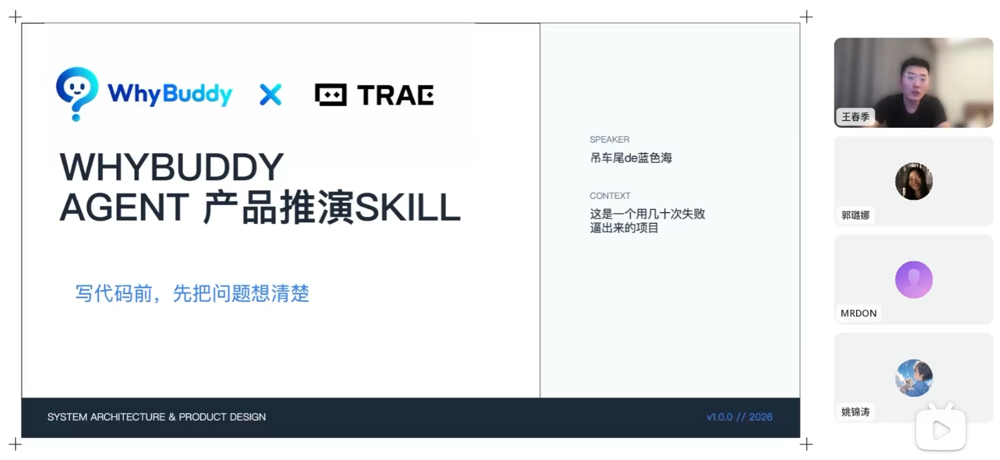
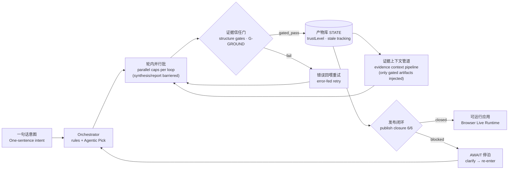
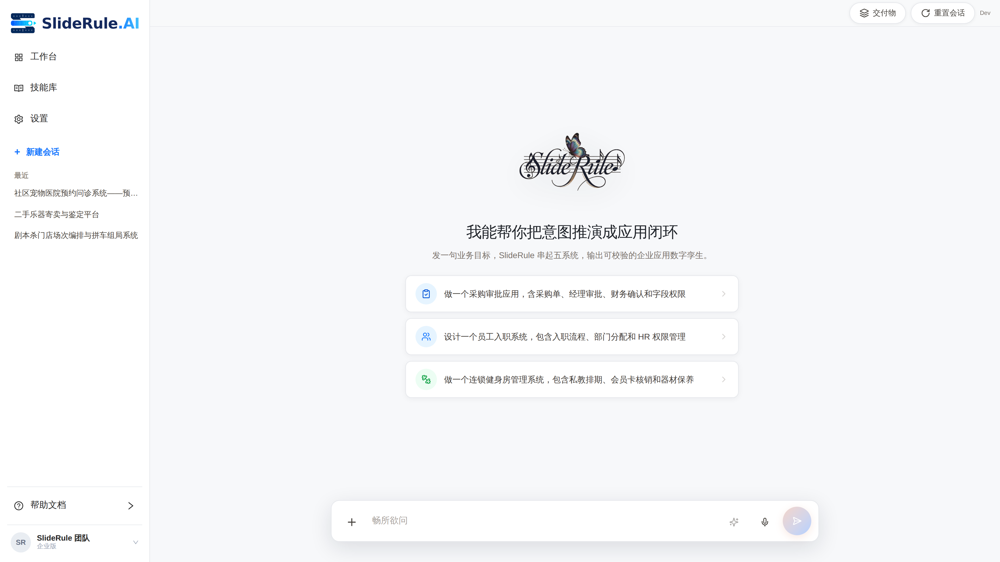
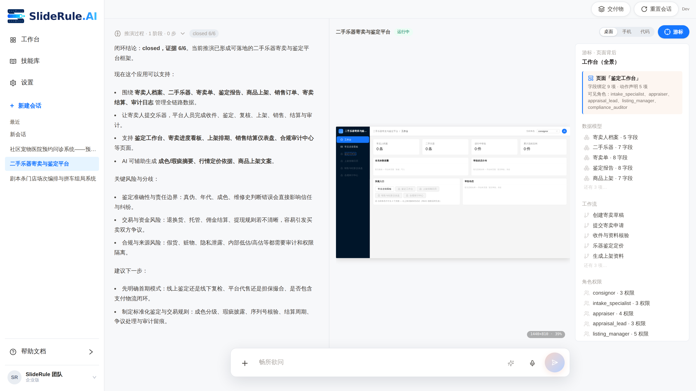
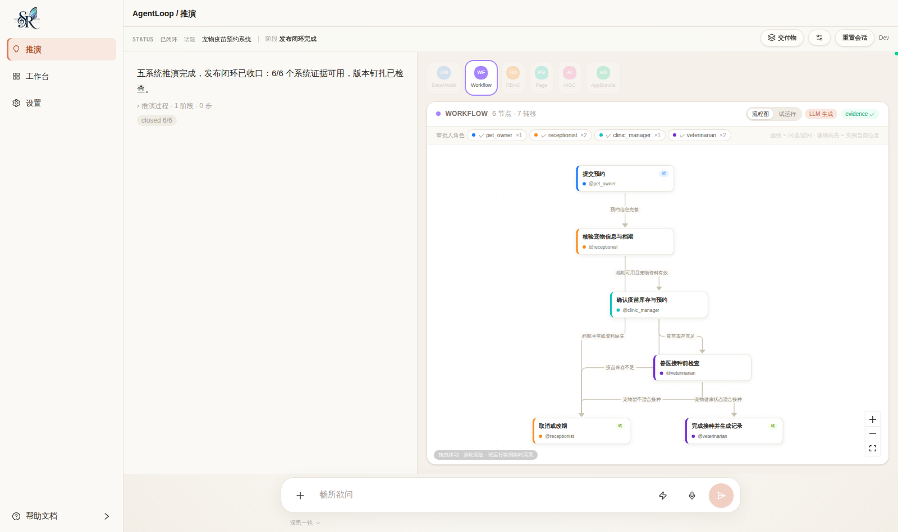
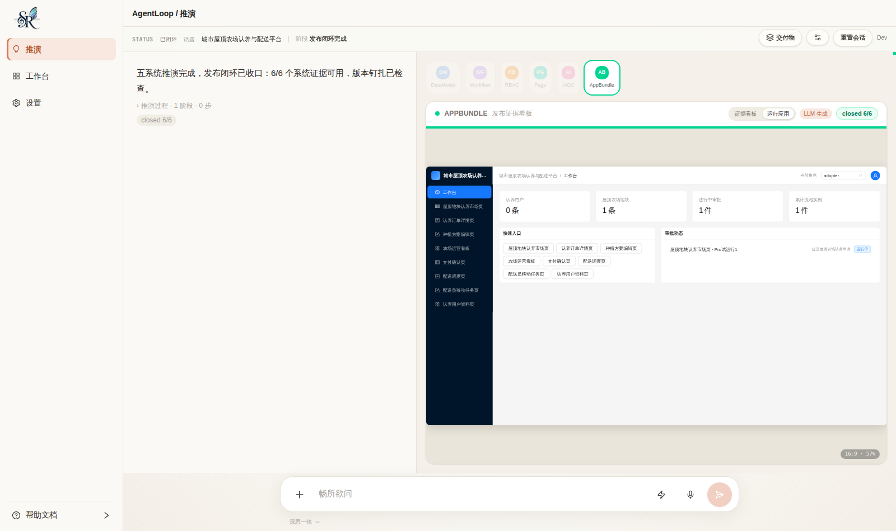

<p align="center">
  
</p>

<p align="center">
  <strong>SlideRule</strong> · product rehearsal engine<br/>
  <em>Clarify ideas, ship a runnable product.</em><br/>
  <sub>把想法问清楚，把产品跑起来</sub>
</p>

<p align="center">
  <sub>
    TRAE Skill Challenge / Community Showcase Project ·
    product name <strong>SlideRule</strong> ·
    <a href="https://sliderule.ai">sliderule.ai</a> ·
    hosted at <a href="https://github.com/xiaojilele-glitch/WhyBuddy">xiaojilele-glitch/WhyBuddy</a>
    (the repo keeps the project's original name)
  </sub>
</p>

<p align="center">
  <a href="https://forum.trae.cn/t/topic/69450"></a>
</p>

<p align="center">
  <sub>🏆 Winner of the <strong>Pioneer Skill Award (先锋技能奖)</strong> at the TRAE「一切皆可 Skill · SOLO 技能创作赛」— judged "outstanding in practicality and completeness, with strong promotion value". Entry: <a href="https://forum.trae.cn/t/topic/17058">From one sentence to executable specs</a> · <a href="https://forum.trae.cn/t/topic/69450">official announcement</a></sub>
</p>

<blockquote>
<strong>🧭 North Star:</strong> <em>"An AI claiming something is done does not count. Only artifacts that pass deterministic gates count."</em><br/>
The single product main line is <strong>SlideRule</strong> — intent → evidence-gated application rehearsal. <code>/autopilot</code> is the archived v4 demo. See <a href="./docs/NORTH_STAR.md">NORTH_STAR.md</a>.
</blockquote>

<p align="center">
  <a href="./README.md"><strong>English</strong></a> ·
  <a href="./README.zh-CN.md"><strong>简体中文</strong></a>
</p>

<p align="center">
  <a href="https://xiaojilele-glitch.github.io/WhyBuddy/agent-loop/workbench"></a>
  <a href="https://github.com/xiaojilele-glitch/WhyBuddy"></a>
  <a href="./ROADMAP.md"></a>
  <a href="./CONTRIBUTING.md"></a>
</p>

<p align="center">
  
  
  
  
  
  
</p>

---

## Why the name

A **slide rule** is an engineer’s analog calculator: scales, a cursor, and alignment before you trust a number.

**SlideRule** is the same idea for product decisions — not a magic “one-click app factory,” but a **rehearsal instrument**:

- every step is visible
- every artifact must pass deterministic gates
- only then does a runnable application appear

If AI says “done,” that still does not count. **The gate has to pass.**

---

## ⚡ 30 Second Overview

> **You enter one sentence. SlideRule rehearses a complete product plan — then lets you run it.**
>
> Five-system model · Evidence-gated artifacts · Publish closure · Browser live runtime
>
> Fully visible · Fully exportable · Fully backed by an evidence trail

<table>
<tr>
<td width="50%">

### 🎯 Pain

You spend **days** writing a PRD, **weeks** aligning the team, and **months** before you know whether the direction is even right.

</td>
<td width="50%">

### 💡 Solution

Enter an idea → **one coffee’s worth of real multi-loop deliberation, every step visible** → full rehearsal → decide whether it is worth building → if not, move on without months of sunk cost.

</td>
</tr>
</table>

### What it is / is not

| SlideRule **is**                                                           | SlideRule **is not**                                     |
| :------------------------------------------------------------------------- | :------------------------------------------------------- |
| A **product rehearsal engine** (intent → gated plan → previewable app)     | A pure **code agent** (Devin / Cursor-style repo labor)  |
| A **business-structure generator** (data · RBAC · workflow · pages · AIGC) | A **chatbot / workflow builder** alone (Dify / n8n)      |
| A **trust-first** system: gates, evidence, fail-closed tools               | An unconstrained “vibe UI” generator with no publish bar |

Closest mental models people use: _“v0/Lovable for the generation surface, Power Platform–like business structure, Manus-like long deliberation — ending in a gated app model, not a git repo.”_

---

## 🎮 Try It Now (Zero Install)

The static demo runs entirely in your browser — no backend, no key, nothing to install:

- **Workbench (start here)** → <https://xiaojilele-glitch.github.io/WhyBuddy/agent-loop/workbench>
- **Rehearsal surface** → <https://xiaojilele-glitch.github.io/WhyBuddy/agent-loop/sliderule>

What you can do there:

- **Watch a full rehearsal** — the main demo card pre-fills a real project intent (community pet-clinic booking & triage); press send and watch the engine reason through six skills to a **6/6 publish closure**. Playback is captured from a real end-to-end LLM run, not hand-written.
- **Open finished examples** — gallery cards (second-hand instrument consignment · script-murder venue scheduling) open as fully closed rehearsals: read the report, **run the generated app**, switch roles, drive approvals.
- **BYOK** — bring an OpenAI-compatible key (stays in your browser) to run live rehearsals on new topics.

---

## Product Screens

A consolidated 16-screen photo wall from SlideRule example rehearsals.


**Watch the Full Rehearsal Demo**

TRAE SOLO-based product rehearsal automation: from a one-sentence idea to executable specs.

[](https://www.bilibili.com/video/BV1BbEA6RE8a/?spm_id_from=333.1007.top_right_bar_window_history.content.click&vd_source=f07b7d222ea8a4494ad17a2a3911b1ae)

Click the video cover above to open the Bilibili demo.

---

## ⚙️ The V5 Rehearsal Engine

One sentence in → multi-loop reasoning over a **capability pool** (evidence search, risk analysis, counter-arguments, synthesis, reporting…) → a **five-system model** (data model · RBAC · workflow · pages · AIGC) → ships only when **publish closure** holds **6/6** evidence.

> **An AI claiming something is done does not count. Only artifacts that pass deterministic gates count.**


```mermaid
flowchart LR
  U["一句话意图<br/>One-sentence intent"] --> ORCH["Orchestrator<br/>rules + Agentic Pick"]
  ORCH --> PAR["轮内并行批<br/>parallel caps per loop<br/>(synthesis/report barriered)"]
  PAR --> GATE{"证据信任门<br/>structure gates · G-GROUND"}
  GATE -->|gated_pass| STATE[("产物库 STATE<br/>trustLevel · stale tracking")]
  GATE -->|fail| FEED["错误回喂重试<br/>error-fed retry"]
  FEED --> PAR
  STATE --> ECTX["证据上下文管道<br/>evidence context pipeline<br/>(only gated artifacts injected)"]
  ECTX --> PAR
  STATE --> CLOSE{"发布闭环<br/>publish closure 6/6"}
  CLOSE -->|closed| APP["可运行应用<br/>Browser Live Runtime"]
  CLOSE -->|blocked| AWAIT["AWAIT 停泊<br/>clarify → re-enter"]
  AWAIT --> ORCH
```

What makes it different from “an LLM with a long prompt”:

| Mechanism                     | What it does                                                                                                                    |
| :---------------------------- | :------------------------------------------------------------------------------------------------------------------------------ |
| **Evidence trust gate**       | Every artifact passes structural + grounding gates before it earns `gated_pass`; failures re-ask with validator errors          |
| **Evidence context pipeline** | Downstream reasoning is fed **only gated** upstream artifacts, priority-packed under budget with honest omission notes          |
| **Publish closure**           | Ships only when all six skills (dataModel · RBAC · workflow · page · AIGC · appBundle) hold evidence — otherwise parks at AWAIT |
| **Real tools**                | `web.search` and `code.run` (E2B sandbox, fail-closed without a key) via an MCP-style registry                                  |
| **Blind-judged upgrades**     | Engine changes ship with paired blind evals (A/B, position-swapped) — e.g. agentic pick 4:0, evidence pipeline 2:0              |

Deep dives: [V5.7 architecture (Chinese)](<./docs/SlideRule V5.7 架构图.md>) · [five-system generation eval](./docs/five-system-generation-eval.md) · [live-runtime blueprint](./docs/LIVE_SYSTEMS_BLUEPRINT.md)

---

## 🕹️ Browser Live Runtime

The rehearsed model is not just diagrams — **the browser renders it into an operable system**. The five-system JSON is the schema: zero backend, zero database for the runtime preview.

|                                                                                                                                                                                             |                                                                                                                                                                                                          |
| ------------------------------------------------------------------------------------------------------------------------------------------------------------------------------------------- | -------------------------------------------------------------------------------------------------------------------------------------------------------------------------------------------------------- |
|  <br/> <sub>Studio home — brand sidebar, session gallery, guided examples</sub>                                          |  <br/> <sub>**X-ray cursor (游标)** — hover any element and read five-system declarations: fields, roles, workflow nodes</sub> |
|  <br/> <sub>**Live workflow** — role-colored nodes; running instances light up their current node</sub> |  <br/> <sub>**Run the app** — Pro shell from the model: charts, tables, forms, approvals</sub>                         |

After a topic closes (all state in the browser, per-session):

- **Run the app** — desktop / tablet / phone frames, typed forms, detail drawers, approval submissions
- **Switch roles** — RBAC locks menus and buttons live; role preview stays in sync both ways
- **Drive approvals** — start / approve / reject / branch; the workflow diagram is a live monitor
- **Edit data in place** — DataModel table writes the same rows the app reads
- **Try AIGC for real** — declared AI capabilities run on the same LLM channel; failures surface honestly
- **Export with evidence** — delivery package includes a rehearsal-runtime snapshot

---

## 🚀 Quick Start

### Option A — Docker, one command (recommended)

Full stack (frontend + Node server + Python rehearsal engine), no local Node/Python needed — **and no database** for the main line (JSON file store):

```bash
git clone https://github.com/xiaojilele-glitch/WhyBuddy.git && cd WhyBuddy

cp .env.example .env      # fill at least LLM_API_KEY (any OpenAI-compatible provider) + SESSION_SECRET
docker compose up -d --build

# open http://localhost:3000/agent-loop/workbench
```

| Service  | Port                      | Role                                                                                          |
| :------- | :------------------------ | :-------------------------------------------------------------------------------------------- |
| `app`    | `3000` (host) → `3001`    | Node server + bundled frontend; SlideRule API thin-proxies to Python                          |
| `python` | `9700` (network-internal) | V5 rehearsal engine: five-system generation, evidence trust gates, evidence pipeline, closure |

`mysql` is an **optional profile**, only for legacy accounts (login / email codes / projects): `docker compose --profile accounts up -d`.

Sessions and artifacts persist in the named volume `sliderule-python-data` — rebuilds keep your data.

```bash
docker compose logs -f app python   # follow logs
docker compose up -d --build        # rebuild after pulling updates
docker compose down                 # stop (keeps data volumes)
docker compose down -v              # stop and wipe data
```

<details>
<summary>📌 <strong>Deployment notes</strong></summary>

- **Required env**: `LLM_API_KEY` / `LLM_BASE_URL` / `LLM_MODEL` (any OpenAI-compatible provider) and `SESSION_SECRET` (use a 64-char random hex in production). Without an LLM key the stack still boots; rehearsals fall back to deterministic templates.
- **Optional**: `WEB_SEARCH_API_KEY` (grounded web evidence) and `E2B_API_KEY` (sandboxed `code.run`) — missing keys fail closed; tools stay unavailable.
- **Port conflicts**: change `app`’s `ports` mapping in `docker-compose.yml` (e.g. `"8080:3001"`).
- **Accounts (optional)**: the rehearsal main line needs no database. Enable accounts with `docker compose --profile accounts up -d`.
- **Production servers — pull, don’t build**: releases to `main` build images to ghcr.io (`.github/workflows/deploy-images.yml`). On the server:

  ```bash
  docker compose -f docker-compose.prod.yml pull && docker compose -f docker-compose.prod.yml up -d
  # auto-updates (Watchtower every 5 min):
  docker compose -f docker-compose.prod.yml --profile auto up -d
  # image address is assembled from four .env vars, each overridable:
  #   SLIDERULE_REGISTRY=ghcr.io  SLIDERULE_IMAGE_OWNER=xiaojilele-glitch  SLIDERULE_IMAGE_TAG=latest
  # rollback to a release:      SLIDERULE_IMAGE_TAG=<commit-sha>
  # your own fork's images:     SLIDERULE_IMAGE_OWNER=<your-github-user-lowercase>
  # slow ghcr (e.g. China):     SLIDERULE_REGISTRY=ghcr.nju.edu.cn   (owner unchanged — the mirror is transparent)
  # Docker Hub dual-push:       SLIDERULE_REGISTRY=docker.io + SLIDERULE_IMAGE_OWNER=<hub-user>
  #   ^ changing the registry alone is not enough: namespaces are per-registry.
  ```

- **Corporate TLS-intercepting proxies**: drop your root CA (`.crt` PEM) into `docker/certs/` before building (see `docker/certs/README.md`). Certificates are gitignored.
- **Not in compose**: Lobster Executor (DinD, opt-in), Redis (off by default), Feishu (mock by default).
- `.env` is never baked into images; it is injected at runtime via `env_file`.

</details>

### Option B — Local development

```bash
git clone https://github.com/xiaojilele-glitch/WhyBuddy.git && cd WhyBuddy
pnpm install
pnpm run dev:all          # full stack: frontend + server + executor
```

Requirements: Node.js 22+ · pnpm · (optional) Python 3.11+ for the rehearsal engine · (optional) Docker for executor mode.

### Option C — Browser only (no server, no .env)

```bash
pnpm run dev:frontend     # open http://localhost:3000
```

Or use the [hosted static demo](https://xiaojilele-glitch.github.io/WhyBuddy/agent-loop/workbench).

---

## 🧩 The `sliderule` Skill Package

Besides the full app, SlideRule ships a **self-contained Skill package** for Trae, Claude, or any host that supports Agent Skills. One sentence in → a reviewable spec package out (requirements / design / tasks / traceability matrix / UI previews). Every gate is **actually run by scripts** — `checks_ledger.json` records each script, exit code, and output.

```bash
unzip skills/sliderule.zip
# drop the resulting sliderule/ folder into your agent host's skills directory
# (Trae: Skills · Claude: skill), then give it a one-sentence idea
```

Setup and package layout: [`skills/README.md`](./skills/README.md).

---

## 📝 Rehearsal Examples

> Every rehearsal is shareable content. The first three are live in the [static demo](https://xiaojilele-glitch.github.io/WhyBuddy/agent-loop/workbench) — captured from real end-to-end engine runs.

| 💬 Input                                            | 📦 Output                                                                                      |
| :-------------------------------------------------- | :--------------------------------------------------------------------------------------------- |
| "Community pet-clinic booking & triage system"      | Six-skill playback · 6/6 publish closure · runnable booking/triage app                         |
| "Second-hand instrument consignment & appraisal"    | Closed rehearsal · consignment ledger, appraisal workbench, listing calendar, compliance audit |
| "Script-murder venue scheduling & party matching"   | Closed rehearsal · session board, store calendars, sign-up & carpool grouping                  |
| "Procurement approval with field-level permissions" | Five-system model · approval state machine · RBAC field locks · risk & counter-evidence report |

---

## 🏗️ System Architecture

Current engine (V5.7, per-increment commit provenance): [docs/SlideRule V5.7 架构图.md](<./docs/SlideRule V5.7 架构图.md>)

Historical: [V5.6](<./docs/SlideRule V5.6 架构图.md>) · [V5.5](<./docs/SlideRule V5.5 架构图.md>) · [V5.4](<./docs/SlideRule V5.4 架构图.md>) · [V5.3](<./docs/SlideRule V5.3 架构图.md>) · [V5.2](<./docs/SlideRule V5.2 架构图.md>) · [v4 Skill closed-loop diagram](./docs/assets/SlideRuleArc/SlideRuleSkill%E9%97%AD%E7%8E%AF%E6%80%BB%E5%9B%BE_%E6%94%B9%E8%BF%9B%E7%89%88v4.md) (architecture behind the award-winning Skill package)

---

## 🛠️ Tech Stack

| Layer    | Technology                                                                           |
| :------- | :----------------------------------------------------------------------------------- |
| Frontend | React 19 · Vite · TypeScript · Tailwind · streamdown / assistant-ui · Three.js (R3F) |
| Server   | Express · Socket.IO · TypeScript (thin proxy to the Python engine)                   |
| Engine   | Python 3.11 · FastAPI · deterministic gates + LLM capability pool                    |
| AI       | OpenAI-compatible APIs (any provider) · BYOK in the browser                          |
| Tools    | `web.search` · `code.run` (E2B) via MCP-style registry                               |
| Testing  | Vitest · pytest · Playwright browser smokes · fast-check (PBT)                       |
| Storage  | JSON session store · MySQL 8 (accounts) · IndexedDB (browser)                        |
| Deploy   | Docker Compose · GitHub Pages static demo · GitHub Actions gate                      |

---

## 📊 Project Scale

| Metric               |   Count |
| :------------------- | ------: |
| Project files        |   8,194 |
| TypeScript/TSX files |   2,926 |
| TypeScript lines     | 835,305 |
| Python lines         |  92,137 |
| Test files           |   1,322 |
| Spec directories     |     316 |

---

## ⚔️ How to place SlideRule

These tools solve **different jobs**. The table is not “we replace them all” — it shows where the rehearsal main line is unique.

| Capability                                                        | Agent frameworks<br/>(CrewAI / LangGraph) | Workflow builders<br/>(Dify / n8n) | **SlideRule** |
| :---------------------------------------------------------------- | :---------------------------------------: | :--------------------------------: | :-----------: |
| Open source                                                       |                    ✅                     |                 ✅                 |      ✅       |
| Multi-agent / long orchestration                                  |                    ✅                     |                 ⚠️                 |      ✅       |
| One sentence → **product structure** (data · RBAC · flow · pages) |                    ❌                     |                 ❌                 |      ✅       |
| Spec package (requirements · design · tasks · traceability)       |                    ❌                     |                 ❌                 |      ✅       |
| **Evidence-gated publish closure**                                |                    ❌                     |                 ❌                 |      ✅       |
| Rehearsed model **runs as an app** in the browser                 |                    ❌                     |                 ❌                 |      ✅       |
| Replay, audit, human park / re-enter                              |                    ⚠️                     |                 ⚠️                 |      ✅       |
| Sandboxed code tools                                              |                    ⚠️                     |                 ⚠️                 |      ✅       |
| Browser-only demo (zero install)                                  |                    ❌                     |                 ❌                 |      ✅       |

For generation UX people often compare **v0 / Lovable / Bolt**; for long visible deliberation, **Manus-class agents**; for enterprise app structure, **Power Platform / low-code**. SlideRule’s bet is the **intersection**: _rehearse the business system under gates, then run the model — not only emit code or a chat bot._

---

## 🤝 Contributing

```bash
1. Fork & clone → pnpm install
2. pnpm run dev:frontend (UI) or pnpm run dev:all (full stack)
3. Before submitting: pnpm run check && pnpm run test
```

**Branch model**: `main` is production; `pre_main` is daily integration. Merges go through the release gate — a red gate mechanically blocks the merge:

```bash
bash scripts/merge-gated.sh <your-branch> "<message>"            # daily → pre_main
bash scripts/merge-gated.sh pre_main "<release message>" main    # release → main
```

See [CONTRIBUTING.md](./CONTRIBUTING.md).

---

## ⭐ Star History

> Every rehearsal is content that helps others discover what is possible. Star this repository to help more people find it.

<p>
  <a href="https://github.com/xiaojilele-glitch/WhyBuddy/stargazers"></a>
  <a href="https://github.com/xiaojilele-glitch/WhyBuddy/forks"></a>
  <a href="https://github.com/xiaojilele-glitch/WhyBuddy/watchers"></a>
</p>

📈 [Star growth curve →](https://star-history.com/#xiaojilele-glitch/WhyBuddy&Date)

---

<p align="center">
  <strong>SlideRule</strong> · <a href="https://sliderule.ai">sliderule.ai</a><br/>
  <a href="./LICENSE"><strong>MIT License</strong></a> ·
  Source: <a href="https://github.com/xiaojilele-glitch/WhyBuddy">xiaojilele-glitch/WhyBuddy</a>
</p>
