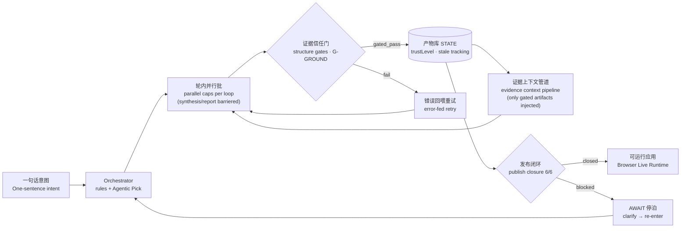

<p align="center">
  
</p>

<p align="center">
  <strong>SlideRule</strong> · 产品推演引擎<br/>
  <em>把想法问清楚，把产品跑起来</em><br/>
  <sub>Clarify ideas, ship a runnable product.</sub>
</p>

<p align="center">
  <sub>
    TRAE Skill 挑战赛作品 / 社区展示项目 ·
    产品名 <strong>SlideRule</strong> ·
    <a href="https://sliderule.ai">sliderule.ai</a> ·
    托管于 <a href="https://github.com/xiaojilele-glitch/WhyBuddy">xiaojilele-glitch/WhyBuddy</a>
    （仓库沿用项目原名）
  </sub>
</p>

<p align="center">
  <a href="https://forum.trae.cn/t/topic/69450"></a>
</p>

<p align="center">
  <sub>🏆 TRAE「一切皆可 Skill · SOLO 技能创作赛」<strong>先锋技能奖</strong>获奖作品——评审语："作品在实用性、完成度上有出色表现，具有很强的推广价值"。参赛帖：<a href="https://forum.trae.cn/t/topic/17058">《从一句话到可执行规格：产品预演全流程自动化》</a> · <a href="https://forum.trae.cn/t/topic/69450">获奖公示</a></sub>
</p>

<blockquote>
<strong>🧭 北极星：</strong><em>「AI 声称完成不算数，过了确定性门的产物才算数。」</em><br/>
唯一产品主线是 <strong>SlideRule</strong>——意图 → 证据过门的应用推演。<code>/autopilot</code> 是已归档的 v4 演示。详见 <a href="./docs/NORTH_STAR.md">北极星文档</a>。
</blockquote>

<p align="center">
  <a href="./README.md"><strong>English</strong></a> ·
  <a href="./README.zh-CN.md"><strong>简体中文</strong></a>
</p>

<p align="center">
  <a href="https://xiaojilele-glitch.github.io/WhyBuddy/agent-loop/workbench"></a>
  <a href="https://github.com/xiaojilele-glitch/WhyBuddy"></a>
  <a href="./ROADMAP.md"></a>
  <a href="./CONTRIBUTING.md"></a>
</p>

<p align="center">
  
  
  
  
  
  
</p>

---

## 为什么叫这个名字

**计算尺（slide rule）** 是工程师的模拟计算工具：刻度、游标，先对齐再相信读数。

**SlideRule** 把同一套思路用在产品决策上——不是魔法式的「一键 App 工厂」，而是一台**推演仪器**：

- 每一步都可见
- 每件产物必须过确定性门
- 只有过门之后，才长出可运行的应用

模型说「做完了」仍然不算数。**门过了才算数。**

---

## ⚡ 30 秒了解

> **你输入一句话。SlideRule 推演完整产品方案——并让你直接跑起来。**
>
> 五系统模型 · 证据过门的产物 · 发布闭环 · 浏览器运行时
>
> 全程可见 · 全部可导出 · 处处有证据链

<table>
<tr>
<td width="50%">

### 🎯 痛点

写 PRD 要**几天**，对齐团队要**几周**，验证方向对不对要**几个月**。

</td>
<td width="50%">

### 💡 解法

输入一个想法 → **一杯咖啡的真实多轮推演，每一步都看得见** → 完整预演 → 判断值不值得做 → 不值得就换下一个，不必沉没数月。

</td>
</tr>
</table>

### 它是什么 / 不是什么

| SlideRule **是** | SlideRule **不是** |
| :--------------- | :----------------- |
| **产品推演引擎**（意图 → 过门方案 → 可预览应用） | 纯 **写代码 Agent**（Devin / Cursor 式改仓库劳动力） |
| **业务结构生成器**（数据 · RBAC · 工作流 · 页面 · AIGC） | 单独的 **聊天机器人 / 工作流搭建器**（Dify / n8n） |
| **信任优先**系统：门、证据、工具 fail-closed | 无发布门槛的「随缘 UI 生成」 |

别人常用的心智锚点：*「生成面像 v0/Lovable，业务结构像 Power Platform，长推演像 Manus——终点是过门的应用模型，不是 git 仓库。」*

---

## 🎮 立即体验（零安装）

静态演示完全在浏览器里运行——无后端、无需 key、无需安装：

- **工作台（从这里开始）** → <https://xiaojilele-glitch.github.io/WhyBuddy/agent-loop/workbench>
- **推演界面** → <https://xiaojilele-glitch.github.io/WhyBuddy/agent-loop/sliderule>

在里面你可以：

- **看一场完整推演**——主演示卡预填真实项目意图（社区宠物医院预约问诊），点发送看引擎经六技能推到 **6/6 发布闭环**。回放来自真实 LLM 端到端捕获，不是手写脚本。
- **打开完成态示例**——画廊卡（二手乐器寄卖鉴定 · 剧本杀场次编排）是已闭环推演：读报告、**运行生成的应用**、切换角色、驱动审批。
- **BYOK**——填入你自己的 OpenAI 兼容 key（只存在浏览器），即可对新话题真跑推演。

---

## 产品界面

SlideRule 示例推演的 16 屏照片墙。


**完整推演演示视频**

基于 TRAE SOLO 的产品预演自动化：从一句话想法到可执行规格。

[](https://www.bilibili.com/video/BV1BbEA6RE8a/?spm_id_from=333.1007.top_right_bar_window_history.content.click&vd_source=f07b7d222ea8a4494ad17a2a3911b1ae)

点击上方视频封面打开 Bilibili 演示。

---

## ⚙️ V5 推演引擎

一句话进来 → 在**能力池**上多轮推理（证据检索、风险分析、反证、综合、报告……）→ 落成**五系统模型**（数据模型 · RBAC · 工作流 · 页面 · AIGC）→ 只有**发布闭环**拿满 **6/6** 证据才交付。

> **AI 声称完成不算数，过了确定性门的产物才算数。**



它和「套着长 prompt 的 LLM」的区别：

| 机制 | 作用 |
| :--- | :--- |
| **证据信任门** | 每件产物先过结构门 + 接地门才拿 `gated_pass`；失败把校验错误回喂重试 |
| **证据上下文管道** | 下游推理只吃**过了门的上游产物**，按优先级装箱，省略如实留痕 |
| **发布闭环** | 六技能（数据模型 · RBAC · 工作流 · 页面 · AIGC · 应用包）证据齐全才发布，否则停在 AWAIT |
| **真实工具** | `web.search` 与 `code.run`（E2B 沙盒，无 key 则 fail-closed），经 MCP 式注册表接入 |
| **盲评签字上线** | 引擎改动配对盲评（A/B · 换位）——如 agentic pick 4:0、证据管道 2:0 |

深入阅读：[V5.3 架构图](<./docs/SlideRule V5.3 架构图.md>) · [五系统生成评测](./docs/five-system-generation-eval.md) · [运行时蓝图](./docs/LIVE_SYSTEMS_BLUEPRINT.md)

---

## 🕹️ 浏览器运行时

推演出来的模型不只是图——**浏览器把它渲染成可操作的系统**。五系统 JSON 即 schema：预览运行时零后端、零数据库。

| | |
| --- | --- |
|  <br/> <sub>工作室首屏——品牌侧栏、会话列表、示例引导</sub> |  <br/> <sub>**游标透视**——悬停任意元素，读出绑定字段、可见角色、工作流节点</sub> |
|  <br/> <sub>**工作流实况**——角色着色节点；运行中的实例实时点亮当前节点</sub> |  <br/> <sub>**运行应用**——由模型渲染的 Pro 壳：图表、表格、表单、审批</sub> |

话题闭环后你可以（状态在浏览器内、按会话隔离）：

- **运行应用**——桌面/平板/手机机身，类型化表单、详情抽屉、提交审批
- **切换角色**——RBAC 实时锁菜单与按钮；角色预览双向同步
- **驱动审批**——发起/通过/驳回/分支；工作流图即实况监视器
- **就地改数据**——数据模型表写的就是应用读的同一份行
- **真跑 AIGC**——声明能力走同一 LLM 通道；失败如实呈现
- **带证据导出**——交付包附带推演运行时快照

---

## 🚀 快速开始

### 方式 A——Docker 一键部署（推荐）

全栈（前端 + Node 服务 + Python 推演引擎），无需本地 Node/Python——主线**也不需要数据库**（JSON 文件库）：

```bash
git clone https://github.com/xiaojilele-glitch/WhyBuddy.git && cd WhyBuddy

cp .env.example .env      # 至少填 LLM_API_KEY（任意 OpenAI 兼容供应商）和 SESSION_SECRET
docker compose up -d --build

# 打开 http://localhost:3000/agent-loop/workbench
```

| 服务 | 端口 | 职责 |
| :--- | :--- | :--- |
| `app` | `3000`（宿主）→ `3001` | Node 服务 + 打包前端；SlideRule API 薄代理到 Python |
| `python` | `9700`（仅容器网络内） | V5 推演引擎：五系统生成、证据信任门、证据管道、发布闭环 |

`mysql` 是**可选 profile**，仅遗留账号功能（登录/邮箱验证码/projects）：`docker compose --profile accounts up -d`。

会话与产物持久化在命名卷 `sliderule-python-data`——容器重建不丢数据。

```bash
docker compose logs -f app python   # 跟日志
docker compose up -d --build        # 更新后重建
docker compose down                 # 停止（保留数据卷）
docker compose down -v              # 停止并清空数据
```

<details>
<summary>📌 <strong>部署须知</strong></summary>

- **必填环境变量**：`LLM_API_KEY` / `LLM_BASE_URL` / `LLM_MODEL`（任意 OpenAI 兼容供应商）与 `SESSION_SECRET`（生产用 64 位随机 hex）。不填 LLM key 也能启动，推演走确定性模板回退。
- **可选能力**：`WEB_SEARCH_API_KEY`（全网证据）、`E2B_API_KEY`（`code.run` 沙盒）——不填则对应工具 fail-closed 不可用。
- **端口冲突**：改 `docker-compose.yml` 里 `app` 的 `ports`（如 `"8080:3001"`）。
- **账号功能（可选）**：推演主线不需要数据库。需要时 `docker compose --profile accounts up -d`。
- **生产服务器——只拉不建**：发版到 `main` 会构建镜像推 ghcr.io（`.github/workflows/deploy-images.yml`）。服务器上：

  ```bash
  docker compose -f docker-compose.prod.yml pull && docker compose -f docker-compose.prod.yml up -d
  # 全自动更新（Watchtower 每 5 分钟）：
  docker compose -f docker-compose.prod.yml --profile auto up -d
  # 回滚：把 :latest 换成某次发版的 :<commit-sha>
  # 国内拉 ghcr 慢：.env 加 SLIDERULE_REGISTRY=ghcr.nju.edu.cn
  # 或 Docker Hub 双推（配好 secrets 后）：
  #   SLIDERULE_IMAGE_APP=docker.io/<Hub用户名>/whybuddy-app:latest
  #   SLIDERULE_IMAGE_PYTHON=docker.io/<Hub用户名>/whybuddy-python:latest
  ```

- **企业 TLS 拦截代理**：根证书（PEM `.crt`）放进 `docker/certs/` 再构建（见 `docker/certs/README.md`）。证书已 gitignore。
- **不在 compose 内**：Lobster Executor（DinD，单独 opt-in）、Redis（默认关）、飞书（默认 mock）。
- `.env` 不进镜像，运行时经 `env_file` 注入。

</details>

### 方式 B——本地开发

```bash
git clone https://github.com/xiaojilele-glitch/WhyBuddy.git && cd WhyBuddy
pnpm install
pnpm run dev:all          # 全栈：前端 + 服务端 + 执行器
```

环境要求：Node.js 22+ · pnpm ·（可选）Python 3.11+ 跑推演引擎 ·（可选）Docker 执行器模式。

### 方式 C——纯浏览器（无服务端、无 .env）

```bash
pnpm run dev:frontend     # 打开 http://localhost:3000
```

或直接用[线上静态演示](https://xiaojilele-glitch.github.io/WhyBuddy/agent-loop/workbench)。

---

## 🧩 `sliderule` 技能包

除完整应用外，SlideRule 还提供**自包含 Skill 包**，可装进 Trae、Claude 或任何支持 Agent Skills 的宿主。一句话进 → 可评审规格包出（需求/设计/任务/可追溯矩阵/UI 预览）。每道门由**脚本真实跑过**——`checks_ledger.json` 记录脚本、退出码与输出。

```bash
unzip skills/sliderule.zip
# 把解出的 sliderule/ 放进宿主技能目录
#（Trae：Skills · Claude：skill），然后给它一句话想法
```

安装与产物结构：[`skills/README.md`](./skills/README.md)。

---

## 📝 预演示例

> 每一次预演都是可分享内容。下面前三个就在[静态演示](https://xiaojilele-glitch.github.io/WhyBuddy/agent-loop/workbench)里——全部来自引擎端到端真跑。

| 💬 输入 | 📦 输出 |
| :------ | :------ |
| 「社区宠物医院预约问诊系统」 | 六技能回放 · 6/6 发布闭环 · 可运行预约分诊应用 |
| 「二手乐器寄卖与鉴定平台」 | 已闭环 · 寄卖台账、鉴定工作台、上架排期、合规审计 |
| 「剧本杀门店场次编排与拼车组局」 | 已闭环 · 场次看板、门店排期、报名与拼车 |
| 「采购审批 + 字段级权限」 | 五系统模型 · 审批状态机 · RBAC 字段锁 · 风险与反证报告 |

---

## 🏗️ 系统架构

当前引擎（V5.3，增量可溯提交）：[docs/SlideRule V5.3 架构图.md](<./docs/SlideRule V5.3 架构图.md>)

历史版本：[V5.2](<./docs/SlideRule V5.2 架构图.md>) · [v4 Skill 闭环总图](./docs/assets/SlideRuleArc/SlideRuleSkill%E9%97%AD%E7%8E%AF%E6%80%BB%E5%9B%BE_%E6%94%B9%E8%BF%9B%E7%89%88v4.md)（获奖技能包背后的架构）

---

## 🛠️ 技术栈

| 层次 | 技术 |
| :--- | :--- |
| 前端 | React 19 · Vite · TypeScript · Tailwind · streamdown / assistant-ui · Three.js (R3F) |
| 服务端 | Express · Socket.IO · TypeScript（薄代理到 Python 引擎） |
| 引擎 | Python 3.11 · FastAPI · 确定性门 + LLM 能力池 |
| AI | OpenAI 兼容 API（任意供应商）· 浏览器 BYOK |
| 工具 | `web.search` · `code.run`（E2B）· MCP 式注册表 |
| 测试 | Vitest · pytest · Playwright 浏览器冒烟 · fast-check（PBT） |
| 存储 | JSON 会话库 · MySQL 8（账号）· IndexedDB（浏览器） |
| 部署 | Docker Compose · GitHub Pages 静态演示 · GitHub Actions 发布门 |

---

## 📊 项目规模

| 指标 | 数量 |
| :--- | ---: |
| 项目文件 | 8,194 |
| TypeScript/TSX 文件 | 2,926 |
| TypeScript 行数 | 835,305 |
| Python 行数 | 92,137 |
| 测试文件 | 1,322 |
| Spec 目录 | 316 |

---

## ⚔️ 怎么安放 SlideRule

这些工具解决的是**不同工作**。下表不是「我们全面替代它们」，而是标出推演主线独特的位置。

| 能力 | Agent 框架<br/>（CrewAI / LangGraph） | 工作流搭建<br/>（Dify / n8n） | **SlideRule** |
| :--- | :-----------------------------------: | :--------------------------: | :-----------: |
| 开源 | ✅ | ✅ | ✅ |
| 多 Agent / 长编排 | ✅ | ⚠️ | ✅ |
| 一句话 → **产品结构**（数据 · RBAC · 流程 · 页面） | ❌ | ❌ | ✅ |
| 规格包（需求 · 设计 · 任务 · 追溯） | ❌ | ❌ | ✅ |
| **证据过门的发布闭环** | ❌ | ❌ | ✅ |
| 推演模型在浏览器**跑成应用** | ❌ | ❌ | ✅ |
| 回放、审计、人工停泊 / 再入 | ⚠️ | ⚠️ | ✅ |
| 沙盒代码工具 | ⚠️ | ⚠️ | ✅ |
| 纯浏览器零安装演示 | ❌ | ❌ | ✅ |

生成体验上人们常比 **v0 / Lovable / Bolt**；长推演可见性常比 **Manus 类 Agent**；企业应用结构常比 **Power Platform / 低代码**。SlideRule 押注的是**交汇点**：*在门下推演业务系统，再跑模型——不只吐代码，也不只聊 Bot。*

---

## 🤝 贡献

```bash
1. Fork & clone → pnpm install
2. pnpm run dev:frontend（界面）或 pnpm run dev:all（全栈）
3. 提交前：pnpm run check && pnpm run test
```

**分支模型**：`main` 是生产分支；`pre_main` 是日常集成。合并一律走发布门——门红机械拦截：

```bash
bash scripts/merge-gated.sh <你的分支> "<说明>"            # 日常 → pre_main
bash scripts/merge-gated.sh pre_main "<发版说明>" main     # 发版 → main
```

详见 [CONTRIBUTING.md](./CONTRIBUTING.md)。

---

## ⭐ Star History

> 每一次预演，都是帮他人发现新可能的内容。Star 本仓库，让更多人找到它。

<p>
  <a href="https://github.com/xiaojilele-glitch/WhyBuddy/stargazers"></a>
  <a href="https://github.com/xiaojilele-glitch/WhyBuddy/forks"></a>
  <a href="https://github.com/xiaojilele-glitch/WhyBuddy/watchers"></a>
</p>

📈 [查看 Star 增长曲线 →](https://star-history.com/#xiaojilele-glitch/WhyBuddy&Date)

---

<p align="center">
  <strong>SlideRule</strong> · <a href="https://sliderule.ai">sliderule.ai</a><br/>
  <a href="./LICENSE"><strong>MIT License</strong></a> ·
  源码：<a href="https://github.com/xiaojilele-glitch/WhyBuddy">xiaojilele-glitch/WhyBuddy</a>
</p>
