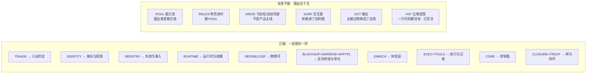

# SlideRule V6.1 · V6.0 未搬清单

一张一个事实：V6.0 有 19 个子图 183 个节点，V6.1 **有意不搬**其中一部分。
这份清单存在的理由，就是 V6.0 头注那句话的另一半：

> 照着一个不存在的结构去理解系统，比不知道它存在更糟。
> ——反过来同样成立：**照着一个「没画」的空白，以为那块东西不存在，一样糟。**

2026-08-29 逐个子图对着代码核过一遍。搬了的见下表左栏，没搬的**在这里写清楚为什么**。

## 一眼看全：V6.0 的 19 个子图去了哪

## 已搬（V6.1 一张图对一块）

| V6.0 子图 | V6.1 图 |
|---|---|
| `TRIAGE` 入站判定 | `入站判定` |
| `IDENTITY` 身份与权限 | `身份与权限` |
| `REENTRY` 失效与重入 | `失效与重入` |
| `RUNTIME` 运行时 | `运行时与续播` |
| `REFINELOOP` 精修环 | `精修环` |
| `BLOCKSUP` + `NARROW` + `APPTPL` | `区块供给与窄化` |
| `ENRICH` 体验层 | `体验层` |
| `EXEC` + `TOOLS` 执行层 | `执行与记账` |
| `CORE` 控制平面 | `控制面` |
| `CLOSURE` + `TRUST` 闭环与信任 | `闸与闭环` |

## 没搬，以及为什么

**① `POOL` 能力池（33 节点）—— 有意不搬，这是 V6.1 立的规矩**
`控制面` 图里写着「本图不画能力池散文」。能力池是平权表，画成图只会得到一张
33 个孤点的散文墙；要查某个能力做什么，看 `services/capability_maps.py` 的表比看图快。

**② `ROLES` 角色与协作（7 节点）—— 随 ① 一起不搬**
头脑风暴 / 综合器 / 流边界守卫都是能力池内部的调度形态。降级兜底那一条是活的
（`services/run_degradation.py`），但它属于「一次推演怎么降级」，已由
`闸与闭环` 的 fail-closed 语义覆盖。

**③ `DRIVE` 驱动层 · 马拉松 / 自动驾驶（6 节点）—— 不是产品主线**
`/api/sliderule/drive-marathon` 路由与 `slide_rule_marathon.py` **都还在**，
前端 `client/src/lib/sliderule-marathon-driver.ts` 里也确实有一处 fetch 打它。
⚠ 但**同一个文件**里还有 `/drive-full-stream` 与续播 —— 产品主路径走的是后者
（见 `控制面` 图）。文件名叫 marathon 只是历史，别据此认为马拉松是主线。
> 待确认（没查完，别当结论）：那处 `/drive-marathon` fetch 今天还有没有产品调用点。
> 查法照 CLAUDE.md 第一条：在那条路径上打一行日志，看真机跑一轮进不进去。

**④ `SURF` 交互面（7 节点）—— 拆散进了别的图**
`IntakeHintBar` 已接在 `ComposerDock` 上，画在 `入站判定` 的 hint 一支；
附件提取、IM 输出编排属于作曲家内部，`活UI路由` 只画路由不画组件树。

**⑤ `OUT` 输出（4 节点）—— 主输出物换了**
V5 时代主输出是「可行性/推演报告」，V6 主输出是**应用**。`report.write` 能力仍在，
但已改成范围卡勾选 `wantFeasibilityReport` 才注入短清单——从脊柱降成可选项。
应用墙 `AppsWorkbench` 画在 `活UI路由`。

**⑥ V6.0 里那批「一行代码都没有」的提案格 —— 不许搬**
`VISPROMPT` / `VISIMG` / `VISHTML` / `VISDERIVE` / `SEMLINE`：V6.0 自己的读图纪律
就写着这五格是红虚线提案。第 3、4 步「已定——不建」（2026-08-13 看完 12 张渲染截图
后的裁决：无图的生成效果更好）。**搬进 V6.1 就等于把一个被否决的方案画成现状。**
