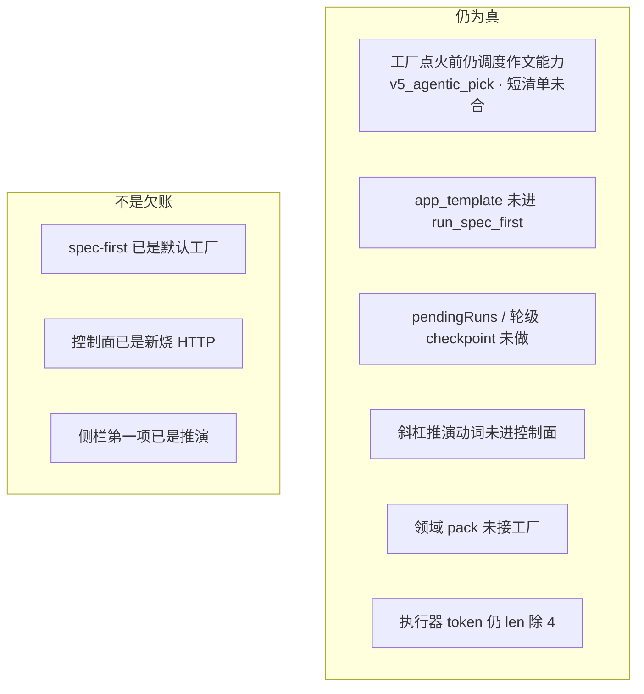

# SlideRule V6.1 已知缺口

一张一个事实：只画**此刻仍为真**的欠账。已落地的不要再标「尚未做」。
本图对照的是 PR-4 之后、短清单/斜杠动词/骨架接线尚未合入的代码。数字不写在图上。

已落地、图上不许再欠：spec-first 已接主轴；`POST /control-turn-stream` 是新烧插座；侧栏「推演」；AppsWorkbench 可见性开关；续播 `GET /runs/{id}/stream`。

