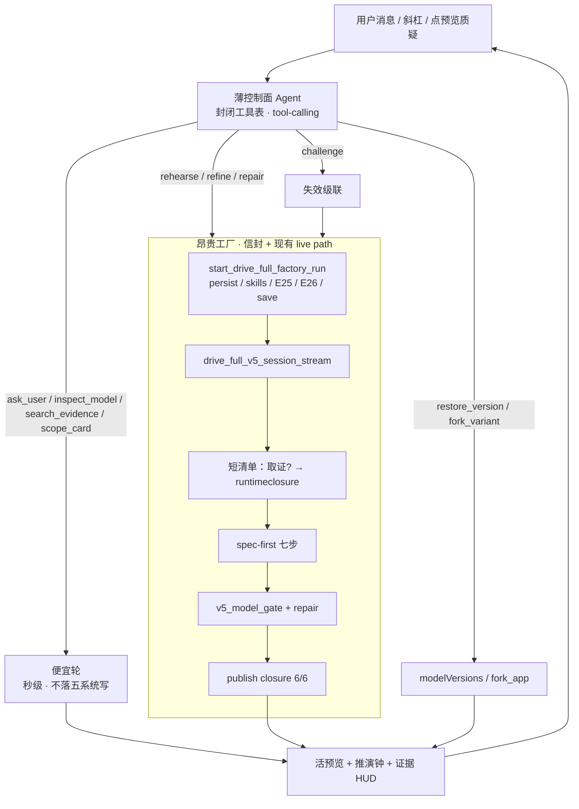

# SlideRule V6.1 控制面

一张一个事实：用户消息进入薄控制面；只有 `rehearse` / `refine` / `repair` 才进工厂信封。
源：`docs/欠缺模块清单-对照Claude与Grok-build.md` §7。本图不画能力池散文，不把 GEN5 画成脊柱。

```mermaid
flowchart TB
  U[用户消息 / 斜杠 / 点预览质疑] --> CP[薄控制面 Agent<br/>封闭工具表 · tool-calling]

  CP -->|ask_user / inspect_model / search_evidence / scope_card| CHEAP[便宜轮<br/>秒级 · 不落五系统写]
  CP -->|rehearse / refine / repair| FACTORY
  CP -->|challenge| INV[失效级联]
  CP -->|restore_version / fork_variant| VER[modelVersions / fork_app]

  INV --> FACTORY

  subgraph FACTORY["昂贵工厂 · 信封 + 现有 live path"]
    direction TB
    ENV[start_drive_full_factory_run<br/>persist / skills / E25 / E26 / save]
    ENV --> D[drive_full_v5_session_stream]
    D --> P[短清单：取证? → runtimeclosure]
    P --> SF[spec-first 七步]
    SF --> G[v5_model_gate + repair]
    G --> C6[publish closure 6/6]
  end

  CHEAP --> HUD[活预览 + 推演钟 + 证据 HUD]
  C6 --> HUD
  VER --> HUD
  HUD --> U
```
