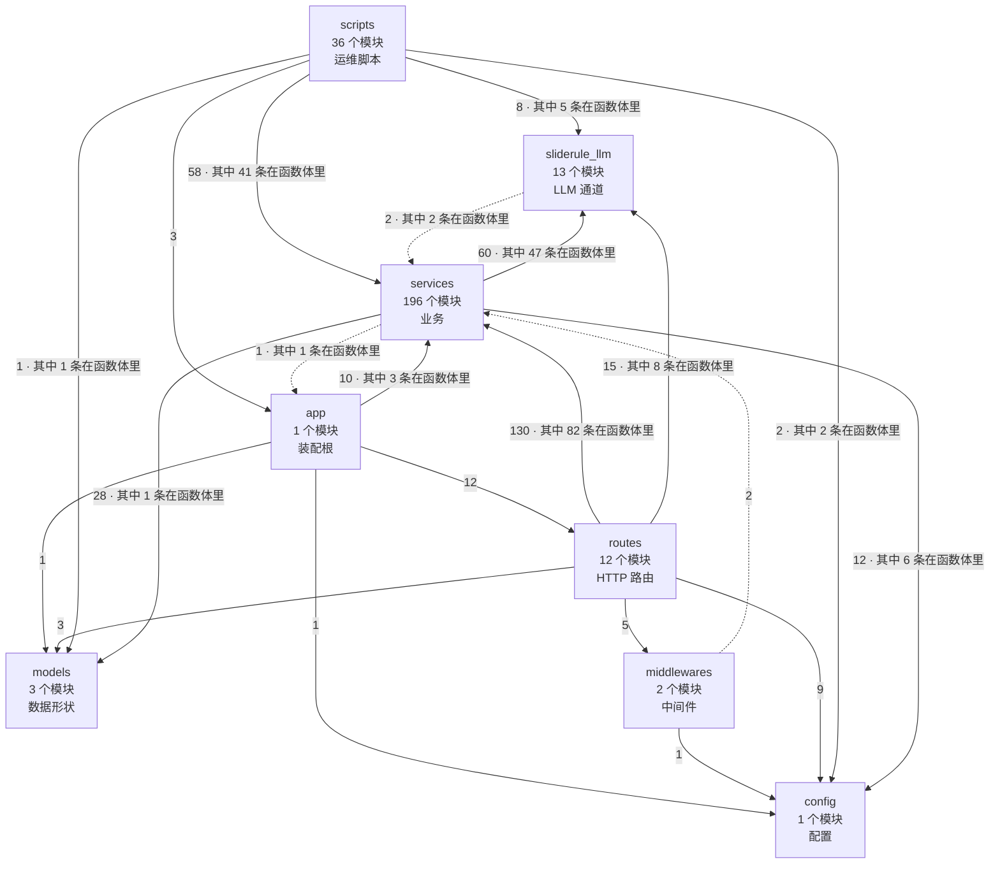

# SlideRule V6.2 架构图（自动生成）

> ⚠ **这个文件是生成的，不要手改。** 改了下次 `--emit` 会覆盖，而且
> `tests/test_architecture.py::Test图与代码同步` 会当场变红。
> 要改架构，改代码或改 `slide-rule-python/architecture.toml`，然后重新生成：
> 
> ```bash
> slide-rule-python/.venv/bin/python slide-rule-python/arch_graph.py --emit
> ```

抄的是 grok-build 的做法：他们**一张架构图都没有**，91 个 crate 在各自
`Cargo.toml` 里显式声明依赖，347 条边由编译器强制，根 `Cargo.toml` 是生成的。
我们没有那个编译器，所以自己写一个——见 `slide-rule-python/arch_graph.py` 模块头。

## 此刻的事实（由代码算出，不是手写）

- 扫描文件 **267** 个，模块 **267** 个
- 内部依赖边 **763** 条，其中 **463** 条写在函数体里（60%）
- 未声明的跨包依赖 **3** 条（基线 3 条）
- 模块级循环依赖 **4** 个（基线 4 个）
- services 内部越层依赖 **1** 条（基线 1 条）

### services 内部分层（抄 grok 的叶子 crate）

| 层 | 模块数 | 可以依赖 | 是什么 |
|---|---|---|---|
| `util` | 117 | （谁都不依赖） | 纯工具：不依赖 services 里任何其它模块 |
| `core` | 52 | util | 核心：模型 / 闸 / 闭环 / 生成件 |
| `flow` | 27 | util、core | 编排：驱动器 / 流水线 / 控制面 / 会话 |

叶子层 `util` 不依赖 services 里任何其它模块——这是它能被所有人安全 import 的全部理由，也是 `import` 不必躲进函数体的前提。

虚线 = 未在 `architecture.toml` 里声明的边（欠账，只许变少）。



## 循环依赖

Rust 里这一类根本编译不出来；Python 得自己数。**只许变少。**

- `services.capability_maps -> services.slide_rule_executor -> services.capability_maps`
- `services.page_shell -> services.spec_tree -> services.page_shell`
- `services.persistence -> services.slide_rule_session -> services.persistence`
- `services.v5_capability_executor -> services.v5_full_driver -> services.v5_capability_executor`

## 未声明的跨包依赖

- `middlewares -> services`
- `services -> app`
- `sliderule_llm -> services`

## services 内部越层依赖

叶子碰了上层，或 core 碰了 flow。**只许变少。**

- `core -> flow :: services.page_shell -> services.spec_tree`
