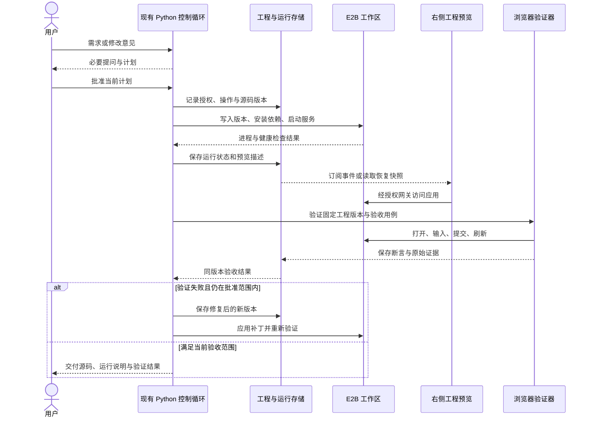

# WhyBuddy 工程运行与浏览器验证整体重构方案

日期：2026-09-11。状态：实施中，P1/P2 的部分基础能力已实现；各阶段完成条件仍按真实验收判断。本轮执行记录见第 15 节。

代码基线：WhyBuddy `c9283935fed3da04c3671572ab546c469eda4d65`；grok-build `SOURCE_REV=c4ea71cfdbcdb21e32e41bc25a0043d7d4836714`。本方案依据当前函数体、调用点、存储与测试约束制定。后续执行前须重新确认入口，行号可能随提交变化。

## 1. 重构目标与总体决定

让 WhyBuddy 的一个会话能够持续开发一个真实项目：明确需求与计划，生成和修改源码，在 E2B 运行，由浏览器检查行为，依据同一工程版本的证据决定是否交付。失败可以定位、恢复和继续修改；关闭网页不丢项目，也不会让远端进程失去管理。

保留 Python 作为产品会话、工具授权、项目版本和验收判定的权威；保留 React 工作台；复用已有模型网关。E2B 提供工程运行环境，Playwright 提供浏览器操作。首期不增加第二套 Agent 主循环，不把 grok Rust 宿主整体引入产品。

原有需求访谈、五系统规格、问卷与计划批准、会话存档、应用版本和工作台继续发挥作用。HTML 推演模式保留明确的适用范围；新工程模式由工程自己的路由、状态、API 和业务权限负责运行。

**首个完整验收场景：** 用户提出一个小型任务管理应用，确认计划后生成工程；在预览里新增、编辑、筛选任务，刷新后数据仍在；只读用户不能修改；模型收到一次真实失败后修改源码并复测；关闭工作台后能恢复；沙盒销毁后能从持久化源码重建。

首期选择固定的 React + TypeScript + Vite 工程模板，并在完整业务验收阶段加入受管 Node API 与测试数据库。框架自由选择、多分支并行、第三方发布平台、多云沙盒和可视化源码编辑在后续阶段展开。五系统规格按任务需要增量更新，普通样式修复不必重新走完整需求访谈和规格起草。

## 2. 当前真实链路与需要解决的问题

### 2.1 当前事实

| 当前代码 | 已核实的职责 | 对重构的影响 |
|---|---|---|
| [control-turn-stream](../slide-rule-python/routes/sliderule_full.py#L1541) | 产品控制入口；登录、会话归属检查后开始 SSE | 新工程任务继续从这个入口进入 |
| [rehearsal_control](../slide-rule-python/services/rehearsal_control.py#L3463) | 模型与工具循环、问答、计划、工具结果回传 | 在现有循环注册工程工具，逐步抽出职责 |
| [drive_full_factory](../slide-rule-python/services/drive_full_factory.py#L59) | 工厂任务的权威状态读取、批准检查与后台启动边界 | 提炼共用授权和运行启动能力，保持旧工厂入口可用 |
| [spec_first_pipeline](../slide-rule-python/services/spec_first_pipeline.py) | 规格与页面等阶段的现有生成流水线 | 工程模式增加新的产物执行器，不能只改显示层 |
| [v5_full_driver](../slide-rule-python/services/v5_full_driver.py#L2515) | 向前端发出带 HTML 的 `spec_page` 事件 | 新增工程事件，旧 HTML 事件继续服务旧模式 |
| [SlideRuleStudio](../client/src/pages/sliderule/SlideRuleStudio.tsx#L1129) | 会话页选择页面、画布等舞台 | 增加按产物类型选择的工程预览入口 |
| [html-app-surface](../client/src/pages/sliderule/live-runtime/html-app-surface.tsx#L658) | 清洗生成脚本、写入 `iframe.srcdoc`，宿主填数据和接点击 | 不能把远端 URL 直接套入同源 DOM 绑定逻辑 |
| [AppsWorkbench](../client/src/pages/agent-loop/dashboard/AppsWorkbench.tsx) | 应用中心有 HTML 页面与旧模型运行时两种入口 | 必须同时覆盖应用中心、版本恢复和复刻 |
| [run_registry](../slide-rule-python/services/run_registry.py#L143) | 后台工厂运行、事件序号、取消和续订；注册表仍在进程内存 | 已有刷新续接基础，不等于服务重启后的持久恢复 |
| [app_store](../slide-rule-python/services/app_store.py) | 保存应用设计、模型、HTML 和版本血缘 | 工程源码和业务数据库不能继续塞进设计模型 |
| [mcp_tools](../slide-rule-python/services/mcp_tools.py#L392) | 一次性 E2B Python 执行，结束后销毁 | 未发现该 `code.run` 接到产品模型主循环；不能当作项目工作区 |
| [app_screenshot](../slide-rule-python/services/app_screenshot.py) | 打开已有 WhyBuddy 页面截图 | 不负责启动生成工程，也不构成完整应用验收 |

现有生成消费链为：控制面 → 工厂 → spec-first → HTML 页面事件 → 会话状态 → Studio / 应用中心 → HTML 舞台。只有整条链新增工程产物，迁移才生效。

### 2.2 必须前置处理的边界

1. **执行与订阅分离。** 当前控制 SSE 的生成器由 HTTP 响应持有，断线会关闭；工厂 run 才有独立后台生命周期。安装依赖、执行命令和浏览器操作不能无管理地挂在请求中。
2. **持久互斥与恢复。** 内存 `_runs`、`_active_by_session` 和控制回合互斥不能抵抗服务重启或多实例。会话状态的 CAS 保存也不能替代项目写锁。
3. **验收权威。** [会话 PUT](../slide-rule-python/routes/sliderule_full.py#L931) 目前允许客户端回传 `publishClosure`；[持久化合并](../slide-rule-python/services/persistence.py#L942) 也保留此投影。新工程的通过状态必须由服务端证据推导，客户端不能写入。
4. **预览权限。** 能打开 E2B 地址不代表继承 WhyBuddy 会话权限。项目文件、终端日志、截图、预览与停止操作都需要检查资源归属。
5. **运行状态归属。** 工程模式的表单、路由、业务数据由生成工程负责，不能再由宿主 `htmlRuntime` 同时维护第二份。
6. **现有部署是约束。** Render 配置存在免费实例与休眠；持久工程任务不能依赖实例一直在线或本地临时文件。上线前必须验证恢复能力和持久存储。

### 2.3 已有验证的准确范围

本会话已用 E2B 完成一次性 Python 执行、文件写入、Node HTTP 服务启动、本机 Chrome 打开与点击、跨域 iframe 点击、修改文件后 HTTP 返回更新内容以及沙盒清理。

这说明基础路线可行。尚未验证 Vite HMR、私有预览鉴权、WebSocket 代理、沙盒恢复、云端浏览器执行、生成应用业务链路或生产成本。后续每一项都要单独验收，不能沿用这次最小烟测的成功结论。

## 3. 保留、演进与退出清单

| 部分 | 处理方式 | 边界 |
|---|---|---|
| 访谈、问卷、计划批准 | 保留并完善恢复合同 | 只有确实缺少的信息才询问；批准与计划版本绑定 |
| 五系统规格、产品章程、角色权限描述 | 保留为生成输入与验收依据 | 区分产品规格和应用实际实现，规格齐全不能单独判成功 |
| 会话与应用版本 | 演进为引用工程版本、运行与证据 | 小型索引留会话；源码、日志、截图独立存储 |
| 模型网关、skills、证据检索 | 复用现有入口 | 工具清单只声明实际可用能力 |
| Studio 分栏、设备缩放、日志和批准面板 | 保留外壳，逐项接真实事件 | 不用虚构进度代替安装、运行、验收状态 |
| HtmlAppSurface 与 HTML 画布 | 保留为显式的 HTML 推演/历史查看模式 | 工程失败不得静默回落成 HTML 并显示成功 |
| 宿主 HTML 业务绑定 | 工程模式逐步退出 | 旧应用继续兼容；工程业务状态只有一个所有者 |
| 元素点选编辑、透视、布局测量 | 后期重做跨域 bridge 与源码映射 | 不直接访问 E2B iframe 的 `contentDocument` |
| 一次性 PDF、代码取证、截图工具 | 继续承担独立任务 | 与项目工作区生命周期分开 |
| Node / Lobster 历史执行路径 | 先盘点消费者，再按入口退役 | 新工程执行统一进入 Python 管理的 E2B provider；不回落到宿主 native 执行 |
| 架构图生成、依赖闸与测试资产 | 持续使用 | 新边显式声明；不扩循环基线来放过新依赖 |

## 4. grok-build 复用策略

复用以完整能力为单位：输入、状态归属、执行副作用、输出、取消和恢复测试一起迁移。Rust 代码按行为改写到 Python / TS，工具说明和提示词需要对齐实际工具名与能力。

| 模块 | 优先提取 | 改写或保留的边界 |
|---|---|---|
| [tools](<grok-build 模块/xai-grok-tools.md>) | registry、类型化 IO、read/search/patch/bash、结果截断、任务与人工决策合同 | 文件和命令执行端接 E2B；不使用本机执行器运行生成代码 |
| [workspace](<grok-build 模块/xai-grok-workspace.md>) | 资源持有者、WorkspaceOp、权限与清理 | E2B 创建、租约、重连、存储、私有预览需要实现 |
| [shell](<grok-build 模块/xai-grok-shell.md>) | session actor、stream ownership、取消、持久化、统一重建 Agent | 改善现有 Python 控制面，不另外建立对话循环 |
| [agent](<grok-build 模块/xai-grok-agent.md>) | 工具集和提示词装配、计划模式、压缩策略 | 首次创建与模式切换共用装配输入 |
| [pager](<grok-build 模块/xai-grok-pager.md>) | Action / Effect、问答/批准/权限/工具/任务状态 | React 负责展示；62 个 view 声明不等于 62 个独立可迁移产品面板 |
| [PTY harness](<grok-build 模块/xai-grok-pager-pty-harness.md>) | 启动真实程序、注入操作、采集实际输出、保留复现产物 | 场景思想迁移到浏览器；不把 PTY 测试算成 Web 验收 |
| [telemetry](<grok-build 模块/xai-grok-telemetry.md>) | 会话/操作关联、结构化事件、错误与成本诊断 | 复用字段设计，SDK 发送端按部署选择 |
| [fast-worktree](<grok-build 模块/xai-fast-worktree.md>) | 分支隔离、创建与回收合同 | CoW/BTRFS/NFS 性能优化等并发规模出现后再评估 |
| [login](<grok-build 模块/xai-grok-login.md>) | 凭证 provider、刷新与存储分离 | 不替换已有 WhyBuddy 账号模型，不复制 Grok 专属登录流程 |
| [pager-render](<grok-build 模块/xai-grok-pager-render.md>) | 展示原语与业务状态分离 | 终端 Buffer、转义序列和输入兼容层不移入 Web |

当前 grok 快照的 `finalize_session_setup` 未注入完整 BrowserService，`shutdown_browser_service` 为空，`browser_tab_chrome_e2e.rs` 只有注释。OS sandbox 是在已有环境施加限制，并非云沙盒供应系统；不能把这些占位或注释当成完成的执行能力。源码依据见 [workspace 详解](<grok-build 模块/xai-grok-workspace.md#关键链路与源码阅读路径>)。

## 5. 目标职责与操作流程

| 责任 | 权威所有者 | 接收与产出 |
|---|---|---|
| 用户意图、计划、工具调度 | Python 现有控制循环 | 用户输入与工具结果 → 计划/工具调用/对话事件 |
| 工程内容与版本 | 项目存储服务 | 文件补丁 → 不可变源码版本与父版本 |
| 会话任务与执行日志 | 持久运行服务 | 幂等操作 → 有序事件、终态、可恢复记录 |
| 项目文件与进程 | 工作区管理器 + E2B provider | 指定工程版本 → 受管环境、进程、日志、服务地址 |
| 应用实际业务 | 生成工程自己的前后端 | 路由、表单、业务 API、角色权限、数据 |
| 真实行为检查 | 受控浏览器验证 worker | 固定版本与用例 → 操作记录、断言、截图、网络/控制台结果 |
| 是否满足交付条件 | Python 验收判定器 | 规格要求 + 对应版本的证据 → passed/failed/blocked/stale |
| 工作台与预览 | React + 独立来源的预览网关 | 权威状态 → 面板与工程页面；用户操作 → 明确命令 |

下图是**拟实施的操作时序**，不表示当前 import 依赖，也不替代自动生成的权威架构图。



## 6. 工程、运行与证据的数据合同

以下名字和字段均为拟新增合同，实施时通过迁移提交建立。Python Pydantic 模型作为规范来源，导出 JSON Schema 并生成 TS wire 类型；生成物同步检查进入脚本测试。前端类型不能替代服务端参数验证。

| 实体 | 核心字段 | 不变量 |
|---|---|---|
| Project | projectId、sessionId、appRootId、ownerId、runtimeKind、currentRevision | 归属取服务端身份；一个项目可有多轮对话 |
| ProjectRevision | revision、parentRevision、treeHash、manifestRef、templateVersion、lockfileHash、specRevision、planRef | 发布后不可修改；只改源码也产生新版本 |
| Workspace | workspaceId、projectId、branch、provider | 逻辑工作区稳定；不等同于某一台 E2B 实例 |
| WorkspaceLease | workspaceId、sandboxId、generation、leaseOwner、expiresAt、mountedRevision、processRefs | sandboxId 和 provider 凭证由服务端拥有；写入要检查租约代次 |
| ControlRun / Operation | controlRunId、operationId、toolCallId、idempotencyKey、projectId、expectedRevision、approvalRef、status、remoteProcessId | 一个操作只由一个有效 worker 推进；重试先查执行状态 |
| RuntimeInstance | runtimeId、workspaceId、revision、status、port、health、lastHeartbeat | 健康与版本独立确认；HTML 200 不表示业务验证通过 |
| PreviewDescriptor | kind、projectId、runtimeId、revision、status、entryUrl、expiresAt、capabilities | URL 是临时入口；过期后重新授权和解析，不能当永久产物 |
| VerificationRecord | verificationId、revision、runtimeId、specRevision、suiteVersion、steps、assertions、result、artifactRefs | 可信 worker 写入；版本不符或缺必需用例不能通过 |
| RuntimeEvent | schemaVersion、sessionId、controlRunId、projectId、operationId、seq、type、timestamp、payload | 单 run 内序号单调；先持久化再对外宣布完成 |

`runtimeKind` 采用显式枚举 `html-prototype | project`。旧记录缺字段时只按历史 HTML 合同读取，不生成虚假的 projectId。会话和应用中心保存工程引用，不能把目录、长日志和截图 base64 全部嵌进 `V5SessionState`。

存储采用现有持久 SQL 配置与网关能力，增加独立的项目/版本/操作/事件表。第一版小型源码和证据文件可按 hash 去重存入独立内容表，设置单文件、单项目和保留量上限；超过限额如实报错。大截图、trace、上传素材扩大后接对象存储，manifest 合同不变。生产模式缺持久后端时禁止宣称“工程已保存”；本地开发可用 SQLite 与指定目录。

生成应用自己的业务数据库是另一类数据。源码快照不代表业务数据备份；开发测试可用沙盒内数据库和已声明的备份/恢复策略，真实用户数据进入独立的应用数据库或租户命名空间。生成应用账号与 WhyBuddy 工作台账号分别建模，不能借工作台登录冒充应用 RBAC 已实现。

## 7. 运行恢复、幂等与授权

### 7.1 状态不能混在一个“运行中”里

- 控制任务：`queued → running → waiting_user / completed / failed / cancelling → cancelled`；异常中断可进入 `interrupted`，等待对账。
- 运行实例：`provisioning → syncing → installing → starting → ready`；另有 `stopping / stopped / expired / failed / reconciling`。
- 验证：`not_run / running / passed / failed / blocked / stale`。

停止应用服务、停止本轮模型任务、销毁沙盒是三个动作。源码与证据在这些动作后仍保留。计划等待可以没有活跃沙盒；已有预览按空闲策略保留或停止，不让等待用户无限续费。

### 7.2 订阅、恢复与并发

将现有控制生产者从 HTTP 订阅生命周期中分离，复用现有模型循环及 run 序号/取消思想，增加持久运行记录。HTTP 负责提交命令、查询快照和订阅事件；关闭订阅不取消运行。显式“停止”才发取消请求，预算与孤儿策略在服务端执行。

前端保存最后消费序号，通过 `afterSeq` 续播；快照包含 `lastSeq`，先应用快照再补后续事件，重复事件按序号去重。旧客户端未理解工程事件时显示不支持，不能把工程事件误判为 HTML 完成。

第一版单 worker 也要保存租约。每个项目分支只允许一个写入者；接管时增加 generation，旧 worker 的写入和终态提交必须被拒绝。首期接管优先停止旧进程或重建沙盒，无法确认旧实例停止时保留 `reconciling`，不允许新旧实例共同写持久数据。

服务重启后按数据库记录查 E2B：实例仍在则连接并检查进程与源码版本；实例失效则从不可变版本重建。恢复文件和工作区不表示自动重放所有命令：不确定是否完成的提交、数据库迁移或外部请求进入待对账状态，禁止盲重试。

### 7.3 操作与文件边界

操作记录先写入数据库，再发往 provider；成功结果与证据保存后再发完成事件。安装/启动等长操作返回 operationId，模型和界面通过状态/日志工具跟踪，不阻塞 FastAPI 事件循环。

`apply_patch` 携带 expectedRevision 或文件 hash。冲突时返回差异，不覆盖其他操作成果。路径校验覆盖相对路径、绝对路径、符号链接以及归档解包；限制在项目目录内。终端输出分块持久化并限制模型上下文长度，完整日志通过授权引用查看。

权限分为资源访问、计划范围、具体操作三层。已批准范围内的正常改文件、运行测试和修复继续执行，不每一步重复询问。跨项目、扩大访问范围或产生额外外部副作用时重新判定。每次工具执行都复查服务端权限与当前批准版本，不能只靠工具菜单隐藏。

WhyBuddy 的模型凭证、E2B 管理凭证、主数据库凭证不进入生成项目环境。确有业务需求的凭证通过单独的项目 secret 引用注入，受授权范围约束，日志脱敏；浏览器和模型上下文不接收 provider 管理 token。

## 8. 预览、浏览器与证据闭环

### 8.1 实时预览

新增 `SandboxPreviewSurface`，只消费服务端确认的 PreviewDescriptor。HTML 模式继续使用 HtmlAppSurface；会话页与应用中心共用产物选择规则，并展示准备、启动、就绪、停止、过期、失败等真实状态。

私有预览采用与 WhyBuddy 主站分离的来源，生产使用专用预览域名；主站认证 cookie 必须限定主站，不让生成代码共享主站源。每个运行实例使用隔离的来源，避免不同项目共享 localStorage、cookie 和 service worker。

第一版通过预览网关代理 HTTP 与 WebSocket：工作台向 Python 申请项目范围的短时访问票据，网关兑换并消费票据，使用隔离来源的受限会话继续访问；清理 URL 票据并避免进入日志与 Referer。E2B 流量凭据由网关注入上游，前端不持有。网关仅接受服务端登记的实例/端口，不能成为任意 URL 代理。

当前已安装 SDK 的 `SandboxNetworkOpts.allow_public_traffic` 默认是 true；`secure=True` 的文档指的是 envd 访问认证，不能据此认为应用端口已经私有。实施时需要验证关闭公开访问、直连拒绝、授权代理、票据撤销、跨用户拒绝和 HMR WebSocket；这组验证完成前，远端 URL 只用于无敏感数据的内部烟测。

先实现直接预览、刷新、设备尺寸与打开独立页面。Vite host/origin/HMR 配置随运行描述下发并校验，代理不能随意改坏资源路径和 WebSocket；健康探针还要确认正在服务的工程 revision。

### 8.2 浏览器验证

首期浏览器验证器使用受控 Playwright worker，与生成应用分离。部署可使用独立的 E2B 验证沙盒和预烤浏览器模板；每次验证新建 context，按任务回收。生成项目不能读写验证脚本、结果记录或管理凭证。

浏览器工具覆盖打开页面、定位元素、点击、输入、选择、提交、等待、DOM 断言、截图、console/network 与 trace。所有工具都返回真实结果或明确失败，不能用页面源码长度、按钮数量或模型自述替代。

开发预览支持 HMR，正式验收固定源码 revision，并用锁文件安装/构建可复现产物。验证期间禁止并发修改同一实例；运行前后核对版本。后续可以用独立验证实例提高并行度。每次源码、依赖或关键配置改变，对应旧证据立即标为 stale。

应用源代码中的测试可作为一类证据；必须有独立于生成代码的受管验收用例，覆盖实际需求。生成应用不能通过自行输出 `passed` 使宿主通过。

### 8.3 检查与交付

| 检查层 | 必须记录的证据 | 不能据此单独推断的结论 |
|---|---|---|
| 工程构建 | 模板/锁文件、类型检查与构建退出码、日志 | 编译成功不代表业务可用 |
| 服务启动 | 进程、端口、版本响应、健康检查 | HTTP 200 不代表页面和 API 正确 |
| 页面渲染 | 实际 DOM、资源加载、截图、console | 一张截图不代表提交/刷新/权限可用 |
| 业务主链 | 输入、提交、API 响应、刷新后持久数据、断言 | 用例通过只代表声明覆盖范围 |
| 权限与失败路径 | 未授权拒绝、错误提示、网络失败、恢复行为 | 宿主账号权限不等于应用权限 |

新增权威工程验收结果，不复用可被客户端写入的 publishClosure 作为通过依据。旧 HTML 展示投影兼容读取，但不得解锁工程交付。新结果由服务端从 VerificationRecord 推导，再通过统一 serializer 投影给前端；同步修改路由、持久化、恢复、白名单与应用中心消费。

`passed` 必须同时满足当前规格要求、固定源码版本、必需测试与行为证据。未配置浏览器、缺证据或外部依赖不可用为 blocked，断言失败为 failed，源码变化为 stale。执行工具完成、预览就绪、产品验收通过、对外发布分别记录。

交付至少包含源码版本、锁文件、运行与配置说明、验证范围及未覆盖项、证据入口和当前预览状态。工程导出不含 secret。公开部署或推送生成项目到外部仓库是独立发布动作，按已授予权限执行，不能因为页面预览就绪就自动公开。

## 9. 拟新增模块与现有入口改动

以下路径是实施建议，不是当前已存在文件。表中的分层先按职责确定，具体依赖需在两个架构清单中声明。

| 拟新增或提炼的模块 | 层次 / 责任 |
|---|---|
| `models/project_runtime.py` | 数据叶子：项目、版本、运行、事件与证据模型 |
| `services/project_manifest.py` | util：路径、源码树 hash、manifest 与补丁前置校验 |
| `services/workspace_provider.py` | util：provider 协议；依赖数据模型，不依赖业务服务 |
| `services/e2b_workspace_provider.py` | core：通过 provider 协议调用 E2B，转换错误，不做会话授权 |
| `services/project_store.py` | core：持久项目/内容/版本/操作/事件，使用既有存储基础设施 |
| `services/project_policy.py` | core：资源与批准范围判定，不发 UI 事件 |
| `services/project_runtime.py` | core：租约、版本同步、进程、健康、取消、恢复与回收 |
| `services/control_run_service.py` | flow：提炼现有控制生产者的持久生命周期，不另写模型循环 |
| `services/project_tools.py` | flow：工程工具适配到现有工具分派与结果合同 |
| `services/browser_verification.py` | core：受管浏览器任务、固定版本与证据采集 |
| `services/project_delivery_gate.py` | core：根据结构化证据和需求判定，无浏览器 IO |
| `routes/project_runtime.py` | HTTP 边缘：项目命令/查询/订阅/预览票据，使用现有身份边界 |
| `shared/project-runtime.generated.ts` | 生成的 TS wire 合同，不依赖 client/server |
| `client/src/pages/sliderule/project-runtime/` | UI：状态选择、预览、文件差异、日志、验证结果 |
| `server/project-preview/` | 仅预览 HTTP/WS 传输与票据校验；Python 保持项目授权和状态权威 |

`project_tools` 不反向 import `rehearsal_control`。控制循环只负责注册、调度和回填结果；策略、数据与服务通过参数传入。core 不依赖 flow；provider 不导入路由；共享 TS 合同保持叶子。具体拆分必须接受架构检查，不因模块数量增加就认为设计完成。

现有改动点覆盖：`rehearsal_control`、`drive_full_factory`、`run_registry`、`v5_state`、`sliderule_full`、`persistence`、`app_store`、`scope_authority`、`v5_publish_closure_response`；客户端 `sliderule-marathon-driver`、`useSlideRuleSession`、`SlideRuleStudio`、`spec-live-pages`、`app-store-client`、`AppsWorkbench`。

同步 `/drive-full`、流式 `/drive-full-stream` 与产品 `/control-turn-stream` 对工程模式必须走同一权威运行服务；尚未支持的旧入口明确返回不支持，不偷偷执行旧 HTML 流水线。工程相关的新 Node 接口仅做传输，不复制 Python 的业务判断。

## 10. 分阶段实施与功能提交

阶段顺序按依赖排列。每个阶段都有用户可见结果、验收和回退方式；只完成文档、函数或模拟测试不能进入下一阶段的完成态。提交粒度按功能，阶段内可拆多个提交，按已有授权推送工作分支。

| 阶段 | 交付与主要工作 | 完成条件 | 回退条件与方式 |
|---|---|---|---|
| P0 基线与合同确认 | 固定真实入口、旧模式样本、缺口与验收用例；确认持久库与预览来源部署方式 | 记录一轮产品原样请求/事件；明确现有失败与新增失败；本方案可审查 | 没有开始业务迁移，无数据变更 |
| P1 持久基础与权威边界 | runtimeKind、工程版本、操作/事件、单写租约、服务端验收字段；控制生产者与订阅解耦 | 旧会话可读；伪造 owner/revision/closure 被拒；断线重订阅、服务重启对账、不重复派发 | 关闭工程创建；新增表和字段保留，旧 HTML 继续工作 |
| P2 固定工程运行与预览 | 持久模板 → E2B → 安装 → 服务 → 私有预览；Studio/应用中心接相同描述；先完成固定模板而非自由生成 | 真机按钮/API 烟测；HMR；未授权直连失败；刷新不重建；销毁后源码重建 | 工程显示停止/失败，保留源码；不自动变成 HTML |
| P3 模型操作工程 | read/list/search/patch/exec/logs/status 接入现有循环；计划范围、冲突、预算和真实取消 | 用户批准后模型修改源码、页面变化；一次失败能把真实错误送回同一循环；刷新与停止可控 | 禁止新写入工具；已保存工程可读、可导出和按策略停止 |
| P4 浏览器检查与修复 | 独立 Playwright、固定版本证据、权威 gate、失败反馈与有限重试 | 正反用例能使结果变绿/变红；改源码使旧证据 stale；无浏览器时 blocked | 暂停验证任务；工程仍可预览，但不能显示验收通过 |
| P5 规格到真实业务工程 | 五系统规格映射成工程任务与用例；路由、API、持久数据、应用权限；导出与版本恢复 | 本文首个完整业务场景通过；重启/重建后的源码和业务数据按合同恢复；无 mock API 冒充 | 已有工程回到指定源码版本并重验；保留旧类型应用与原始数据 |
| P6 编辑体验、灰度与旧路清理 | bridge/点选编辑、复刻、发布、资源治理；按项目灰度；清理无消费者的旧执行分支 | 两个产品入口一致；旧应用兼容；灰度指标达标；源码来源和证据可追溯 | 关闭新项目默认工程模式；已有工程保留可恢复记录和数据 |

建议功能提交边界：

1. `feat(project): add runtime contracts and revision storage`
2. `feat(control): persist operations and resumable control runs`
3. `fix(project): enforce ownership and server-owned verification`
4. `feat(workspace): manage E2B project lifecycle and recovery`
5. `feat(preview): authorize isolated HTTP and WebSocket preview`
6. `feat(studio): display project runtime in studio and app center`
7. `feat(tools): connect project tools to the control loop`
8. `feat(verify): collect browser evidence and enforce revision gates`
9. `feat(generator): produce and repair runnable business projects`
10. `feat(project): restore export and fork project revisions`
11. `feat(editor): bridge preview selection to source patches`
12. `refactor(runtime): retire superseded project execution paths`

P2 是第一个可见里程碑；P4 是模型操作与浏览器检查闭环；P5 才满足完整业务应用的首期交付目标。P6 的并行分支、可视化编辑和外部部署分别立功能验收，不阻塞前面已有里程碑。

## 11. 测试与验收清单

每个功能提交运行相关单测、合同测试及必须的架构检查；阶段验收运行真实服务。测试断言要执行实际入口或消费路径，禁止仅匹配注释里的工具名。

| 领域 | 正向验收 | 必须失败或拒绝的验收 |
|---|---|---|
| 会话和项目归属 | 所有者可读写与恢复 | 其他用户猜到 project/run/sandbox ID 也不能读日志、源码或停止 |
| 批准 | 当前批准范围内自动推进 | 过期计划、跨项目操作、伪造批准无法执行 |
| 持久运行 | 刷新续播；重启接管；序号去重 | 重复提交不启动两份操作；旧租约不能提交结果 |
| 源码 | 补丁产生新 revision；恢复内容一致 | 旧 hash 冲突、目录逃逸、符号链接逃逸、归档逃逸被拒 |
| 进程 | 启动、探针、日志、停止真实有效 | `task.cancel()` 后远端仍跑时不能宣称 cancelled |
| 私有预览 | 授权用户打开及 HMR | 无票据直连、过期/撤销票据、错误 origin、任意上游代理被拒 |
| 浏览器证据 | DOM/点击/API/刷新/角色断言真实执行 | 页面 200、假 passed 字符串、旧版本截图不能单独过闸 |
| 工程版本 | 源码改变使旧证据 stale | 仅恢复旧 gate 不重新核版本不能过闸 |
| 双入口 | Studio 和 AppsWorkbench 同一产物选择 | project 错误不能静默显示旧 HTML 或另一个项目 |
| 业务数据 | 写入后刷新与声明的重建方式保留 | 仅 localStorage 模拟写入不能冒充真实 API 持久化 |
| 无外部能力 | 缺 E2B/浏览器/存储时说明缺项 | 不回落到宿主执行，不伪造通过或已保存 |

变异验证至少覆盖：去掉项目归属检查、忽略 expectedRevision、允许客户端写验收状态、移除真实进程停止、把旧证据当新证据、断开 UI 工程事件消费。每次只变异一处，确认对应判据变红后恢复源码。

回归锚点包括 [会话归属](../slide-rule-python/tests/test_session_ownership_paths.py)、[驱动归属](../slide-rule-python/tests/test_drive_routes_ownership.py)、[run 归属](../slide-rule-python/tests/test_runs_ownership.py)、[控制生命周期](../slide-rule-python/tests/test_control_stream_lifecycle.py)、[计划批准](../slide-rule-python/tests/test_control_plan_approval.py)、[批准持久化](../slide-rule-python/tests/test_plan_approval_persistence_boundary.py)、[页面回退真实性](../slide-rule-python/tests/test_page_fallback_truth.py)；新增测试需同时覆盖项目入口与实际前端消费。

现有仓库命令：

```powershell
# 从仓库根目录运行，按改动选真实相关测试，不复制旧测试通过数量。
& slide-rule-python/.venv/Scripts/python.exe -m pytest slide-rule-python/tests/test_control_stream_lifecycle.py slide-rule-python/tests/test_control_plan_approval.py slide-rule-python/tests/test_session_ownership_paths.py -q
pnpm run test:client
pnpm run check
pnpm run test:scripts
pnpm run arch:emit
pnpm run arch:check
```

代码改动后重新生成 Python / TS / 全仓架构并过闸；仅文档方案不改权威依赖图。修改含 Mermaid 的文件须使用仓库真实浏览器渲染器。历史基线失败应在相同基线复现并注明，不能默认沿用旧记录，也不能顺手修无关代码。

已创建 `smoke:project-runtime` 与 `project:contracts:check` 命令；`smoke:project-browser` 尚未创建。当前 runtime 烟测只验证固定工程的执行原语，不代表浏览器或业务验收。烟测报告记录源码版本、模板/依赖、运行 ID、步骤、原始日志和证据文件，输出明确通过/失败/缺条件。

## 12. 部署、资源与回退

开发继续使用现有 Vite / Node / Python 启动方式；生成工程在 E2B 运行。新增 worker 初期可以与 Python 部署在同一服务，但生命周期必须由持久记录驱动，重启可对账；需要持续处理时配置不休眠的 worker。达到并发需求后再单独部署，不先增加无必要的调度平台。

预览网关作为独立来源的传输服务部署；可复用 Node 运行环境，但不能在主站同源下提供可执行生成内容。上线配置包含隔离域名、TLS、HTTP/WS 路由、主站 host-only cookie、票据签名、实例端口映射与撤销。浏览器 worker 使用固定浏览器/模板版本，并能在生产环境真实启动。

新配置按能力分组声明：工程功能开关、模板/锁文件版本、持久库、内容存储、预览来源和票据、工作区/命令/验证超时、每用户并发、日志与文件上限、空闲回收和任务总预算。具体变量名在实施提交中确定并写入 `.env.example` 与部署配置，不能仅修改本地 `.env` 就声称线上已具备能力。

成本分别记录 E2B 应用实例时长、验证实例时长、冷启动/依赖安装、LLM 调用、存储和流量。P2/P4 采集冷/热启动与失败恢复样本后确定阈值；设置有限可配置上限，不用未经测量的“秒开”或单次费用作承诺。已标定的旧参数不随本方案调整。

数据库采用先增字段/表、双类型读取、按项目启用的迁移。特性开关控制新项目默认类型，已创建项目类型持久化。回退代码必须仍能识别 project 记录并展示只读/停止状态；否则最低回退版本锁定在 P1，不回退到会把工程记录误读成 HTML 的版本。

回收任务根据持久租约与 provider 清单对账，处理崩溃遗留实例。销毁失败保留待重试记录并记录 provider 超时兜底；不能先删记录再假定沙盒已经停止。删除项目和删除业务数据另有明确操作，停预览不删数据。

## 13. 后续编辑、发布与旧路径退出标准

跨域 bridge 只传受控的选中、布局与定位消息，检查 origin、event.source、project/runtime/revision 和消息版本。不能把来自生成应用的任意 postMessage 当命令执行。元素选择映射到源码后由受权补丁修改工程，形成新版本与 HMR；刷新后修改仍在才算编辑成功。

旧 HTML 转工程采用显式转换操作：保留原始应用和来源引用，把 HTML/CSS/素材作为迁移输入，补工程路由与真实动作，建立新版本并重新验证；不直接改 runtimeKind 冒充已经转换。已有业务数据另写迁移与回滚程序。

工程复刻沿用应用中心已有所有权与血缘规则，复制不可变源码引用后创建新项目，不复用原工作区或秘密配置。切换版本需同步恢复源码、锁文件、运行描述和验证状态，不能只切模型版本。

旧路径只有在同步/流式/会话/应用中心/脚本消费者都明确迁移或标记兼容，回归通过、真实样本覆盖、依赖图证明无遗漏入口后才删除。生成应用对外发布另接版本固定、配置、数据库迁移、部署结果和回滚合同；E2B 开发预览不当成永久生产托管。

## 14. 当前执行清单与完成定义

- [x] 核对控制入口、HTML 生成/消费、E2B 一次性调用、应用中心和存储边界。
- [x] 验证最小 E2B Web 服务与本机浏览器操作，明确尚未验证的范围。
- [x] 形成保留/替换、grok 复用、数据合同、阶段验收和回退方案。
- [ ] P0 采集固定业务样本原始请求/事件并确定部署与资源基线。
- [ ] P1 持久工程合同、执行恢复、授权和权威证据。
- [ ] P2 固定模板工程、私有实时预览、刷新与重建。
- [ ] P3 同一模型循环内修改工程、处理失败和停止真实进程。
- [ ] P4 浏览器检查、证据过期与自动修复闭环。
- [ ] P5 首个真实业务应用、数据持久化、版本导出恢复。
- [ ] P6 编辑体验、灰度、发布扩展与旧执行路径清理。

整体完成以真实业务样本为准：从批准计划到源码、E2B 应用、浏览器证据、失败修复、刷新恢复和可复现交付完整走通；旧应用仍按原类型正常读取；未完成或不具备条件的能力明确显示状态。迁移进度按阶段和能力报告，不把文件数量、代码行数或参考覆盖率折算成完成百分比。

## 15. 2026-09-11 审查后第一批修复

本轮起点为 `5dae0cf6`。按“执行真实性 → 持久恢复基础 → 主链授权 → 私有预览”的顺序推进，当前完成以下修复：

| 功能 | 已落实的行为 | 当前边界 |
|---|---|---|
| E2B 执行合同 | 工程目录统一为 `/home/user/workspace`；显式传入 API key；前台命令保留真实退出码和有界输出；后台使用 SDK 实际 PID | 生成代码仍只在沙盒执行；工具输出不是验收结论 |
| 文件与进程 | 写文件拒绝目录/文件符号链接逃逸；停止覆盖 npm 子进程；新 provider 可按持久 ID 重连；销毁失败可重试；已过期实例可按 ID 确认消失 | 创建附带 workspace 元数据供后续对账；自动资源回收 worker 尚未接通 |
| 运行真实性 | 要求锁文件并执行 `npm ci --ignore-scripts`；传入实际端口和 `--strictPort`；确认进程存活、页面可读、版本标记一致后才返回 ready | 版本标记只用于运行健康；不作为独立业务证据 |
| 租约与资源 | 安装期间持续续租；创建后立即登记 sandbox；接管前确认旧实例已销毁；清理失败保留引用；启动期间再次核对源码版本 | ready 之后尚无常驻 worker 管理；沙盒受有限超时约束，不能据此宣称持续预览已完成 |
| 存储恢复 | `claim_operation` 以当前租约和行版本 CAS 接管旧操作；旧 worker 不能提交；确认销毁后才清空 runtime 引用 | 接管原语已完成，任务分派、进程重启扫描、取消与事件续播尚需接真实运行服务 |
| 工程版本权威 | 普通会话保存保留已存工程指针；明确更新版本使用 `expected_project_revision` CAS；失败上传/发布先占存储额度 | 配额保守计数，尚无自动 GC 返还；真实 PostgreSQL 网关验收另做 |
| 运行入口 | 检查真实会话归属、当前工程版本和批准计划内容哈希；拒绝客户端命令；不向客户端返回 sandbox、worker、进程明细或裸 E2B URL | 默认拒绝启动。仅开发环境、超级管理员、明确内部开关可做内部烟测；生产始终拒绝，直到持久分派与私有网关接好 |
| 架构合同 | 会话 TS 类型实际引用生成的 Project 合同；删除新加的孤儿豁免；新 workspace → platform 依赖明确声明 | 没有增加循环或违规基线 |

真实 E2B 烟测命令为 `pnpm run smoke:project-runtime`。固定 React/TS/Vite 工程通过了 8 项检查：符号链接拒绝且外部内容不变、写入与命令同目录、非零退出保留 stderr、指定端口与版本健康、新 provider 重连、未授权直连返回 403、修改源码后 HTTP 返回新内容、停止后父子服务与监听消失。烟测所建沙盒均已销毁。

本机原始报告在 `artifacts/project-runtime/1789128730-3cfd6c4d.json`，对应源码快照在同名 SQLite 文件；这些运行产物不进入仓库。第一轮锁文件超过 32 KiB 工具输出上限时明确失败，随后改为压缩传输完整锁文件，再运行通过。报告保留真实过程，不用第一轮失败记录冒充通过。

反向测试覆盖失败启动、健康不符、陈旧版本、无批准、跨用户、生产禁用、租约接管和清理失败。项目相关与控制/会话回归共 177 passed、3 skipped；两项跳过是 Windows 无法运行的 Linux helper 测试，其对应能力已在 E2B 实测，另一项是文件存储不适用的跨 worker SQL CAS 用例。脚本测试 56/56 通过，Python/TS/grok 架构检查通过，三份架构图与本方案的 Mermaid 已由真实 Chrome 渲染。

执行目录、API key、公开流量、销毁重试、存储 CAS/配额、启动退出码、就绪探针与批准检查均做了变异验证。全仓 TypeScript 检查仍有 18 条错误；与起点版本使用同一依赖和编译配置比较，诊断完全一致，本轮没有新增。

**下一批按以下顺序实施，不把本轮修复等同于 P1/P2 验收完成：**

1. 将操作表、接管、心跳和有序事件接入受管后台任务；HTTP 提交与订阅分离，补重启扫描、取消、重复请求和 `afterSeq` 恢复验收。
2. 从真实会话和当前批准计划创建工程，绑定服务端项目引用；将源码工具接入现有控制循环，确保修改与运行使用同一个工程版本。
3. 建立隔离来源的预览 HTTP/WS 网关和短时票据，验证授权访问、撤销和 Vite HMR 后，再接 Studio 与 AppsWorkbench。
4. 加独立浏览器 worker、固定版本证据与交付闸，再进入真实业务工程的失败修复闭环。

尚未完成：工作台中的可用工程预览、HMR WebSocket 代理、浏览器点击/业务断言、应用数据恢复与完整服务重启恢复。第 14 节的 P1/P2 勾选保持未完成。
