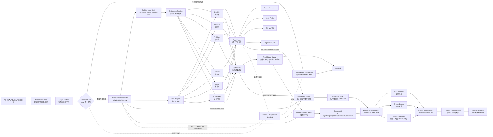

```mermaid
flowchart LR
    %% ======================
    %% User / Autopilot入口
    %% ======================
    U[用户输入产品想法 / 任务目标] --> AP[Autopilot Pipeline<br/>现有蓝图驾驶舱流程]

    AP --> STAGE[Stage Context<br/>当前阶段上下文]

    %% ======================
    %% Decision Gate
    %% ======================
    STAGE --> DG{Decision Gate<br/>LLM 自主决策}

    DG -->|不需要头脑风暴| SA[Single Agent Linear Path<br/>沿用现有单 Agent 执行]
    SA --> AP_OUT[阶段输出]

    DG -->|需要头脑风暴| BO[Brainstorm Orchestrator<br/>多智能体协作调度器]

    %% ======================
    %% Orchestrator内部
    %% ======================
    BO --> MODE[Collaboration Mode<br/>discussion / vote / division / audit]
    BO --> RR[Role Registry<br/>角色注册表]

    RR --> DECIDER[Decider<br/>决策者]
    RR --> PLANNER[Planner<br/>规划师]
    RR --> ARCH[Architect<br/>架构师]
    RR --> EXEC[Executor<br/>执行者]
    RR --> AUDIT[Auditor<br/>审计员]
    RR --> UI[UI Previewer<br/>UI 预览师]

    MODE --> SESSION[Brainstorm Session<br/>多分支推理会话]

    SESSION --> DECIDER
    SESSION --> PLANNER
    SESSION --> ARCH
    SESSION --> EXEC
    SESSION --> AUDIT
    SESSION --> UI

    %% ======================
    %% Tool Proxy
    %% ======================
    DECIDER --> TP[Tool Proxy<br/>统一工具代理]
    PLANNER --> TP
    ARCH --> TP
    EXEC --> TP
    AUDIT --> TP
    UI --> TP

    TP --> DOCKER[Docker Sandbox]
    TP --> MCP[MCP Tools]
    TP --> GH[GitHub API]
    TP --> SKILLS[Registered Skills]

    %% ======================
    %% 输出汇总
    %% ======================
    DECIDER --> SYN[Synthesizer<br/>协作结果综合]
    PLANNER --> SYN
    ARCH --> SYN
    EXEC --> SYN
    AUDIT --> SYN
    UI --> SYN

    SYN --> RESULT[Final Stage Output<br/>决策 / 方案 / 信心分 / 分歧意见]
    RESULT --> AP_OUT

    %% ======================
    %% 事件总线
    %% ======================
    BO -->|brainstorm.* events| EB[BlueprintEventBus<br/>统一运行时事件总线]
    TP -->|tool.completed / tool.failed| EB
    SYN -->|session.completed| EB

    EB --> SOCKET[Socket.IO Relay<br/>实时推送到 Job Room]

    %% ======================
    %% 前端状态
    %% ======================
    SOCKET --> STORE[BlueprintRealtimeStore<br/>brainstormGraph Slice]

    STORE --> NODES[Branch Nodes<br/>推理节点]
    STORE --> EDGES[Branch Edges<br/>父子关系]
    STORE --> META[Session Metadata<br/>模式 / 角色 / Token / 状态]

    %% ======================
    %% 3D可视化
    %% ======================
    NODES --> WG[Brainstorm Wall Graph<br/>dagre + Canvas2D]
    EDGES --> WG
    META --> WG

    WG --> TEX[Three.js CanvasTexture<br/>贴到 3D 墙面大屏]
    TEX --> WALL[3D Wall Mind Map<br/>实时多分支推理树]

    %% ======================
    %% 记忆与回放
    %% ======================
    BO --> MS[Artifact Memory Store<br/>会话持久化]
    RESULT --> MS

    MS --> REPLAY[Replay API<br/>GET /api/blueprint/jobs/:id/brainstorm/:sessionId]
    REPLAY --> STORE

    %% ======================
    %% 降级
    %% ======================
    DG -.失败 / 超时.-> DEG[Graceful Degradation<br/>降级事件]
    BO -.LLM / Docker / Token / Timeout异常.-> DEG
    TP -.工具不可达.-> DEG
    DEG -.fallback.-> SA
    DEG --> EB
```