# AIGC 中台 · V2 标准详图（样板）

> 本系统在 V2 中为**执行点（PEP）**。保留它真正独有的：Agent 编排执行、节点能力池、LLM/RAG/工具运行时。
> V2 相对 V1 的关键改动：
> - **P0-1**：`RBAC_GATE / RETRIEVAL_AUTH`（知识库/文档/片段级权限过滤）的**判定委托 PDP**。
> - **P0-3**：`Model Datasource / 数据节点`读写业务数据，绑定数据中台 SSOT。
> - **P0-2/P1-7**：实例/节点/模型事件进**平台总线**；配置变更被**全局依赖图**失效；决策证据进**统一 Trace**。
> - **P2-9**：`SKILL_CONFIG` 已改名 `TOOL_SKILL_CONFIG`，与「Skill 能力」区分。
> - **Skill 可落地补强（114.00）**：显式补出 `Field Binding / Output Schema / Provider KeyRef / Retrieval Policy / Citation Policy / Trace Evidence`，后续可直接映射成 AIGC-Skill 的 model + gate。

```mermaid
flowchart TB

subgraph INGRESS["01 接入、身份与租户"]
direction LR
  ROUTER["● AIGC Routes LLM/Flow/Knowledge/Vector"]:::core
  AUTH{"● JWT + 租户隔离"}:::gate
  RBAC_GATE{"● 鉴权入口（委托 PDP）"}:::gate
  RATE_LIMIT{"◆ AI 多级限流"}:::gate
end

subgraph CONTROL["02 配置与资产控制平面（独有）"]
direction LR
  ORCH_DEF["● 编排定义 Flow nodes+edges"]:::policy
  ORCH_VERSION["● 编排版本 草稿/发布/恢复"]:::ledger
  NODE_REGISTRY["● Node Registry + Schema"]:::policy
  MODEL_CONFIG["● Model Config Provider/参数"]:::policy
  PROVIDER_SECRET_REF["◆ Provider KeyRef / SecretRef<br/>禁止明文密钥"]:::trust
  PROMPT_TEMPLATE["● Prompt Template + 版本"]:::policy
  OUTPUT_SCHEMA["● Output Schema<br/>结构化输出/写回字段"]:::policy
  MODEL_DATASOURCE["● Model Datasource / Field Binding<br/>inputFieldRefs / outputFieldRefs"]:::policy
  KB_DEF["● Knowledge Base 分块策略"]:::policy
  VECTOR_COLLECTION["● Vector Collection 维度/度量"]:::policy
  ONTOLOGY["● Ontology 概念/关系"]:::policy
  RETRIEVAL_POLICY{"◆ Retrieval Policy<br/>租户/角色/知识范围"}:::gate
  CITATION_POLICY["● Citation Policy<br/>来源引用/证据要求"]:::policy
  MCP_PLUGIN["● MCP Plugin Center"]:::policy
  TOOL_SKILL_CONFIG["● Tool-Skill Config（原 SKILL_CONFIG·已改名）"]:::policy
  TOOL_POLICY["◆ Tool Policy 白名单/预算"]:::policy
  FLOW_PUBLISH_GATE{"◆ Flow Publish Gate 版本冻结/依赖校验"}:::gate
  ACTIVE_ORCH["● Active Orchestration"]:::done
end

subgraph EXEC["03 编排执行控制平面（核心·独有）"]
direction LR
  INPUT_GUARD{"◆ Input Guard 注入检测"}:::gate
  FLOW_FACTORY["● Flow Instance Factory 冻结版本"]:::core
  FLOW_INSTANCE[("● Flow Instance 状态/当前节点")]:::state
  ORCHESTRATOR["● Flow Executor 调度节点/推进边"]:::core
  NODE_EXECUTOR["● Node Executor Dispatcher"]:::core
  NODE_POOL["● 节点能力池<br/>交互/LLM/知识/工具/多模态/向量 50+ 节点"]:::cap
  FLOW_CONTROL["● Flow Control 条件/循环/暂停"]:::core
  HUMAN_WAIT["● Await User Input"]:::await
  FLOW_RESULT["● Flow Result outputs/logs/artifacts"]:::report
  TRACE_EVIDENCE["● Trace Evidence<br/>prompt/model/rag/tool/output"]:::ledger
end

subgraph EXECTOP["04 LLM / RAG / 工具执行拓扑（独有）"]
direction LR
  PROMPT_RENDERER["● Prompt Renderer"]:::core
  MODEL_ROUTER["● Model Router + Token Budget"]:::core
  CHAT_SERVICE["● LLM Chat/Embedding Service"]:::core
  PROVIDER_ADAPTER["● Provider Adapter 统一协议/熔断"]:::core
  QUERY_PIPELINE["● RAG Query retrieve→rerank→generate"]:::core
  RETRIEVAL_AUTH{"◆ 检索权限过滤（委托 PDP）"}:::gate
  TOOL_ROUTER["● Tool Router Skill/Agent/MCP/API"]:::core
  TOOL_SANDBOX["◆ Tool Sandbox 超时/网络边界"]:::trust
end

subgraph RUNTIME["05 运行时（独有）"]
direction LR
  MYSQL[("● MySQL 编排/版本/知识/配置")]:::runtime
  REDIS[("● Redis 会话/限流/锁")]:::runtime
  QDRANT[("● Qdrant 向量检索")]:::runtime
  QUEUE["● Bull Queue 异步节点/索引/同步"]:::bus
end

OUTPUT["06 输出<br/>对话/编排结果/RAG答案/多模态产物"]:::report

KERNEL_PDP{"① PDP（外部）"}:::kernel
KERNEL_SSOT[("② 数据模型 SSOT（外部）")]:::kernel
KERNEL_BUS["③ 平台事件总线（外部）"]:::kernel
KERNEL_DEP["④ 全局失效引擎（外部）"]:::kernel
KERNEL_TRACE["⑤ 统一 Trace（外部）"]:::kernel
KERNEL_COMPOSE{"⑥ 应用中心 组装根（外部）"}:::kernel

%% 接入
ROUTER --> AUTH
AUTH --> RBAC_GATE
RBAC_GATE --> RATE_LIMIT

%% 配置发布
ORCH_DEF --> ORCH_VERSION
NODE_REGISTRY --> ORCH_DEF
MODEL_CONFIG --> ORCH_DEF
MODEL_CONFIG --> PROVIDER_SECRET_REF
PROMPT_TEMPLATE --> ORCH_DEF
OUTPUT_SCHEMA --> ORCH_DEF
MODEL_DATASOURCE --> ORCH_DEF
KB_DEF --> ORCH_DEF
KB_DEF --> VECTOR_COLLECTION
VECTOR_COLLECTION --> RETRIEVAL_POLICY
ONTOLOGY --> RETRIEVAL_POLICY
RETRIEVAL_POLICY --> CITATION_POLICY
MCP_PLUGIN --> TOOL_POLICY
TOOL_SKILL_CONFIG --> TOOL_POLICY
PROVIDER_SECRET_REF --> FLOW_PUBLISH_GATE
ORCH_VERSION --> FLOW_PUBLISH_GATE
FLOW_PUBLISH_GATE --> ACTIVE_ORCH

%% 执行
RATE_LIMIT --> INPUT_GUARD
INPUT_GUARD --> FLOW_FACTORY
ACTIVE_ORCH --> FLOW_FACTORY
FLOW_FACTORY --> FLOW_INSTANCE
FLOW_INSTANCE --> ORCHESTRATOR
ORCHESTRATOR --> NODE_EXECUTOR
NODE_EXECUTOR --> NODE_POOL
NODE_POOL --> FLOW_CONTROL
FLOW_CONTROL --> HUMAN_WAIT
FLOW_CONTROL --> FLOW_RESULT
FLOW_RESULT --> TRACE_EVIDENCE

%% 拓扑
NODE_POOL --> PROMPT_RENDERER
PROMPT_TEMPLATE --> PROMPT_RENDERER
PROMPT_RENDERER --> MODEL_ROUTER
MODEL_ROUTER --> CHAT_SERVICE
PROVIDER_SECRET_REF --> PROVIDER_ADAPTER
CHAT_SERVICE --> PROVIDER_ADAPTER
NODE_POOL --> QUERY_PIPELINE
VECTOR_COLLECTION --> QUERY_PIPELINE
RETRIEVAL_POLICY --> QUERY_PIPELINE
QUERY_PIPELINE --> RETRIEVAL_AUTH
RETRIEVAL_AUTH --> QDRANT
CITATION_POLICY --> QUERY_PIPELINE
NODE_POOL --> TOOL_ROUTER
TOOL_POLICY --> TOOL_ROUTER
TOOL_ROUTER --> TOOL_SANDBOX
NODE_POOL --> MODEL_DATASOURCE
OUTPUT_SCHEMA --> FLOW_RESULT

%% 运行时
FLOW_INSTANCE --> MYSQL
FLOW_INSTANCE --> REDIS
ORCHESTRATOR -.异步.-> QUEUE
FLOW_RESULT --> OUTPUT

%% 与内核（V2 关键改动）
RBAC_GATE -.①鉴权委托.-> KERNEL_PDP
RETRIEVAL_AUTH -.①检索权限.-> KERNEL_PDP
MODEL_DATASOURCE -.②字段绑定/数据节点读写.-> KERNEL_SSOT
OUTPUT_SCHEMA -.②输出写回字段.-> KERNEL_SSOT
FLOW_INSTANCE -.③实例/节点/模型事件.-> KERNEL_BUS
ORCH_VERSION -.③发布事件.-> KERNEL_BUS
KERNEL_DEP -.④配置变更失效.-> ACTIVE_ORCH
FLOW_PUBLISH_GATE -.④闭包校验.-> KERNEL_DEP
PROMPT_RENDERER -.⑤Prompt版本证据.-> KERNEL_TRACE
MODEL_ROUTER -.⑤模型路由证据.-> KERNEL_TRACE
PROVIDER_ADAPTER -.⑤Provider调用证据.-> KERNEL_TRACE
QUERY_PIPELINE -.⑤RAG/citation证据.-> KERNEL_TRACE
TOOL_SANDBOX -.⑤工具执行证据.-> KERNEL_TRACE
FLOW_RESULT -.⑤输出产物证据.-> KERNEL_TRACE
TRACE_EVIDENCE -.⑤统一证据包.-> KERNEL_TRACE
KERNEL_COMPOSE ==>|⑥组装引用| ORCH_DEF
KERNEL_COMPOSE ==>|⑥版本钉选| ORCH_VERSION
KERNEL_COMPOSE ==>|⑥运行时快照解析| ACTIVE_ORCH

classDef kernel fill:#fef3c7,stroke:#d97706,color:#78350f,stroke-width:1.5px
classDef core fill:#e0e7ff,stroke:#4f46e5,color:#312e81,stroke-width:1.5px
classDef cap fill:#ede9fe,stroke:#7c3aed,color:#4c1d95,stroke-width:1.5px
classDef policy fill:#fae8ff,stroke:#c026d3,color:#701a75,stroke-width:1.5px
classDef gate fill:#fde68a,stroke:#d97706,color:#78350f,stroke-width:1.5px
classDef ledger fill:#ccfbf1,stroke:#0f766e,color:#134e4a,stroke-width:1.5px
classDef runtime fill:#f5f5f4,stroke:#78716c,color:#292524,stroke-width:1.5px
classDef state fill:#f1f5f9,stroke:#64748b,color:#0f172a,stroke-width:1.5px
classDef bus fill:#fef9c3,stroke:#ca8a04,color:#713f12,stroke-width:1.5px
classDef report fill:#dcfce7,stroke:#16a34a,color:#14532d,stroke-width:1.5px
classDef trust fill:#cffafe,stroke:#0891b2,color:#164e63,stroke-width:1.5px
classDef await fill:#e0f2fe,stroke:#0284c7,color:#0c4a6e,stroke-width:1.5px
classDef done fill:#dcfce7,stroke:#16a34a,color:#14532d,stroke-width:1.5px
```

## AIGC-Skill 可落地字段映射（114.00）

| 图中节点 | 后续 AIGC-Skill 字段 | Gate（校验闸门） |
|---|---|---|
| `ORCH_DEF` / `ACTIVE_ORCH` | `AigcCapability.id`、`kind`、`flowRef`、`traceSpan` | 编排必须有稳定 id、能力类型和已发布版本引用 |
| `MODEL_CONFIG` / `MODEL_ROUTER` | `providerRef`、`modelRef`、`tokenBudget` | 模型路由必须引用已声明 provider，不允许悬空 |
| `PROVIDER_SECRET_REF` | `keyRef` / `secretRef` | 禁止明文 `apiKey`，只能用密钥引用 |
| `PROMPT_TEMPLATE` | `promptRef`、`promptVersion` | 能力必须引用存在的 prompt 版本 |
| `OUTPUT_SCHEMA` | `outputSchemaRef`、`outputFieldRefs` | 结构化输出必须有 schema；写回字段必须存在于 SSOT |
| `MODEL_DATASOURCE` | `inputFieldRefs`、`outputFieldRefs` | 输入/输出字段必须能在 DataModel SSOT 中解析 |
| `KB_DEF` / `VECTOR_COLLECTION` | `knowledgeSourceRefs` | RAG 知识源必须绑定租户、集合和引用策略 |
| `RETRIEVAL_POLICY` / `RETRIEVAL_AUTH` | `allowedRoleRefs`、`permissionRefs` | 检索权限必须委托 RBAC PDP，角色/权限必须存在 |
| `CITATION_POLICY` | `citationRequired`、`citationPolicyRef` | RAG 输出需要可追溯来源时必须产出 citation |
| `TOOL_SKILL_CONFIG` / `TOOL_POLICY` | `toolRefs`、`toolPermissionRefs`、`budgetPolicy` | 工具调用必须有白名单、预算和 RBAC 权限引用 |
| `TRACE_EVIDENCE` | `evidenceRefs`、`traceEvents` | prompt/model/rag/tool/output 的证据必须进入统一 Trace |
| `KERNEL_COMPOSE` | `versionPins` | AppBundle 必须钉选 flow、prompt、tool、provider/model policy 版本 |

## 后续 114 队列拆分建议

1. `AIGC model base metamodel`：落 `AigcCapability`、provider、prompt、RAG、tool、output schema 的基础类型。
2. `AIGC provider/key gate`：落 `Provider KeyRef / SecretRef`，禁止明文密钥。
3. `AIGC PEP + SSOT gates`：权限委托 RBAC PDP，字段绑定 DataModel SSOT。
4. `AIGC project/resolve/crossRefs`：把图中能力投影成节点/边，并暴露给 AppBundle。
5. `AIGC AppBundle pins + impact`：让应用中心钉住 AIGC 产物版本，并让字段/角色变更能追踪到 AIGC 能力。
