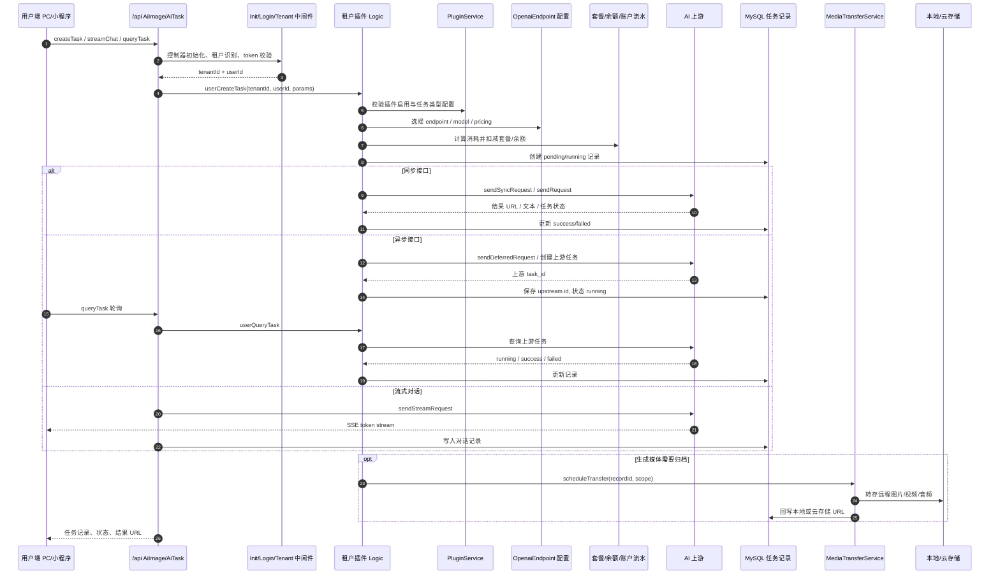
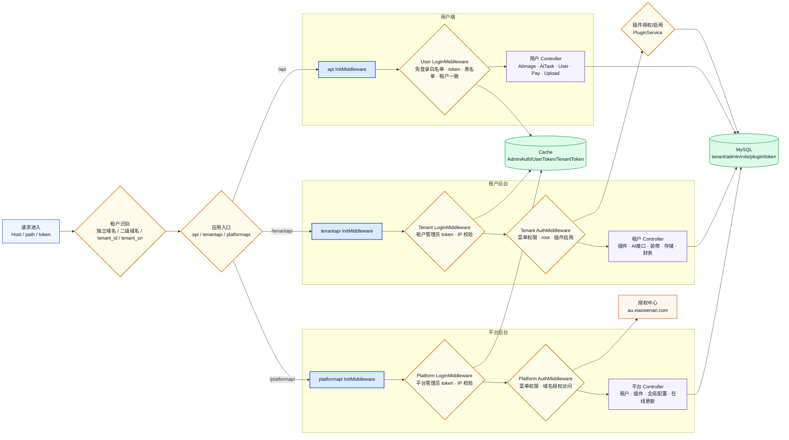
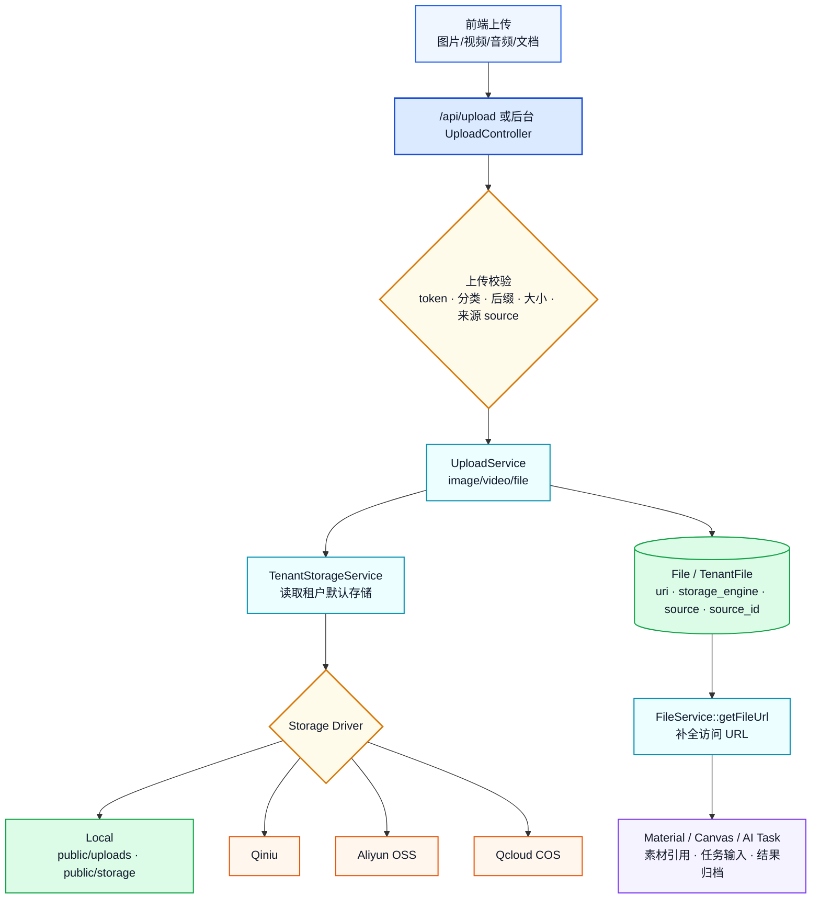
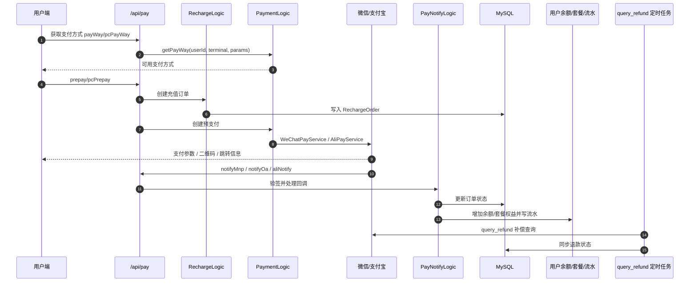

# AI 美工助手 / 多租户 SaaS 系统 Mermaid 架构图

> 参照 `Sliderule v5.1.md` 的分层方式整理：先给出系统边界，再给主架构图、关键链路图、运行不变式。本文档面向当前仓库 `img.xiaowenan.com`，覆盖 PC 用户端、平台总后台、租户后台、ThinkPHP 多应用后端、AI 任务、支付、上传存储、授权更新与运行支撑。

---

## 一、系统定位

本系统是一个多租户 AI 创作平台，核心能力包括：

- PC 用户端：AI 图片、AI 视频、AI 对话、数字人、语音、证件照、智能抠图、画布项目、素材与灵感广场。
- 租户后台：插件配置、AI 接口配置、套餐、充值、用户、素材、装修、渠道、支付、存储、推广、财务。
- 平台后台：租户管理、插件管理、全局配置、权限、支付/存储基础配置、在线更新。
- 后端服务：ThinkPHP 多应用，按 `/api`、`/tenantapi`、`/platformapi` 分离用户端、租户端、平台端。
- 外部依赖：OpenAI 兼容接口、火山方舟、第三方视频/图片协议、微信/支付宝、短信、对象存储、授权更新中心。

---

## 二、主架构图

```mermaid
flowchart TB

subgraph CLIENT["00 访问层 / Client Surface"]
  direction TB
  PC["PC 用户端 / Nuxt 3<br/>ai-image · ai-video · ai-chat · canvas · tools · recharge"]:::surface
  MNP["小程序/H5/DIY 运行端<br/>首页装修 · 个人中心 · 灵感 · 生成入口"]:::surface
  TENANT_ADMIN["租户后台 / Vue 3 + Vite<br/>插件 · AI 接口 · 用户 · 财务 · 装修 · 存储"]:::surface
  PLATFORM_ADMIN["平台后台 / Vue 3 + Vite<br/>租户 · 插件 · 权限 · 全局配置 · 在线更新"]:::surface
end

subgraph EDGE["01 接入与静态层 / Edge"]
  direction TB
  NGINX["Nginx / BaoTa vhost<br/>域名绑定 · TLS · HTTP/2/QUIC · 静态资源"]:::edge
  STATIC["静态资源目录<br/>pc · tenant · platform · resource · uploads · storage"]:::edge
  HOTLINK{"防盗链 / 缓存策略<br/>Referer 拦截 · 字体长缓存 · 图片缓存"}:::gate
end

subgraph APP["02 后端应用层 / ThinkPHP Multi App"]
  direction TB
  API["用户 API / app/api<br/>Login · User · AiImage · AiTask · Upload · Pay · Recharge · Inspiration · Canvas"]:::app
  TENANT_API["租户 API / app/tenantapi<br/>Auth · Plugin · ApiConfig · Package · Decorate · Storage · Finance · Channel"]:::app
  PLATFORM_API["平台 API / app/platformapi<br/>Tenant · Plugin · Pay · Storage · OnlineUpdate · Permission"]:::app
  INDEX["Index / public fallback<br/>默认入口 · 静态代理 · 基础页面"]:::app
end

subgraph GUARD["03 初始化与访问闸 / Guards"]
  direction TB
  INIT{"InitMiddleware<br/>定位 Controller · 注入 request.controllerObject"}:::gate
  TENANT_RESOLVE{"租户识别<br/>域名 / tenant_id / tenant_sn · request.tenantId"}:::gate
  USER_LOGIN{"用户登录闸<br/>token · 自动续期 · 黑名单 · 租户一致性"}:::gate
  ADMIN_LOGIN{"后台登录闸<br/>admin token · IP 绑定 · 自动续期"}:::gate
  AUTHZ{"权限闸<br/>菜单权限 · root bypass · 插件启用校验"}:::gate
  DEMO{"演示模式闸<br/>禁提交 · 敏感字段脱敏"}:::gate
end

subgraph DOMAIN["04 业务域 / Domain Modules"]
  direction TB
  USER["用户域<br/>登录注册 · 微信登录 · 账号安全 · 余额/积分 · 实名"]:::domain
  AI_IMAGE["AI 图片域<br/>配置 · 创建任务 · 查询 · 记录 · 删除 · 分享灵感"]:::domain
  AI_TASK["AI 任务域<br/>视频 · 对话/SSE · 数字人 · TTS/STT · 智能剪辑 · 证件照"]:::domain
  CANVAS["画布/工作流域<br/>项目 · 资产 · 公开工作流 · 全景分享"]:::domain
  MATERIAL["素材与上传域<br/>素材分类 · 图片/视频/文件 · 远程图片代理"]:::domain
  INSP["灵感/内容域<br/>灵感广场 · 文章 · 搜索 · 弹窗"]:::domain
  FINANCE["交易域<br/>套餐 · 充值 · 支付 · 退款 · 账户流水 · 推广佣金"]:::domain
  TENANT_DOMAIN["租户配置域<br/>租户 · 插件 · AI 接口 · 装修 · 渠道 · 存储 · 短信"]:::domain
end

subgraph SERVICE["05 服务层 / Services"]
  direction TB
  PLUGIN_SVC["PluginService<br/>插件启用 · 设置读取 · accessUri 映射"]:::service
  OPENAI_SVC["OpenaiApiService<br/>同步/异步/流式 · 价格匹配 · endpoint 选择"]:::service
  IMAGE_TASK_SVC["OpenaiImageTaskService<br/>图片任务提交 · 查询 · 结果归档"]:::service
  ARK_SVC["VolcengineArkApiService<br/>方舟图片/视频协议适配"]:::service
  MEDIA_TRANSFER["MediaTransferService<br/>远程媒体转存 · rescue · cleanup"]:::service
  UPLOAD_SVC["UploadService + FileService<br/>上传校验 · 文件落库 · URL 生成"]:::service
  STORAGE_SVC["TenantStorageService + Storage Driver<br/>local · qiniu · aliyun · qcloud"]:::service
  PAY_SVC["PaymentLogic + PayNotifyLogic<br/>微信/支付宝预支付 · 回调 · 退款查询"]:::service
  AUTH_SVC["授权/更新服务<br/>域名授权 · 更新检查 · 逐级更新"]:::service
  SMS_WECHAT["短信/微信服务<br/>EasyWechat · 腾讯云短信 · 小程序登录"]:::service
end

subgraph DATA["06 数据与状态 / Data Plane"]
  direction TB
  MYSQL[("MySQL<br/>la_* tables<br/>tenant · user · plugin · task · file · pay · finance")]:::data
  CACHE[("Cache<br/>file / redis<br/>token · auth · storage · config")]:::data
  LOCAL_FILE[("本地文件<br/>public/uploads · public/storage · runtime")]:::data
  CLOUD_FILE[("云存储<br/>七牛 · 阿里云 OSS · 腾讯云 COS")]:::data
  LOGS[("日志<br/>Nginx access/error · ThinkPHP log · 操作日志")]:::data
end

subgraph EXT["07 外部系统 / External"]
  direction TB
  AI_PROVIDER["AI 上游<br/>OpenAI-compatible · Volcengine Ark · 多米/阿里视频协议"]:::external
  PAY_PROVIDER["支付通道<br/>WeChat Pay · Alipay"]:::external
  SMS_PROVIDER["短信/微信生态<br/>Tencent SMS · WeChat Mini Program/OA"]:::external
  AUTH_CENTER["授权更新中心<br/>au.xiaowenan.com / authapi"]:::external
end

subgraph OPS["08 运行任务 / Runtime Jobs"]
  direction TB
  CRON["Crontab<br/>定时任务调度"]:::ops
  QUERY_REFUND["query_refund<br/>退款状态补偿"]:::ops
  TRANSFER_RESCUE["media_transfer_rescue<br/>媒体转存失败重试"]:::ops
  TRANSFER_CLEAN["media_transfer_cleanup<br/>临时媒体清理"]:::ops
end

%% Client to edge
PC --> NGINX
MNP --> NGINX
TENANT_ADMIN --> NGINX
PLATFORM_ADMIN --> NGINX
NGINX --> STATIC
NGINX --> HOTLINK

%% Edge to apps
NGINX -->|/api| API
NGINX -->|/tenantapi| TENANT_API
NGINX -->|/platformapi| PLATFORM_API
NGINX -->|fallback| INDEX

%% Guard chain
API --> INIT --> TENANT_RESOLVE --> USER_LOGIN
TENANT_API --> INIT --> TENANT_RESOLVE --> ADMIN_LOGIN --> AUTHZ --> DEMO
PLATFORM_API --> INIT --> ADMIN_LOGIN --> AUTHZ --> DEMO

%% App to domain
USER_LOGIN --> USER
USER_LOGIN --> AI_IMAGE
USER_LOGIN --> AI_TASK
USER_LOGIN --> CANVAS
USER_LOGIN --> MATERIAL
USER_LOGIN --> INSP
USER_LOGIN --> FINANCE
AUTHZ --> TENANT_DOMAIN
AUTHZ --> FINANCE
AUTHZ --> MATERIAL
AUTHZ --> INSP

%% Domain to services
AI_IMAGE --> PLUGIN_SVC
AI_IMAGE --> OPENAI_SVC
AI_IMAGE --> IMAGE_TASK_SVC
AI_TASK --> PLUGIN_SVC
AI_TASK --> OPENAI_SVC
AI_TASK --> ARK_SVC
AI_TASK --> MEDIA_TRANSFER
CANVAS --> MATERIAL
MATERIAL --> UPLOAD_SVC
UPLOAD_SVC --> STORAGE_SVC
FINANCE --> PAY_SVC
TENANT_DOMAIN --> PLUGIN_SVC
TENANT_DOMAIN --> STORAGE_SVC
TENANT_DOMAIN --> AUTH_SVC
USER --> SMS_WECHAT

%% Service to data/external
PLUGIN_SVC --> MYSQL
OPENAI_SVC --> AI_PROVIDER
IMAGE_TASK_SVC --> AI_PROVIDER
ARK_SVC --> AI_PROVIDER
MEDIA_TRANSFER --> LOCAL_FILE
MEDIA_TRANSFER --> CLOUD_FILE
UPLOAD_SVC --> LOCAL_FILE
STORAGE_SVC --> LOCAL_FILE
STORAGE_SVC --> CLOUD_FILE
PAY_SVC --> PAY_PROVIDER
SMS_WECHAT --> SMS_PROVIDER
AUTH_SVC --> AUTH_CENTER

USER --> MYSQL
AI_IMAGE --> MYSQL
AI_TASK --> MYSQL
CANVAS --> MYSQL
MATERIAL --> MYSQL
INSP --> MYSQL
FINANCE --> MYSQL
TENANT_DOMAIN --> MYSQL
USER_LOGIN --> CACHE
ADMIN_LOGIN --> CACHE
AUTHZ --> CACHE
NGINX --> LOGS
API --> LOGS
TENANT_API --> LOGS
PLATFORM_API --> LOGS

%% Runtime jobs
CRON --> QUERY_REFUND --> PAY_PROVIDER
CRON --> TRANSFER_RESCUE --> MEDIA_TRANSFER
CRON --> TRANSFER_CLEAN --> MEDIA_TRANSFER
QUERY_REFUND --> MYSQL
TRANSFER_RESCUE --> MYSQL
TRANSFER_CLEAN --> LOCAL_FILE

classDef surface fill:#eff6ff,stroke:#2563eb,color:#0f172a,stroke-width:1.5px;
classDef edge fill:#eef2ff,stroke:#4f46e5,color:#0f172a,stroke-width:1.5px;
classDef app fill:#dbeafe,stroke:#1d4ed8,color:#0f172a,stroke-width:2px;
classDef gate fill:#fffbeb,stroke:#d97706,color:#0f172a,stroke-width:2px;
classDef domain fill:#f5f3ff,stroke:#7c3aed,color:#111827,stroke-width:1.5px;
classDef service fill:#ecfeff,stroke:#0891b2,color:#0f172a,stroke-width:1.5px;
classDef data fill:#dcfce7,stroke:#16a34a,color:#0f172a,stroke-width:1.5px;
classDef external fill:#fff7ed,stroke:#ea580c,color:#0f172a,stroke-width:1.5px;
classDef ops fill:#f8fafc,stroke:#64748b,color:#111827,stroke-width:1.5px;
```

---

## 三、AI 任务创建与查询链路

---

## 四、多租户与权限链路

---

## 五、上传、素材与存储链路

---

## 六、支付与充值链路

---

## 七、关键边与不变式

### 关键边

- `Nginx -> /api|/tenantapi|/platformapi`：三类后端入口分离，前端通过路径进入对应应用。
- `InitMiddleware -> LoginMiddleware -> AuthMiddleware`：控制器初始化、身份校验、权限校验是后台操作的固定前置链路。
- `tenantId -> PluginService -> OpenaiEndpoint`：AI 能力按租户隔离，插件和接口配置决定可用模型与价格。
- `AiImage/AiTask -> AccountLog/Package -> OpenaiApiService`：生成任务必须先完成计费与记录，再请求上游。
- `AI result -> MediaTransferService -> TenantStorageService`：远程媒体结果需要转存到本地或租户云存储，避免长期依赖上游临时 URL。
- `Pay callback -> PayNotifyLogic -> RechargeOrder/UserAccountLog`：支付结果只以回调验签后的服务端处理为准。
- `UploadService -> StorageDriver -> File/TenantFile`：所有上传都要落库，并保留 storage_engine，后续 URL 由 FileService 统一生成。
- `Auth center -> OnlineUpdate/Access check`：平台授权、逐级更新和访问控制由授权中心提供外部判断。

### 系统不变式

1. 用户端生成类接口必须经过用户 token 校验，免登录接口只允许读取配置或公共内容。
2. 租户后台所有写操作必须经过租户管理员登录、权限校验和插件启用校验。
3. 平台后台必须经过平台管理员登录与权限校验，授权检查失败时禁止打开总后台。
4. AI 任务记录、扣费流水、用户余额变动必须在同一业务链路内可追溯。
5. 上传文件必须经过后缀、大小、分类和存储引擎校验，返回 URL 不直接拼接散落在业务层。
6. 生成结果中的远程媒体 URL 应进入媒体转存队列，最终以本地或云存储 URL 作为稳定结果。
7. 支付成功状态只能由服务端回调或补偿查询确认，前端支付页面结果不能直接改账。
8. 静态资源和上传资源应通过 Nginx 缓存、Referer 拦截、云存储或 CDN 控制出口带宽。

---

## 八、运行与排障关注点

| 关注点 | 主要位置 | 说明 |
| --- | --- | --- |
| 带宽出口 | Nginx access log、`/sys/class/net/*/statistics` | 大文件、字体、图片、视频、盗链请求优先排查 |
| 登录态 | `UserTokenCache`、`TenantAdminTokenCache`、`AdminTokenCache` | token 过期、租户不一致、IP 变化会导致访问失败 |
| AI 任务 | `AiImageRecord`、`AiTaskRecord`、`OpenaiEndpoint` | 关注 endpoint 状态、response_mode、上游 task id、任务状态 |
| 扣费流水 | `UserAccountLog`、套餐/余额相关模型 | 关注创建任务失败后的退款或回滚 |
| 上传存储 | `TenantStorageConfig`、`File/TenantFile` | 云存储未配置或本地存储关闭会影响上传 |
| 支付回调 | `RechargeOrder`、`PayNotifyLogic`、Nginx/PHP 日志 | 回调验签、订单重复处理、退款补偿 |
| 授权更新 | `config/auth.php`、`OnlineUpdateLogic` | 域名授权、版本逐级更新、总后台访问授权 |
| 定时任务 | `Crontab`、`QueryRefund`、`MediaTransferRescue/Cleanup` | 补偿任务失败会导致状态滞后或临时文件堆积 |

---

## 九、生成依据

本图主要参考当前仓库下列文件与目录：

- `Sliderule v5.1.md`：文档组织、分层图和关键边表达方式。
- `pc/README.md`、`pc/package.json`、`pc/pages/*`、`pc/api/*`：PC 用户端功能与技术栈。
- `platform/package.json`、`platform/src/views/*`、`platform/src/api/*`：平台后台功能边界。
- `tenant/package.json`、`tenant/src/views/*`、`tenant/src/api/*`：租户后台功能边界。
- `server/app/api/*`：用户端 API、中间件、AI/支付/上传/用户控制器。
- `server/app/tenantapi/*`：租户后台 API、插件、装修、存储、财务、权限。
- `server/app/platformapi/*`：平台后台 API、租户管理、在线更新、全局配置。
- `server/app/common/service/*`、`server/app/common/model/*`：公共服务、存储、AI 上游、支付、缓存与数据模型。
- `server/config/*`：数据库、缓存、文件系统、授权、定时任务、项目配置。
